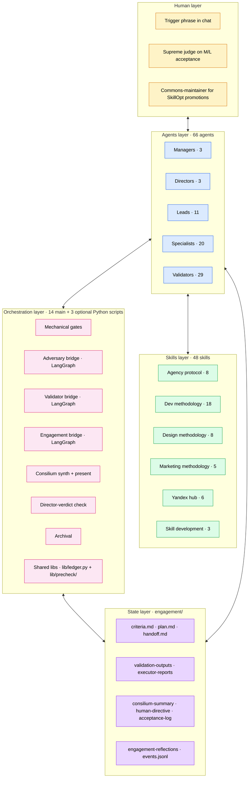
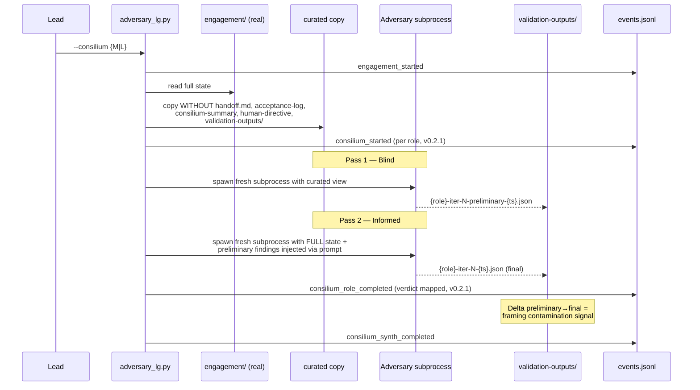
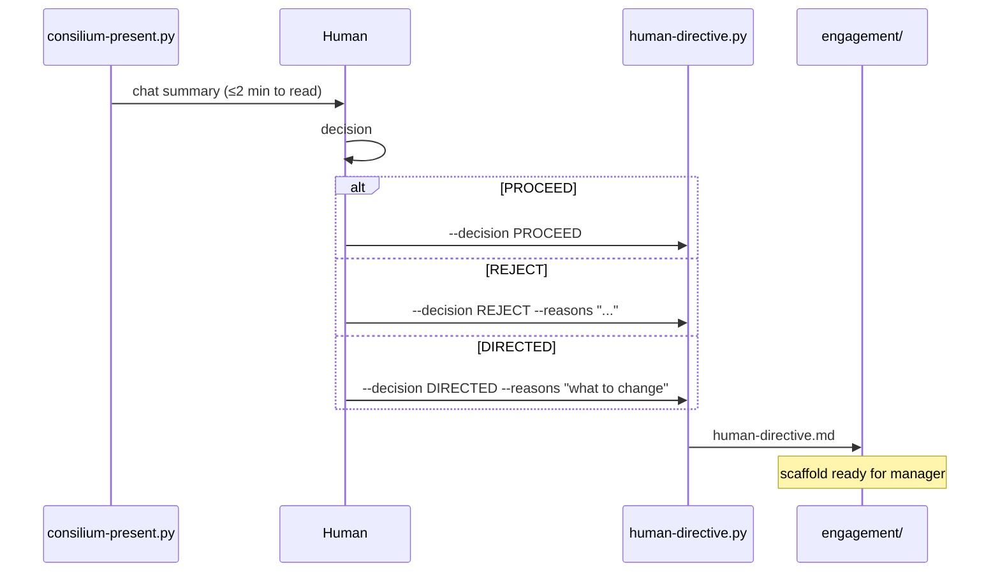
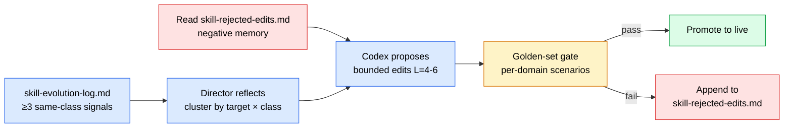
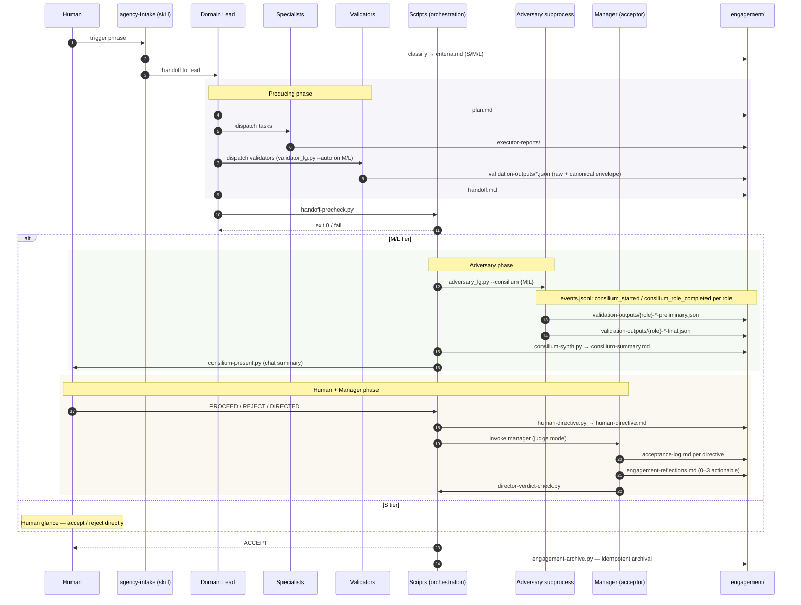

[Русский](./ARCHITECTURE.ru.md) · **English**

# Architecture — agentic-workflow

Deep dive into the system's design. If the README answers «what does
this do», this document answers «how exactly is it built inside». Read
top to bottom: problem → five layers → key mechanisms → state model →
flow.

> **v0.2.4 (2026-05-28):** Windows-compatibility bugfix — `claude.CMD`
> npm-wrapper truncates multiline argv at the first newline (CMD
> line-parsing); `subprocess.run(text=True)` decodes UTF-8 Russian as
> cp1251 on Russian-locale Windows; `consilium_synth_completed` ledger
> emit was passing raw natural verdict to a schema expecting
> `ACCEPT/REJECT/DIRECTED`. All three fixed across 4 scripts
> (`adversary_lg.py` / `validator_lg.py` / `engagement_lg.py` /
> `scripts/lib/precheck/common.py`): `find_claude_cmd()` resolves
> `.CMD` → `claude.exe` via npm wrapper layout (Unix/macOS path
> unaffected); 10 `subprocess.run` sites got `encoding="utf-8",
> errors="replace"`; inline `VERDICT_MAP` mirror of the per-role mapping
> in `_make_finalize_node`. All `--invoker mock` tests passed pre-fix;
> latent risk lived in real subscription mode untested on Windows until
> real subscription mode surfaced them.
>
> **v0.2.3 (2026-05-28):** `engagement_lg.py` end-to-end across all
> 11 nodes (Send fan-out to specialists,
> `validator_lg.py` + `adversary_lg.py` subprocess delegation, manager
> subprocess with canonical-verdict parse, REJECT_NOW short-circuit,
> engagement-archive on ACCEPT). NEW `--mock` execution mode (mutually
> exclusive with `--real`) runs real graph paths but with canned
> subprocess wrappers — enables full end-to-end smoke without claude
> CLI. 7 paths verified on synthetic engagements. See
> [`CHANGELOG.md`](CHANGELOG.md) for the v0.2.3 delta.
>
> **v0.2.2 (2026-05-28):** incremental — modular decomposition of
> `handoff-precheck.py` into `scripts/lib/precheck/` package (8 topic
> modules); the third LangGraph engine added —
> `engagement_lg.py` owning the engagement-level lifecycle with 8 node
> placeholders, 3 HITL pause points, and intake/plan wired to
> `size-detect.py --auto-promote` + `claude -p --agent {domain}-lead`
> subprocess. 3 new ledger payload types
> (`engagement_completed` / `phase_skipped` / `dryrun_marker`). See
> [`CHANGELOG.md`](CHANGELOG.md) for the v0.2.2 delta.
>
> **v0.2.1 (2026-05-28):** this document reflects the full v0.2 +
> refinement state. Major shifts versus v0.1: acceptor / system-optimizer split
> (`*-manager` ≠ `*-director`), authority-and-conflict-resolution
> invariant, per-engagement reflection layer, append-only event ledger
> (`engagement/events.jsonl`), canonical validator envelope,
> tier-keyed validator dispatch (`validator_lg.py --auto` default on M/L),
> critical-pause HITL in `validator_lg.py`. v0.2.1 added per-role
> consilium events in `adversary_lg.py`, golden-set parity across all 3
> domains, and hot-path / cold-path split in 3 heavily-loaded skills.

## 1. Problem statement

Multi-agent pipelines on a single model family suffer from three
systemic pathologies:

1. **Framing contamination.** When the same model plays multiple roles
   (writer, reviewer, judge), they share the same blind spots. A
   «second pass with the same brain» yields the same answer in
   different words.

2. **Goodhart on validators.** Validators degenerate into format-gates,
   checking field presence instead of thinking quality. The bar drifts
   from «is this right?» to «does it pass the check?».

3. **Undifferentiated rigour.** A button tweak and a landing redesign
   go through the same pipeline with the same review depth. Small
   tasks pay the cost of large ones; large ones don't get enough
   attention.

The system addresses these with:
- **Tier-aware dispatch** (S/M/L) — different review depth based on
  task size
- **Filesystem-isolated adversary** in fresh subprocesses
- **Cross-family second opinion** via Codex MCP (different model family
  = different blind spots)
- **Human supreme judge** at one critical transition
- **Acceptor / optimizer separation** — `*-manager` accepts engagements,
  `*-director` improves the corpus (Codex proposes edits, the director
  judges against a golden set)
- **Event ledger** records the full lifecycle in `engagement/events.jsonl`
  for post-hoc replay and analytics

## 2. Five layers



Each layer has a clear scope of responsibility:

| Layer | What it does | What it does NOT do |
|---|---|---|
| **Human** | Triggers intake, issues supreme verdict on M/L, approves SkillOpt promotions | Doesn't write markdown, doesn't validate routinely |
| **Agents** | Plan, execute, judge, run the SkillOpt loop (out-of-band) | Don't write scripts, don't determine tiers, managers don't dispatch |
| **Skills** | Loaded into agent context — methodology, protocols, tool guides | Not invoked directly from chat; some are `triggers:`-aware for the loader |
| **Orchestration** | Mechanical gates, adversary bridge, consilium, event ledger | Doesn't make judgments about content quality |
| **State** | Stores all engagement state on FS — every fact lives in a file | No logic — only schemas, whitelist, mutability rules |

## 3. Skills layer

Skills are methodology references and protocols. Loaded into agent
context via `skills:` in frontmatter. A skill **has no chat trigger by
default**; PROTOCOL skills now expose a `triggers:` frontmatter field
read by the loader.

### Categories

| Category | # | Purpose |
|---|---|---|
| **Agency protocol** | 8 | Agency work contract: schemas, lifecycle, gates, acceptance, system-optimization |
| **Dev methodology** | 18 | TDD, code review, spec planning, deploy, security |
| **Design methodology** | 8 | Brand, design system, UI/UX, presentation |
| **Marketing methodology** | 5 | SEO, semantic drift, AI visibility, task decomposition, benchmark research (standalone entry-point) |
| **Regional SEO/PPC stack** | 6 | API integrations for Russian-market analytics platforms |
| **Skill development** | 3 | Authoring and testing of skills themselves |

### Frontmatter tags for the router

```yaml
---
name: code-writing
domain: dev
triggers:
  - "loaded by every lead / manager / mid-lead via skills frontmatter"
description: |
  [METHODOLOGY] Universal quality coding process (plan, TDD, reviews).
---
```

| Tag | Meaning |
|---|---|
| `[PROTOCOL]` | Mandatory contract (read by agents, not invoked) |
| `[METHODOLOGY]` | Methodology reference (how to do work properly) |
| `[TOOL]` | Description of an integration with a specific tool |

### Key protocol skills

- `agency-intake` — single entry point. Classifies the domain
  (dev/design/marketing), creates `criteria.md`, hands the engagement
  to the matching domain-lead.
- `engagement-protocol` — canonical contract: schemas of all artefacts,
  whitelist of paths, mutability rules, iteration budget, authority
  invariant.
- `acceptance-protocol` — per-engagement acceptance methodology used by
  all `*-manager` agents (tier-aware S/M/L verdict shape, reflection
  emission).
- `system-optimization-protocol` — SkillOpt loop used by all
  `*-director` agents (reflect → bounded edit → golden gate →
  promote / reject).
- `engagement-contract` — minimal specialist subset of engagement
  protocol; loaded by 20 specialists via frontmatter.
- `validation-pipeline` — which validator to run when, in what order,
  how to log to `validation-log.md`; tier-keyed dispatch matrix +
  `validator_lg.py --auto` default on M/L.
- `docs-pipeline` — documentation-diff artefact handling.
- `codex-bridge` — Codex CLI integration as an MCP server for
  cross-family adversary and image generation.

### Hot-path / cold-path split (v0.2.1)

Three heavily-loaded skills have their cold sections moved into
on-demand `references/{topic}.md` files:

- `engagement-protocol/SKILL.md` (1128 → 963 lines) + 7 references:
  `cross-domain`, `dangerous-ops`, `archival`, `ux-heavy`, `abort`,
  `resume`, `budget`.
- `ui-ux-methodology/SKILL.md` (664 → 347 lines) + 2 references:
  `quick-reference` (10 priority categories), `professional-ui-rules`
  (Common Rules + Pre-Delivery Checklist).
- `dev-methodology/SKILL.md` (441 → 351 lines) + 2 references:
  `skills-ecosystem`, `agents`.

Net effect: −572 lines loaded into every engagement that pulls these
skills; +515 lines parked in references that load only when the
hot-path summary indicates the section is relevant.

## 4. Agents layer

66 Claude Code subagents in `~/.claude/agents/`. Each agent has
frontmatter with `name`, `description`, `model`, `skills:`,
`allowed-tools:`. The mirror organises agents into
`agents/{directors,leads,managers,specialists,validators}/` subdirectories.

### Managers (3, NEW in v0.2)

`dev-manager`, `design-manager`, `marketing-manager`. Per-engagement
**acceptor** role: judge between producer and adversary, never plans,
never dispatches, never edits authorial artefacts, never re-runs
validators sweep-style.

| Action | Manager |
|---|---|
| Read `handoff.md`, `validation-outputs/*`, `consilium-summary.md`, `human-directive.md` | ✓ |
| Write verdict per directive in `acceptance-log.md` | ✓ (M/L only) |
| Adjudicate on each adversary↔author disagreement (`UPHELD` / `OVERRULED` / `DEFERRED`) | ✓ |
| Emit 0–3 actionable reflections to `engagement-reflections.md` | ✓ (M/L only) |
| Dispatch work | ✗ |
| Edit handoff content | ✗ |
| Re-run validators sweep-style | ✗ |
| Targeted single validator re-run on L-tier when adversary identifies coverage gap | ✓ (max 1 per validator per iteration) |
| Possible verdicts | ACCEPT / REJECT / ESCALATE |

On S-tier the manager isn't engaged — producer self-attests +
mechanical checks + human glance.

### Directors (3, REPURPOSED in v0.2)

`dev-director`, `design-director`, `marketing-director`. Per-domain
**system-optimizer** role (out-of-band, not per-engagement). Runs the
SkillOpt-style skill-evolution loop on accumulated REJECT/rework
signals from the manager's `skill-evolution-log.md`:

1. **Reflect** — cluster signals by `target × class`
   (`rule_missing` / `rule_wrong` / `rule_ignored`); fires only at
   ≥3 same-class signals.
2. **Codex proposes bounded edits** (cross-family — kills defend-bias).
   Edit budget L: 4–6 patches per cycle, ≤10 lines each.
3. **Judge against golden set** — director (not Codex) verifies the
   edit doesn't regress any scenario in
   `skills/system-optimization-protocol/golden/{domain}/`.
4. **Promote or reject.** Passing edits promote to the `~/.claude/`
   tree. Rejected edits land in `<your-memory>/skill-rejected-edits.md`
   (negative memory; read before next cycle).

The director **never authors edits itself** — Codex is the proposer,
the director is the judge, the human is the commons-maintainer for
cross-domain promotions.

### Leads (11)

**Top-leads (3):** `dev-lead`, `design-lead`, `marketing-lead` —
primary planners for their domains. Receive intake from `agency-intake`,
plan phased execution, dispatch mid-leads (when applicable), run
cross-cutting validators, form the handoff.

**Mid-leads (8):**

| Lead | Track |
|---|---|
| `dev-product-lead` | discovery — research, specs |
| `dev-engineering-lead` | delivery — implementation |
| `dev-quality-lead` | validation, security audit, pre/post-deploy QA |
| `design-brand-lead` | brand voice, identity, guidelines |
| `design-product-design-lead` | UX + UI tracks |
| `marketing-traffic-lead` | SEO + PPC + keyword research |
| `marketing-content-lead` | copy, ad creative, banners |
| `marketing-analytics-lead` | Metrika, AI visibility, semantic drift |

Mid-leads are tier-aware: forbidden on S, optional on M (used only
when ≥2 specialists need coordination), required on L.

### Specialists (20)

Doers. Receive an atomic task from a lead, do the work, hand back a
report in `engagement/executor-reports/`. All 20 specialists load
`engagement-contract` skill (6-bullet specialist subset of the engagement
protocol) via frontmatter.

- **Dev (8):** `dev-backend-engineer`, `dev-frontend-engineer`,
  `dev-fullstack-engineer`, `dev-devops-engineer`, `dev-qa-engineer`,
  `dev-tech-architect`, `dev-product-analyst`, `dev-technical-writer`
- **Design (5):** `design-ux-designer`, `design-ui-designer`,
  `design-visual-designer`, `design-brand-strategist`,
  `design-presentation-designer`
- **Marketing (7):** `marketing-copywriter`, `marketing-banner-designer`,
  `marketing-seo-specialist`, `marketing-ppc-specialist`,
  `marketing-keyword-researcher`, `marketing-web-analyst`,
  `marketing-ai-visibility-specialist`

### Validators (29)

Narrowly-specialized reviewers that the lead invokes for a specific
reason. Each has a skill-binding with a review methodology and returns
a structured JSON report saved to `engagement/validation-outputs/`.
With v0.2 every output gets a `canonical` envelope alongside the
raw fields (normalized verdict + severity + validator_type).

| Validator | What it checks |
|---|---|
| `code-reviewer` | Code quality after implementation |
| `security-auditor` | OWASP Top 10, secrets leakage, auth flows |
| `accessibility-validator` | WCAG AA, ARIA, keyboard nav, contrast |
| `performance-validator` | N+1, memory leaks, hot paths |
| `migration-validator` | DB migration safety (atomicity, rollback) |
| `test-reviewer` | Test quality and strategy |
| `reality-checker` | Cross-check task files against actual code state |
| `skeptic` | Mirage detection — non-existent files / functions / deps |
| `completeness-validator` | Bidirectional spec → tasks traceability |
| `task-validator` | Task file vs template compliance |
| `tech-spec-validator` | Tech-spec template compliance |
| `userspec-quality-validator` | User-spec quality (structure, edge cases) |
| `userspec-adequacy-validator` | Adequacy of solution for the stack |
| `feasibility-assessor` | Research verdict validation |
| `infrastructure-reviewer` | Setup quality (folder structure, hooks, Docker) |
| `deploy-reviewer` | CI/CD pipeline, secrets management |
| `pre-deploy-qa` | Acceptance testing before deploy |
| `post-deploy-qa` | Acceptance testing after deploy on live env |
| `interview-completeness-checker` | Interview completeness in user-spec planning |
| `documentation-reviewer` | Project-knowledge documentation quality |
| `prompt-reviewer` | LLM prompt quality |
| `anti-pattern-detector` | Hidden failure modes in diffs |
| `ux-review` | Exercised narrative on ux-heavy engagements |
| `code-researcher` | Codebase research for a feature (Layer 5) |
| `design-system-researcher` | Existing design system audit before redesign (Layer 5) |
| `brand-context-researcher` | Existing brand history audit before brand work (Layer 5) |
| `product-context-validator` | Cross-domain product coherence |
| `task-creator` | Task file generation from tech-spec |
| `skill-checker` | Skill compliance with `skill-authoring` standards |

## 5. Orchestration layer

14 main + 3 optional Python scripts in `~/.claude/scripts/`. All scripts
are **exit-code gates**: a non-zero exit blocks the pipeline, no
prompts, no negotiations. **No model judgment** — purely deterministic
logic.

### Main (14)

| Script | Purpose |
|---|---|
| `adversary_lg.py` | LangGraph adversary bridge — 5 reviewer roles, two-pass curated-view isolation, `Send` fan-out, SQLite-checkpointed `--resume`, native HITL via `interrupt()`, event ledger wired (lifecycle + per-role + early-return guards) |
| `validator_lg.py` | LangGraph atomic-validator fan-out via `Send`, retry edge, auto-plan from criteria.md predicates, `--resume`, native HITL via `--interrupt-on-critical`, canonical envelope, event ledger wired (8 emit sites) |
| `engagement_lg.py` | LangGraph engagement-level orchestrator (v0.2.2+) owning the full lifecycle intake → plan → dispatch → validate → consilium → accept → archive. 11 nodes including `_barrier_dispatch_node` (sync after Send fan-out to specialists) + 3 HITL pause points (`criteria_lock`, `danger_gate`, `human_directive`). Three execution modes: `--dry-run` (default, placeholders), `--mock` (real graph paths + canned subprocess artefacts — full end-to-end smoke without claude CLI), `--real` (full subprocess with `claude -p --agent X`). Delegates to `validator_lg.py` and `adversary_lg.py` as subprocesses (process isolation; promotion to sub-graphs deferred until field data shows overhead matters). 4 new ledger payload types: `engagement_completed`, `phase_skipped`, `dryrun_marker`. Event ledger wired. |
| `consilium-synth.py` | Adversary output aggregation, two-stage dedup |
| `consilium-present.py` | Chat-ready format with decision menu for the human |
| `director-verdict-check.py` | Mechanical adjudication completeness (legacy name; in v0.2 targets `*-manager` verdict) |
| `handoff-precheck.py` | Tier-aware hard gate (S=6 / M=13 / L=21 checks), event ledger wired (per-check emit) |
| `human-directive.py` | Scaffold `human-directive.md` from CLI args |
| `preflight.py` | Tools availability (Codex CLI, Python deps) |
| `danger-scan.py` | Registry of dangerous operations (DROP TABLE, force-push, prod deploy) |
| `handoff-paths-check.py` | Phantom path detection |
| `cross-val-check.py` | Verbatim quote verification in §4a table |
| `trace-schema-check.py` | Trace JSON schema + staleness check |
| `size-detect.py` | Tier detection at intake / runtime with `--auto-promote` |
| `engagement-archive.py` | Idempotent engagement archival |

### Shared libraries

- `lib/ledger.py` — append-only event ledger. Per-engagement
  `engagement/events.jsonl`. Schema v1 with 17 fields per event, 28
  KNOWN_PAYLOAD_TYPES, assert guards, forward-only with synthetic
  `legacy_import` event for pre-ledger engagements, replay-friendly
  schema versioning. Helpers: `emit_authority_conflict()`,
  `emit_skill_snapshot()`, `snapshot_skills()`, `hash_input()`.
- `lib/precheck/` — modular precheck package (v0.2.2). 8 topic
  modules: `common` (constants, shared utilities), `criteria`
  (frontmatter validation), `handoff` (handoff.md structural checks),
  `iteration` (counter consistency), `validators`
  (validation-outputs/* presence and shape), `acceptance`
  (acceptance-log + director-verdict), `danger` (danger-scan registry),
  plus `__init__` re-exports. `handoff-precheck.py` (1264 → 423 lines,
  CLI/dispatcher only) imports from this package. Topic-clustered for
  the way managers / leads think about the system, not by mechanism.
  Byte-identical JSON output to the pre-refactor monolith on real engagement
  smoke.

### Optional (3)

`engagement-doctor.py`, `engagement-migrate.py`, `token-budget.py` —
opt-in utilities outside the core protocol.

`adversary.py` (legacy stdlib-only bridge) was **removed in v0.2** after
adversary_lg.py absorbed its functionality and the auto-synth pipeline
landed. The 5 dead optional scripts (`cross-val-template`,
`director-sweep`, `metrics-summary`, `secondary-init`, `validator-retry`)
were removed in an earlier cleanup.

## 6. State layer — engagement directory

An engagement is a directory. State is read entirely from the
filesystem. No databases, no external logs, no conversation state — if
a fact matters, it lives in a file.

### Path whitelist (closed list)

```
engagement/
├── criteria.md                 # secretary, semi-immutable
├── scope-sync.md               # manager, optional, append-only
├── plan.md                     # lead, frozen after first dispatch
├── specs/                      # dev: user-spec / tech-spec / research-verdict
├── tasks/                      # all domains: atomic task files
├── tasks/INDEX.md              # mandatory if size: L
├── brand/                      # design only
├── design-system/              # design only
├── ui/                         # design only
├── executor-reports/           # specialists, append-only
├── code-research.md            # OPTIONAL — code-researcher output
├── design-research.md          # OPTIONAL — design-system-researcher output
├── brand-research.md           # OPTIONAL — brand-context-researcher output
├── validation-log.md           # lead, append-only
├── validation-outputs/         # JSON proof-of-run for each validator (raw + canonical)
├── consilium-summary.md        # auto-write from consilium-synth.py (M/L)
├── human-directive.md          # mandatory on M/L
├── codex-outputs/              # Codex assets (optional)
├── iteration                   # plain-text counter
├── screens/iter-N/             # mandatory for ux_heavy
├── traces/iter-N/              # JSON traces of flow logs
├── deploy-log.md               # dev only when deploy boundary crossed
├── docs-diff.md                # docs pipeline only
├── handoff.md                  # lead, REPLACED per iteration
├── acceptance-log.md           # manager, append-only
├── engagement-reflections.md   # manager, append-only on M/L verdict (0–3 actionable lessons)
└── events.jsonl                # append-only event ledger
```

Files **outside the whitelist** are a protocol violation. The
manager's red-flag check does `ls engagement/` — any extraneous file
is grounds for REJECT with reason «out-of-whitelist artefact».

### Mutability rules

| Artefact | Mutability |
|---|---|
| `criteria.md` | semi-immutable (additions/removals — only by user via scope-sync) |
| `plan.md` | mutable until first dispatch, then frozen |
| `handoff.md` | replaced wholesale per iteration |
| `validation-log.md`, `acceptance-log.md`, `executor-reports/*.md`, `engagement-reflections.md`, `events.jsonl` | append-only |
| `validation-outputs/*.json` | immutable after write |

## 7. Tier dispatch (S / M / L)

Tier is determined at intake from `criteria.md` frontmatter:

```yaml
---
engagement: <name>
domain: dev | design | marketing
size: S | M | L
ux_heavy: false | minor | true
tools_required: [...]
---
```

| Tier | Use case | Schema | Adversary | Manager | Validator dispatch | Mechanical checks |
|---|---|---|---|---|---|---|
| **S** | Hotfix, single deliverable | 4-section minimum | None | None | Manual parallel | 6 |
| **M** | Multi-specialist, mid-stakes | Full 11-section | 1× peer-opus | Judge mode | `validator_lg.py --auto` default | 13 |
| **L** | Cross-domain, high-stakes | Full + tasks INDEX | 5× consilium | Judge + adjudication | `validator_lg.py --auto` mandatory | 21 |

Tier is chosen at intake by heuristics: number of specialists involved,
cross-domain nature, ux-heavy flag, risk profile. `size-detect.py
--auto-promote` may promote a tier (S→M, M→L; never demote) when the
engagement grows beyond its original classification.

## 8. Adversary protocol

The adversary runs via `adversary_lg.py` — a LangGraph `StateGraph` — in
a **fresh subprocess** with a **filesystem-curated view**. Two-pass
design separates «what would I say cold?» from «what would I say after
seeing the author's reasoning?». The graph models reviewer fan-out as
`Send` edges and the `codex-informed` dependency as a conditional edge;
`--resume` is artefact-driven — it re-runs only the missing or failed
reviewers.



### Role registry (5)

| Role | Model | Scope |
|---|---|---|
| `peer-opus` | Anthropic Opus | Peer-level adversarial review |
| `codex-blind` | OpenAI GPT-5 (Codex CLI) | Fully independent, no prior findings |
| `codex-informed` | OpenAI GPT-5 (Codex CLI) | Reads peer-opus, focuses on gaps |
| `sonnet-scoped` | Anthropic Sonnet | «Average human» common-sense scope |
| `haiku-scoped` | Anthropic Haiku | Naive obvious-miss scope, format checks |

**Capability rule:** the adversary is never weaker than the producer.

**Tier presets:**
- S = adversary doesn't run
- M = `peer-opus` only
- L = all 5 roles in parallel (cross-family disagreement detection)

### Event ledger emission

Every adversary run writes to `engagement/events.jsonl` via the shared
`lib/ledger.py` shim. Lifecycle events: `engagement_started`,
`consilium_synth_completed`, `interrupt_paused/resumed`,
`human_directive_received`. Per-role events (v0.2.1):
`consilium_started` (before two-pass), `consilium_role_completed`
(after two-pass; payload includes verdict mapping
`satisfied → ACCEPT`, `rework_required` / `suspicious_too_clean` →
`REJECT`, `fail` → `REJECT`).

## 8.5 Engagement-level orchestration (engagement_lg.py)

The third LangGraph engine, added in v0.2.2 and completed in v0.2.3. Owns the **full engagement lifecycle** from intake
through archive — the layer that was implicit in v0.1 (lead agents
coordinated work through artefact files alone). `engagement_lg.py` makes
the lifecycle explicit as a `StateGraph` with checkpointable state, HITL
pause points, and subprocess delegation to the two phase-level engines
(`validator_lg.py`, `adversary_lg.py`).

### State and node graph

```mermaid
flowchart TB
    START([START])
    INT[intake_node<br/>read criteria.md + size-detect --auto-promote]
    CL{HITL: criteria_lock<br/>opt-in --interrupt-on-criteria}
    PLAN[plan_node<br/>claude -p --agent {domain}-lead<br/>writes plan.md w/ specialists]
    DG{HITL: danger_gate<br/>conditional on danger-scan findings}
    DISP[dispatch_node<br/>Send fan-out per specialist]
    SPEC[specialist_node<br/>parallel via Send<br/>claude -p --agent X]
    BAR[barrier_dispatch_node<br/>sync after specialist fan-out]
    VAL[validate_node<br/>subprocess validator_lg.py --auto]
    CONS[consilium_node<br/>subprocess adversary_lg.py --consilium TIER]
    HD{HITL: human_directive<br/>MANDATORY M/L after consilium}
    MGR[manager_accept_node<br/>claude -p --agent {domain}-manager<br/>writes acceptance-log.md]
    ARCH[archive_node<br/>engagement-archive.py]
    END([END])

    START --> INT
    INT --> CL
    CL --> PLAN
    PLAN --> DG
    DG --> DISP
    DISP -->|Send per specialist| SPEC
    DISP -->|empty list| BAR
    SPEC --> BAR
    BAR --> VAL
    VAL -->|REJECT + iter<max| PLAN
    VAL -->|tier in {M,L}| CONS
    VAL -->|tier S| MGR
    CONS --> HD
    HD -->|REJECT_NOW| END
    HD --> MGR
    MGR -->|REJECT + iter<max| PLAN
    MGR -->|ACCEPT| ARCH
    MGR -->|ABORTED| END
    ARCH --> END

    classDef node fill:#dbeafe,stroke:#2563eb,color:#000
    classDef hitl fill:#fef3c7,stroke:#d97706,color:#000
    classDef term fill:#dcfce7,stroke:#16a34a,color:#000

    class INT,PLAN,DISP,SPEC,BAR,VAL,CONS,MGR,ARCH node
    class CL,DG,HD hitl
    class START,END term
```

State is a 20-field `EngagementState` TypedDict: tier, domain, ux_heavy,
iter_n / iter_max, per-phase verdicts, specialist_results (annotated
`list + operator.add` reducer for safe parallel Send branches),
hitl_enabled, paused_at, human_directive, started_at, last_phase_at,
error, mock (bool, propagates `--mock` CLI flag to subprocess wrappers).

### Three execution modes

| Mode | What runs | When to use |
|---|---|---|
| `--dry-run` (default) | Placeholders skip real work; graph completes deterministically with skeleton ACCEPT verdicts | Smoke-test graph structure / checkpointer / HITL wiring without spending tokens |
| `--mock` | Real graph paths exercised; subprocess wrappers write canned artefacts (plan.md, executor-reports, consilium-summary, acceptance-log) | End-to-end smoke on a box without `claude` CLI installed — validates the full state machine including fan-out, barrier, rework loop, REJECT_NOW short-circuit |
| `--real` | Full subprocess to `claude -p --agent X` + sibling LG scripts | Production engagement |

`--real` and `--mock` are mutually exclusive (CLI parser error). Default
stays `--dry-run` until field validation promotes `--real` to default.

### Subprocess delegation vs sub-graphs

`engagement_lg.py` calls `validator_lg.py` and `adversary_lg.py` as
**separate processes** (subprocess delegation), not as in-process
sub-graphs. Rationale:

1. **Crash isolation** — a hang or memory blowup in adversary doesn't
   take down the engagement-level graph.
2. **Independent checkpointers** — each engine has its own SQLite file;
   merging them is a separate design decision.
3. **Observability through unified ledger** — all three engines emit to
   the same `engagement/events.jsonl` via the shared `lib/ledger.py`
   shim. The cross-engine timeline reconstructs by `cat events.jsonl |
   jq`.
4. **Promotion path is open** — when subprocess overhead becomes a
   measurable bottleneck (needs field data), promotion to in-process
   sub-graph is incremental: wrap the existing engine in a
   `build_validator_subgraph()` factory and use
   `builder.add_node("validate", validator_subgraph)`.

### HITL pause points (3)

| Pause | When | Default | Resume payload |
|---|---|---|---|
| `criteria_lock` | After intake, before plan | OFF (`--interrupt-on-criteria` to enable) | `{decision: PROCEED \| ABORT}` |
| `danger_gate` | After plan, before dispatch, only if danger-scan finds unauthorized ops | AUTO (only when findings) | `{decision: PROCEED, scope_sync_updated: true}` |
| `human_directive` | After consilium, before manager_accept (M/L only) | MANDATORY M/L | `{decision: PROCEED_TO_VERDICT \| REJECT_NOW \| DIRECTED_VERDICT, note, reasons}` |

All three use the `interrupt(payload)` primitive + `Command(resume=payload)`
pattern, identical to `adversary_lg.py`'s `_interrupt_apply_directive_node`.

### Event ledger payload types added

Three new payload types in v0.2.2: `engagement_completed` (final, with
overall verdict + duration), `phase_skipped` (e.g. consilium for S-tier
short-circuits with a phase_skipped event), `dryrun_marker` (emitted at
graph start when `--dry-run` to make skeleton runs visible in the
ledger).

## 9. Consilium synthesis (L-tier)

Once 5 reviewers finish, outputs are aggregated via
`consilium-synth.py`:

**Stage 1 — Per-finding dedup.** Each reviewer's findings are
normalized to canonical form. Findings with high textual similarity
(configurable threshold) merge into clusters.

**Stage 2 — Cluster-level voting.** For each cluster, the script
computes:
- How many reviewers raised the issue
- Severity distribution
- Consensus strength
- **Cross-family disagreement flag** — if Anthropic family and Codex
  diverge, a separate marker for manual review

Output is a ranked `consilium-summary.md`:
- **Consensus findings** (≥3 reviewers agree)
- **Outliers worth noting** (1 reviewer, but high severity)
- **Cross-family disagreements** (Anthropic vs OpenAI diverge)

`consilium-present.py` formats the synthesis into a chat-ready summary
with a decision menu — designed to be read in <2 minutes.

## 10. Human as supreme judge

On M/L the human gets the final word at one point: after consilium
synthesis, before manager verdict.



Human input is fast, structured, minimal — the system formats and
expands. The user doesn't write markdown, doesn't structure findings,
doesn't tag severity.

## 11. Manager as judge (M/L only)

On M/L the per-engagement acceptor (`*-manager`) works in **judge mode**.
Doesn't dispatch, doesn't edit, doesn't re-run validators sweep-style.
Loads `acceptance-protocol` skill which encodes the tier-aware verdict
shape, reflection-emission constraint, and adjudication rules.

`director-verdict-check.py` enforces adjudication completeness
mechanically:
- Every adversary finding must have a decision marker in
  `acceptance-log.md`: `UPHELD` / `OVERRULED` / `DEFERRED` with
  rationale
- Every directive from `human-directive.md` must have a corresponding
  acceptance-log item
- Any missed finding → exit 1, the manager rewrites the verdict

Validator re-runs are allowed only on L-tier and only if an adversary
finding explicitly identifies a validator-coverage gap. Maximum 1
re-run per validator per iteration.

After the verdict, the manager appends **0–3 reflections** to
`engagement-reflections.md` — actionable lessons each targeting a
specific skill/agent rule (`target = skills/X | agents/Y` + `class =
rule_missing | rule_wrong | rule_ignored`). Zero reflections is a
valid outcome (generic observations get discarded). These feed the
director's monthly reflection sweep, surfacing sub-threshold patterns
that accumulate across engagements.

## 12. Director as system-optimizer (out-of-band)

The `*-director` role is **not** part of any engagement. It runs the
SkillOpt-style skill-evolution loop on accumulated signals from
manager-emitted `skill-evolution-log.md` entries:



Golden-set parity across domains:

| Domain | Scenarios | Failure classes covered |
|---|---|---|
| `golden/dev/` | 3 (spec-code-drift / flaky-test-masking / security-gap) | rule_ignored / rule_missing / rule_wrong |
| `golden/design/` | 3 (token-drift / aria-missing / dark-contrast-fail) | rule_ignored / rule_missing / rule_wrong |
| `golden/marketing/` | 3 (keyword-undercount / SEO-claim-uncited / brand-voice-pronoun) | rule_ignored / rule_missing / rule_wrong |

A real cycle fires only when ≥3 real same-class signals accumulate in
`<your-memory>/skill-evolution-log.md`. The synthetic dry-run on dev
domain (Codex proposed 3 edits, judge accepted 2, 1 entered the
rejection buffer) is documented in the project memory.

## 13. Mechanical gates

A set of hard mechanical checks runs at every transition. All
deterministic, exit-code based, no model judgment involved.

| Gate | What it does | When it fires |
|---|---|---|
| `preflight.py` | Tools availability (Codex CLI, Python deps) | Before any adversary run |
| `danger-scan.py` | Registry of dangerous operations | Before specialist dispatch |
| `handoff-precheck.py` | Tier-aware structural verification | Lead → Manager |
| `handoff-paths-check.py` | Phantom path detection | As part of precheck |
| `cross-val-check.py` | Verbatim quote verification | precheck (M/L) |
| `trace-schema-check.py` | Trace JSON schema + staleness | precheck (ux_heavy) |
| `director-verdict-check.py` | Adjudication completeness | After manager verdict |
| `size-detect.py --auto-promote` | Tier promotion when engagement grows | Periodic during execution |

Non-zero exit on any gate blocks the pipeline. Fail = stop, fix = retry.

## 14. Iteration budget and escalation

Iteration budget is **root-cause-based**, not slot-based:

| Approach | What happens |
|---|---|
| Slot-based («3 attempts, then escalate») | Budget gaming — agents try light fixes first, burn slots |
| **Root-cause-based** («same root cause twice → escalate») | Forces actual engagement with the underlying issue |

Implementation: `validation-outputs/*.json` carry a `root_cause` tag
(part of the canonical envelope) that survives across iterations. The
mechanical layer detects repeated root causes and triggers escalation
regardless of attempt count.

Standard limit: **2 rework rounds on M, 3 on L**. Past the hard limit,
escalate to the user with a scope-sync proposal.

## 15. Authority and conflict resolution invariant

A written 7-rule precedence resolves any disagreement between sources
of behavior. Lives in `engagement-protocol/SKILL.md`:

1. **Normative precedence** (highest → lowest):
   `CLAUDE.md` > explicit judge decision > `criteria.md` > PROTOCOL
   skills > METHODOLOGY skills > agent body > frontmatter.
2. `criteria.md` may add scope / quality bars but may not waive
   mandatory PROTOCOL gates without an explicit judge waiver.
3. Frontmatter has zero behavioral authority — only declares what must
   be loaded.
4. Agent body may specialize behavior only where loaded skills are
   silent; never overrides on the same topic.
5. Between same-tier skills, the narrower scope wins unless it weakens
   a mandatory check; then the stricter rule wins.
6. Unresolved conflicts are blocking `authority_conflict` events in
   `events.jsonl`; the human judge resolves before execution continues.
7. Each engagement snapshots loaded skill names + versions + content
   hashes at start; mid-engagement edits don't apply until the next
   phase (or judge approval, ledgered).

## 16. Audit trail via filesystem state + event ledger

The engagement directory IS the audit trail. The picture can be
reconstructed via `cat` + a single ledger replay:

| Source | What it shows |
|---|---|
| `iteration` (plain-text counter) | How many iterations occurred |
| `validation-log.md` | Which validators ran, with what verdict |
| `validation-outputs/*.json` | JSON proof-of-runs (raw + canonical envelope) |
| `consilium-summary.md` | What the consilium found on M/L |
| `human-directive.md` | What the human decided |
| `acceptance-log.md` | Append-only history of all manager verdicts |
| `engagement-reflections.md` | Per-engagement reflections feeding SkillOpt |
| `executor-reports/*.md` | What each specialist did |
| `events.jsonl` | Append-only event ledger: phases, validators, interrupts, verdicts, reflections, authority conflicts |

The system is **inspectable, debuggable, diff-able in git**, and works
without additional infrastructure. The event ledger is the primary
observability surface — read via `scripts/lib/ledger.py` API or by
parsing the JSONL directly.

## 17. Anti-patterns the system blocks

| Anti-pattern | Blocking mechanism |
|---|---|
| **Validator sweep theatre** — sweep-style «re-run everything» | Re-runs only point-targeted, with explicit justification through an adversary finding |
| **Phantom claims in handoff** — references to non-existent files | `handoff-paths-check.py` + `skeptic` validator |
| **Manager-rewrite of authorial artefacts** | The manager only writes the verdict + reflections; handoff content is off-limits |
| **Director writing edits to skills directly** | Codex proposes, director judges; the director never writes edits itself |
| **Out-of-whitelist files in engagement/** | `ls engagement/` is checked against the whitelist; any extraneous file = REJECT |
| **Format-first validation** | Validators check root causes; format is split out into a separate mechanical layer; the canonical envelope enforces verdict / severity normalization |
| **Vector-only communication** | Findings are passed in full text; dedup is via textual similarity |
| **Silent rule drift mid-engagement** | Authority invariant rule 7: engagement snapshots loaded skills at start |
| **Mid-lead routing for 1-specialist work** | Tier-aware policy: mid-leads forbidden on S, optional on M, required on L |
| **Reflection bloat** | Per-engagement reflection strict constraint: `target = skill/agent rule`, `class ∈ {rule_missing, rule_wrong, rule_ignored}`. Zero reflections is valid. |

## 18. Entry point and flow

The single entry point for agency work is a trigger phrase in chat.
Both English and Russian are recognized:

```
agency task: <description>
```
or
```
мне надо агенси задачу <description>
```

Standalone capabilities have separate triggers:
- `мне надо провести исследование` / `benchmark research` — invokes
  `benchmark-research` skill (industry reverse-engineering).
- `прогнать skill-evolution` / `skill evolution cycle` — invokes the
  matching domain director to run the SkillOpt cycle on accumulated
  signals.

Add or adjust phrasings in the `agency-intake` skill's `Use when:`
list to match your team's vocabulary.

The system then runs the engagement autonomously through all layers:



S-tier skips adversary, consilium, and manager phase: producer
self-attests, mechanical checks gate, the human accepts directly.

M-tier adds 1× peer-opus adversary, a manager-judge phase, and 0–3
post-verdict reflections.

L-tier adds the full 5-role consilium, cross-family adjudication in
the manager verdict, and tasks INDEX as a required artefact.

The director (`*-director`) is **not** part of this flow — it runs the
SkillOpt loop out-of-band when ≥3 same-class signals accumulate.
