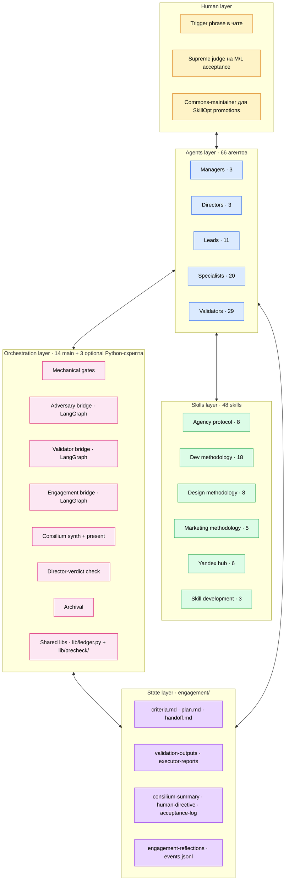
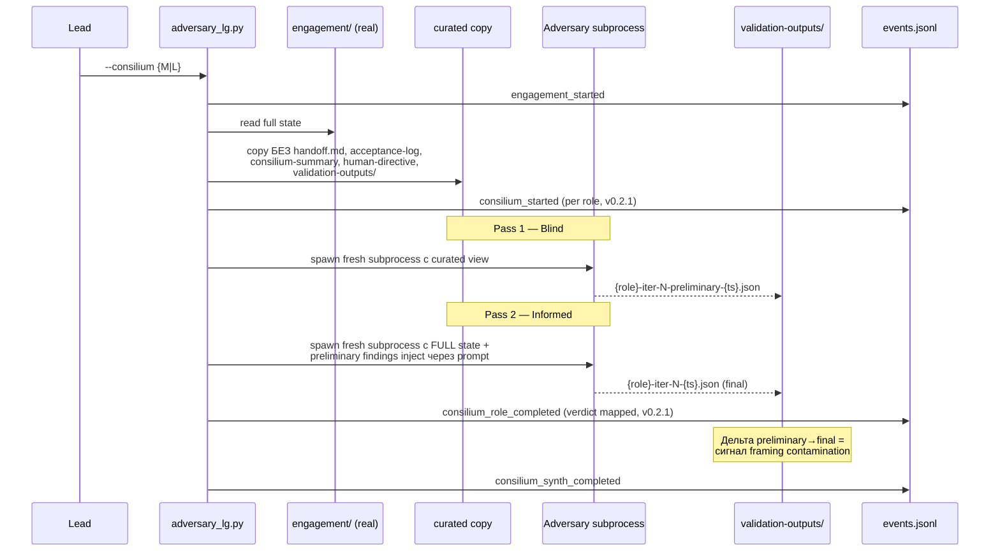
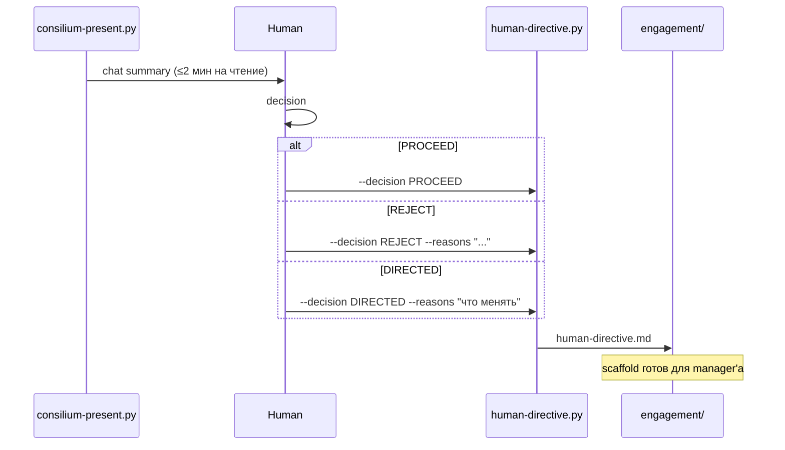
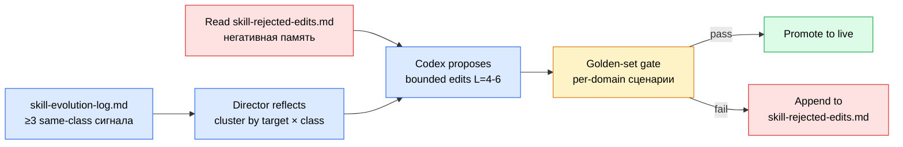
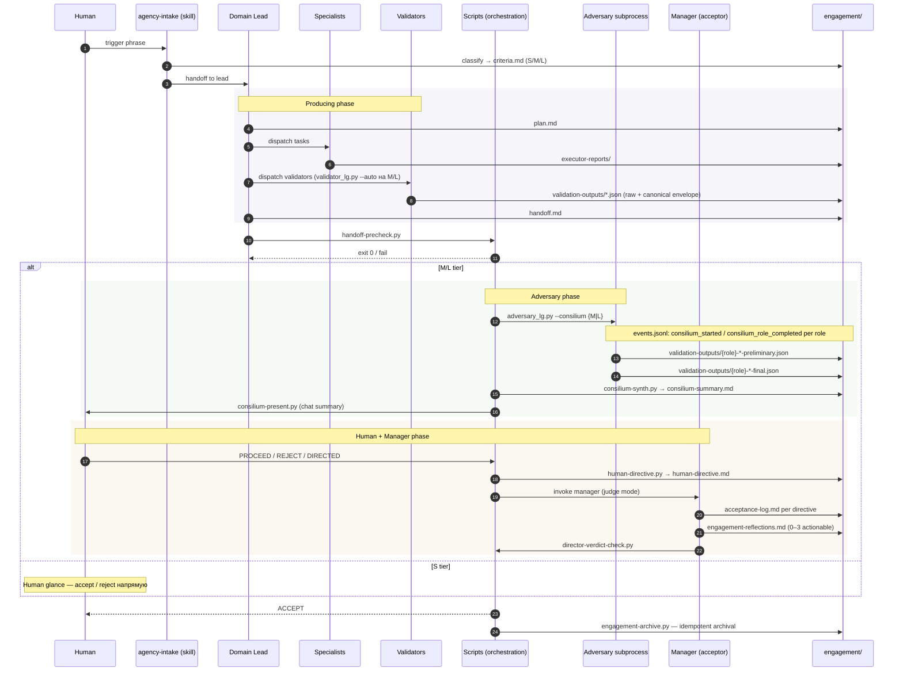

**Русский** · [English](./ARCHITECTURE.md)

# Архитектура — agentic-workflow

Глубокий разбор системы. Если README отвечает на вопрос «что это
делает», этот документ отвечает «как именно оно устроено внутри». Читай
сверху вниз: проблема → пять слоёв → ключевые механизмы → модель
состояния → flow.

> **v0.2.4 (2026-05-28):** Windows-compat bugfix — `claude.CMD`
> npm-wrapper обрезает multiline argv на первом переводе строки (CMD
> line-parsing); `subprocess.run(text=True)` декодирует UTF-8 русский
> как cp1251 на Russian-locale Windows; `consilium_synth_completed`
> ledger emit передавал raw natural verdict в схему ожидающую
> `ACCEPT/REJECT/DIRECTED`. Все три починены в 4 скриптах
> (`adversary_lg.py` / `validator_lg.py` / `engagement_lg.py` /
> `scripts/lib/precheck/common.py`): `find_claude_cmd()` резолвит
> `.CMD` → `claude.exe` через npm wrapper layout (Unix/macOS не
> затронуты); 10 `subprocess.run` сайтов получили `encoding="utf-8",
> errors="replace"`; inline `VERDICT_MAP` mirror per-role mapping в
> `_make_finalize_node`. Все `--invoker mock` тесты проходили pre-fix;
> латентный риск жил в real subscription mode непротестированном на
> Windows до того как real subscription mode их всплыл.
>
> **v0.2.3 (2026-05-28):** `engagement_lg.py` end-to-end по всем
> 11 узлам (Send fan-out на specialists,
> `validator_lg.py` + `adversary_lg.py` subprocess делегация, manager
> subprocess с парсингом canonical verdict, REJECT_NOW short-circuit,
> engagement-archive на ACCEPT). НОВЫЙ режим `--mock` (взаимоисключающий
> с `--real`) запускает реальные пути графа, но с canned subprocess
> wrappers — позволяет полный end-to-end smoke без claude CLI. 7
> путей verified на synthetic engagements. Полная дельта —
> [`CHANGELOG.md`](CHANGELOG.md).
>
> **v0.2.2 (2026-05-28):** инкрементальный — модульное разделение
> `handoff-precheck.py` в пакет `scripts/lib/precheck/` (8 топик-модулей);
> добавлен третий LangGraph движок `engagement_lg.py`,
> владеющий жизненным циклом engagement, с 8 узлами-плейсхолдерами, 3
> точками HITL-паузы и узлами intake/plan, подключёнными к
> `size-detect.py --auto-promote` + `claude -p --agent {domain}-lead`
> subprocess. 3 новых ledger payload types
> (`engagement_completed` / `phase_skipped` / `dryrun_marker`). Полная
> дельта v0.2.2 — [`CHANGELOG.md`](CHANGELOG.md).
>
> **v0.2.1 (2026-05-28):** этот документ отражает полное состояние v0.2
> + WAVE B+C. Основные сдвиги относительно v0.1: разделение acceptor /
> system-optimizer (`*-manager` ≠ `*-director`), инвариант разрешения
> конфликтов авторитета, слой per-engagement reflection, append-only
> event ledger (`engagement/events.jsonl`), канонический envelope
> валидаторов, tier-keyed dispatch валидаторов (`validator_lg.py --auto`
> default на M/L), critical-pause HITL в `validator_lg.py`. v0.2.1
> добавил per-role consilium-события в `adversary_lg.py`, паритет
> golden-сетов во всех 3 доменах и hot-path / cold-path разделение в 3
> тяжёлых skills.

## 1. Проблематика

Многоагентные пайплайны на одной модельной семье страдают тремя
системными патологиями:

1. **Framing contamination.** Когда одна модель играет несколько ролей
   (writer, reviewer, judge), у них одинаковые слепые зоны. «Второй
   проход тем же мозгом» даёт тот же ответ другими словами.

2. **Goodhart на validators.** Валидаторы вырождаются в format-gates,
   проверяют наличие полей вместо качества мышления. Планка дрейфует
   с «это правильно?» на «проходит ли проверку?».

3. **Undifferentiated rigour.** Правка кнопки и редизайн посадочной
   идут через тот же пайплайн с той же глубиной ревью. Мелкие задачи
   платят цену крупных, крупные не получают достаточного внимания.

Система решает их через:
- **Tier-aware dispatch** (S/M/L) — разная глубина ревью в зависимости
  от размера задачи
- **Filesystem-isolated adversary** в свежих subprocess'ах
- **Cross-family второе мнение** через Codex MCP (другая модельная
  семья = другие слепые зоны)
- **Человек как supreme judge** на одном критическом переходе
- **Разделение acceptor / optimizer** — `*-manager` принимает
  engagement'ы, `*-director` улучшает корпус (Codex предлагает правки,
  директор судит против golden-сета)
- **Event ledger** фиксирует полный жизненный цикл в
  `engagement/events.jsonl` для post-hoc replay и аналитики

## 2. Пять слоёв



Каждый слой имеет чёткую зону ответственности:

| Слой | Что делает | Что НЕ делает |
|---|---|---|
| **Human** | Триггерит intake, выносит supreme verdict на M/L, апрувит SkillOpt promotions | Не пишет markdown, не валидирует рутинно |
| **Agents** | Планируют, исполняют, судят, запускают SkillOpt loop (out-of-band) | Не пишут скрипты, не определяют tier'ы, manager'ы не диспатчат |
| **Skills** | Загружаются в agent context — методология, протоколы, tool guides | Не invокируются напрямую из чата; PROTOCOL skills экспонируют `triggers:` для лоадера |
| **Orchestration** | Mechanical gates, adversary bridge, consilium, event ledger | Не делает суждений о качестве контента |
| **State** | Хранит всё состояние engagement'а на FS — каждый факт в файле | Никакой логики — только схемы, whitelist, mutability rules |

## 3. Skills layer

Навыки — методологические референсы и протоколы. Загружаются в agent
context через `skills:` в frontmatter. По умолчанию у навыка **нет
chat-триггера**; PROTOCOL skills экспонируют `triggers:` frontmatter
field, читаемый лоадером.

### Категории

| Категория | # | Назначение |
|---|---|---|
| **Agency protocol** | 8 | Контракт agency-работы: схемы, lifecycle, gates, acceptance, system-optimization |
| **Dev methodology** | 18 | TDD, code review, spec planning, deploy, security |
| **Design methodology** | 8 | Brand, design system, UI/UX, presentation |
| **Marketing methodology** | 5 | SEO, semantic drift, AI visibility, task decomposition, benchmark research (standalone entry-point) |
| **Regional SEO/PPC stack** | 6 | API-интеграции для Russian-market analytics platforms |
| **Skill development** | 3 | Authoring и тестирование самих навыков |

### Frontmatter-теги для router'а

```yaml
---
name: code-writing
domain: dev
triggers:
  - "загружается каждым lead / manager / mid-lead через skills frontmatter"
description: |
  [METHODOLOGY] Universal quality coding process (plan, TDD, reviews).
---
```

| Тег | Значение |
|---|---|
| `[PROTOCOL]` | Обязательный контракт (читается агентами, не invокируется) |
| `[METHODOLOGY]` | Методологический референс (как делать работу правильно) |
| `[TOOL]` | Описание интеграции с конкретным инструментом |

### Ключевые protocol-skills

- `agency-intake` — единая точка входа. Классифицирует домен
  (dev/design/marketing), создаёт `criteria.md`, передаёт engagement
  соответствующему domain-lead.
- `engagement-protocol` — канонический контракт: схемы всех артефактов,
  whitelist путей, mutability rules, iteration budget, authority
  invariant.
- `acceptance-protocol` — методология per-engagement acceptance,
  используемая всеми `*-manager` агентами (tier-aware S/M/L verdict
  shape, эмиссия reflections).
- `system-optimization-protocol` — SkillOpt loop, используемый всеми
  `*-director` агентами (reflect → bounded edit → golden gate →
  promote / reject).
- `engagement-contract` — минимальный specialist-subset engagement-протокола;
  загружается 20 специалистами через frontmatter.
- `validation-pipeline` — какой валидатор когда запускать, в каком
  порядке, как логировать в `validation-log.md`; tier-keyed dispatch
  matrix + `validator_lg.py --auto` default на M/L.
- `docs-pipeline` — handling documentation-diff артефактов.
- `codex-bridge` — интеграция Codex CLI как MCP-сервера для
  cross-family adversary и image generation.

### Hot-path / cold-path разделение (v0.2.1)

Три тяжёлых skills имеют cold-секции перенесённые в on-demand
`references/{topic}.md` файлы:

- `engagement-protocol/SKILL.md` (1128 → 963 строк) + 7 references:
  `cross-domain`, `dangerous-ops`, `archival`, `ux-heavy`, `abort`,
  `resume`, `budget`.
- `ui-ux-methodology/SKILL.md` (664 → 347 строк) + 2 references:
  `quick-reference` (10 priority categories), `professional-ui-rules`
  (Common Rules + Pre-Delivery Checklist).
- `dev-methodology/SKILL.md` (441 → 351 строк) + 2 references:
  `skills-ecosystem`, `agents`.

Net effect: −572 строк на каждую загрузку engagement'а, который
подтягивает эти навыки; +515 строк припаркованы в references,
загружающихся только когда hot-path TL;DR указывает на релевантность
секции.

## 4. Agents layer

66 Claude Code subagent'ов в `~/.claude/agents/`. У каждого frontmatter
с `name`, `description`, `model`, `skills:`, `allowed-tools:`. В
зеркале агенты организованы в подкаталоги
`agents/{directors,leads,managers,specialists,validators}/`.

### Managers (3, НОВОЕ в v0.2)

`dev-manager`, `design-manager`, `marketing-manager`. Per-engagement
**acceptor**: судит между producer и adversary, никогда не планирует,
не диспатчит, не правит авторские артефакты, не запускает валидаторы
sweep-стилем.

| Действие | Manager |
|---|---|
| Читать `handoff.md`, `validation-outputs/*`, `consilium-summary.md`, `human-directive.md` | ✓ |
| Писать вердикт per directive в `acceptance-log.md` | ✓ (M/L only) |
| Adjudicate на каждое расхождение adversary↔author (`UPHELD` / `OVERRULED` / `DEFERRED`) | ✓ |
| Эмиссия 0–3 actionable reflections в `engagement-reflections.md` | ✓ (M/L only) |
| Диспатч работы | ✗ |
| Правка handoff content | ✗ |
| Sweep-style re-run валидаторов | ✗ |
| Targeted single validator re-run на L-tier при наличии gap'а в adversary findings | ✓ (max 1 per validator per iteration) |
| Возможные вердикты | ACCEPT / REJECT / ESCALATE |

На S-tier manager не задействован — producer self-attests + mechanical
checks + human glance.

### Directors (3, ПЕРЕПРОФИЛИРОВАНО в v0.2)

`dev-director`, `design-director`, `marketing-director`. Per-domain
**system-optimizer** (out-of-band, не per-engagement). Запускает
SkillOpt-loop эволюции навыков по накопленным REJECT/rework сигналам
из manager'овского `skill-evolution-log.md`:

1. **Reflect** — кластеризует сигналы по `target × class`
   (`rule_missing` / `rule_wrong` / `rule_ignored`); срабатывает только
   при ≥3 same-class сигналах.
2. **Codex предлагает bounded edits** (cross-family — убирает
   defend-bias). Edit budget L: 4–6 патчей за цикл, ≤10 строк каждый.
3. **Judge против golden-сета** — директор (не Codex) верифицирует,
   что правка не регрессирует ни один сценарий в
   `skills/system-optimization-protocol/golden/{domain}/`.
4. **Promote или reject.** Прошедшие правки промоутятся в `~/.claude/`
   дерево. Rejected попадают в `<your-memory>/skill-rejected-edits.md`
   (негативная память; читается перед следующим циклом).

Директор **никогда не пишет правки сам** — Codex это proposer, директор
это judge, человек — commons-maintainer для cross-domain промоушенов.

### Leads (11)

**Top-leads (3):** `dev-lead`, `design-lead`, `marketing-lead` —
основные планировщики для своих доменов. Получают intake от
`agency-intake`, планируют фазовое исполнение, диспатчат mid-leads
(когда применимо), запускают cross-cutting валидаторы, формируют
handoff.

**Mid-leads (8):**

| Lead | Track |
|---|---|
| `dev-product-lead` | discovery — research, specs |
| `dev-engineering-lead` | delivery — implementation |
| `dev-quality-lead` | validation, security audit, pre/post-deploy QA |
| `design-brand-lead` | brand voice, identity, guidelines |
| `design-product-design-lead` | UX + UI tracks |
| `marketing-traffic-lead` | SEO + PPC + keyword research |
| `marketing-content-lead` | copy, ad creative, banners |
| `marketing-analytics-lead` | Metrika, AI visibility, semantic drift |

Mid-leads tier-aware: запрещены на S, опциональны на M (используются
только когда ≥2 специалиста нужно координировать), обязательны на L.

### Specialists (20)

Исполнители. Получают атомарную задачу от lead'а, делают работу, сдают
отчёт в `engagement/executor-reports/`. Все 20 специалистов загружают
`engagement-contract` skill (6-bullet specialist-subset
engagement-протокола) через frontmatter.

- **Dev (8):** `dev-backend-engineer`, `dev-frontend-engineer`,
  `dev-fullstack-engineer`, `dev-devops-engineer`, `dev-qa-engineer`,
  `dev-tech-architect`, `dev-product-analyst`, `dev-technical-writer`
- **Design (5):** `design-ux-designer`, `design-ui-designer`,
  `design-visual-designer`, `design-brand-strategist`,
  `design-presentation-designer`
- **Marketing (7):** `marketing-copywriter`, `marketing-banner-designer`,
  `marketing-seo-specialist`, `marketing-ppc-specialist`,
  `marketing-keyword-researcher`, `marketing-web-analyst`,
  `marketing-ai-visibility-specialist`

### Validators (29)

Узкоспециализированные reviewers, которых lead вызывает с конкретной
целью. У каждого skill-binding с review-методологией и возвращают
структурированный JSON-отчёт в `engagement/validation-outputs/`. С v0.2
каждый output получает `canonical` envelope рядом с raw полями
(нормализованный verdict + severity + validator_type).

| Validator | Что проверяет |
|---|---|
| `code-reviewer` | Качество кода после implementation |
| `security-auditor` | OWASP Top 10, утечки секретов, auth flows |
| `accessibility-validator` | WCAG AA, ARIA, keyboard nav, contrast |
| `performance-validator` | N+1, memory leaks, hot paths |
| `migration-validator` | Безопасность DB-миграций (atomicity, rollback) |
| `test-reviewer` | Качество тестов и стратегии |
| `reality-checker` | Cross-check task-файлов против реального состояния кода |
| `skeptic` | Mirage detection — несуществующие файлы / функции / зависимости |
| `completeness-validator` | Двунаправленная trace spec → tasks |
| `task-validator` | Task-файл vs template compliance |
| `tech-spec-validator` | Tech-spec template compliance |
| `userspec-quality-validator` | Качество user-spec (структура, edge cases) |
| `userspec-adequacy-validator` | Адекватность решения под стек |
| `feasibility-assessor` | Валидация research verdict |
| `infrastructure-reviewer` | Качество setup'а (folder structure, hooks, Docker) |
| `deploy-reviewer` | CI/CD pipeline, secrets management |
| `pre-deploy-qa` | Acceptance testing до deploy |
| `post-deploy-qa` | Acceptance testing после deploy на live env |
| `interview-completeness-checker` | Полнота интервью в user-spec planning |
| `documentation-reviewer` | Качество project-knowledge документации |
| `prompt-reviewer` | Качество LLM-промптов |
| `anti-pattern-detector` | Скрытые failure modes в diff'ах |
| `ux-review` | Exercised narrative на ux-heavy engagement'ах |
| `code-researcher` | Codebase research для фичи (Layer 5) |
| `design-system-researcher` | Аудит существующего design-system перед редизайном (Layer 5) |
| `brand-context-researcher` | Аудит существующей brand-истории перед brand-работой (Layer 5) |
| `product-context-validator` | Cross-domain product coherence |
| `task-creator` | Генерация task-файлов из tech-spec |
| `skill-checker` | Skill compliance со стандартами `skill-authoring` |

## 5. Orchestration layer

14 main + 3 optional Python-скриптов в `~/.claude/scripts/`. Все скрипты
— **exit-code gates**: ненулевой exit блокирует пайплайн, без
промптов, без переговоров. **Без модельных суждений** — чистая
детерминистическая логика.

### Main (14)

| Скрипт | Назначение |
|---|---|
| `adversary_lg.py` | LangGraph adversary bridge — 5 reviewer-ролей, two-pass curated-view изоляция, `Send` fan-out, SQLite-checkpointed `--resume`, native HITL через `interrupt()`, event ledger подключён (lifecycle + per-role + early-return guards) |
| `validator_lg.py` | LangGraph atomic-validator fan-out через `Send`, retry edge, auto-plan из criteria.md predicates, `--resume`, native HITL через `--interrupt-on-critical`, канонический envelope, event ledger подключён (8 emit sites) |
| `engagement_lg.py` | LangGraph engagement-level оркестратор (v0.2.2+), владеющий полным жизненным циклом intake → plan → dispatch → validate → consilium → accept → archive. 11 узлов, включая `_barrier_dispatch_node` (sync после Send fan-out на specialists) + 3 точки HITL-паузы (`criteria_lock`, `danger_gate`, `human_directive`). Три режима выполнения: `--dry-run` (default, плейсхолдеры), `--mock` (реальные пути графа + canned subprocess артефакты — полный end-to-end smoke без claude CLI), `--real` (полный subprocess через `claude -p --agent X`). Делегирует `validator_lg.py` и `adversary_lg.py` как subprocess'ы (process isolation; промоут в sub-graphs отложен до field-data о накладных расходах). 4 новых ledger payload type: `engagement_completed`, `phase_skipped`, `dryrun_marker`. Event ledger подключён. |
| `consilium-synth.py` | Агрегация adversary outputs, two-stage dedup |
| `consilium-present.py` | Chat-ready format с decision menu для человека |
| `director-verdict-check.py` | Mechanical adjudication completeness (legacy name; в v0.2 проверяет `*-manager` verdict) |
| `handoff-precheck.py` | Tier-aware hard gate (S=6 / M=13 / L=21 checks), event ledger подключён (per-check emit) |
| `human-directive.py` | Scaffold `human-directive.md` из CLI args |
| `preflight.py` | Tools availability (Codex CLI, Python deps) |
| `danger-scan.py` | Реестр опасных операций (DROP TABLE, force-push, prod deploy) |
| `handoff-paths-check.py` | Phantom path detection |
| `cross-val-check.py` | Verbatim quote verification в §4a table |
| `trace-schema-check.py` | Trace JSON schema + staleness check |
| `size-detect.py` | Детектор tier'а на intake / runtime с `--auto-promote` |
| `engagement-archive.py` | Idempotent engagement archival |

### Shared библиотеки

- `lib/ledger.py` — append-only event ledger. Per-engagement
  `engagement/events.jsonl`. Schema v1 с 17 полями per event, 28
  KNOWN_PAYLOAD_TYPES, assert guards, forward-only с synthetic
  `legacy_import` событием для pre-ledger engagement'ов,
  replay-friendly schema versioning. Helpers: `emit_authority_conflict()`,
  `emit_skill_snapshot()`, `snapshot_skills()`, `hash_input()`.
- `lib/precheck/` — модульный precheck-пакет (v0.2.2). 8
  топик-модулей: `common` (константы, shared utilities), `criteria`
  (frontmatter validation), `handoff` (handoff.md structural checks),
  `iteration` (counter consistency), `validators`
  (validation-outputs/* presence and shape), `acceptance`
  (acceptance-log + director-verdict), `danger` (danger-scan registry),
  плюс `__init__` re-exports. `handoff-precheck.py` (1264 → 423 строки,
  CLI/dispatcher only) импортирует из этого пакета. Кластеризация по
  topic'ам — как менеджеры/leads думают о системе, не по mechanism'у.
  Byte-identical JSON output к pre-refactor монолиту на real engagement
  smoke.

### Optional (3)

`engagement-doctor.py`, `engagement-migrate.py`, `token-budget.py` —
opt-in утилиты вне основного протокола.

`adversary.py` (legacy stdlib-only bridge) был **удалён в v0.2** после
того как adversary_lg.py поглотил его функциональность и приехал
auto-synth pipeline. 5 dead optional скриптов (`cross-val-template`,
`director-sweep`, `metrics-summary`, `secondary-init`, `validator-retry`)
удалены в earlier cleanup.

## 6. State layer — директория engagement

Engagement — это директория. Состояние читается полностью с
файловой системы. Никаких баз, никаких внешних логов, никакого
conversation state — если факт важен, он живёт в файле.

### Whitelist путей (закрытый список)

```
engagement/
├── criteria.md                 # secretary, semi-immutable
├── scope-sync.md               # manager, optional, append-only
├── plan.md                     # lead, заморожен после первого dispatch
├── specs/                      # dev: user-spec / tech-spec / research-verdict
├── tasks/                      # все домены: атомарные task-файлы
├── tasks/INDEX.md              # обязательно если size: L
├── brand/                      # design only
├── design-system/              # design only
├── ui/                         # design only
├── executor-reports/           # специалисты, append-only
├── code-research.md            # ОПЦИОНАЛЬНО — code-researcher output
├── design-research.md          # ОПЦИОНАЛЬНО — design-system-researcher output
├── brand-research.md           # ОПЦИОНАЛЬНО — brand-context-researcher output
├── validation-log.md           # lead, append-only
├── validation-outputs/         # JSON proof-of-run для каждого валидатора (raw + canonical)
├── consilium-summary.md        # auto-write от consilium-synth.py (M/L)
├── human-directive.md          # обязательно на M/L
├── codex-outputs/              # Codex assets (опционально)
├── iteration                   # plain-text counter
├── screens/iter-N/             # обязательно для ux_heavy
├── traces/iter-N/              # JSON traces flow-логов
├── deploy-log.md               # dev only когда перешли deploy boundary
├── docs-diff.md                # только для docs pipeline
├── handoff.md                  # lead, ЗАМЕНЯЕТСЯ per iteration
├── acceptance-log.md           # manager, append-only
├── engagement-reflections.md   # manager, append-only на M/L verdict (0–3 actionable lessons)
└── events.jsonl                # append-only event ledger
```

Файлы **вне whitelist** — нарушение протокола. Red-flag check
manager'а делает `ls engagement/` — любой extraneous file = REJECT с
причиной «out-of-whitelist artefact».

### Mutability rules

| Артефакт | Mutability |
|---|---|
| `criteria.md` | semi-immutable (добавления/удаления — только user'ом через scope-sync) |
| `plan.md` | mutable до первого dispatch, потом frozen |
| `handoff.md` | заменяется целиком per iteration |
| `validation-log.md`, `acceptance-log.md`, `executor-reports/*.md`, `engagement-reflections.md`, `events.jsonl` | append-only |
| `validation-outputs/*.json` | immutable после записи |

## 7. Tier dispatch (S / M / L)

Tier определяется на intake из `criteria.md` frontmatter:

```yaml
---
engagement: <name>
domain: dev | design | marketing
size: S | M | L
ux_heavy: false | minor | true
tools_required: [...]
---
```

| Tier | Use case | Схема | Adversary | Manager | Validator dispatch | Mechanical checks |
|---|---|---|---|---|---|---|
| **S** | Hotfix, single deliverable | 4-section minimum | Нет | Нет | Manual parallel | 6 |
| **M** | Multi-specialist, mid-stakes | Full 11-section | 1× peer-opus | Judge mode | `validator_lg.py --auto` default | 13 |
| **L** | Cross-domain, high-stakes | Full + tasks INDEX | 5× consilium | Judge + adjudication | `validator_lg.py --auto` обязателен | 21 |

Tier выбирается на intake эвристиками: число задействованных
специалистов, cross-domain природа, ux-heavy flag, risk profile.
`size-detect.py --auto-promote` может промоутить tier (S→M, M→L;
никогда не понижает) когда engagement растёт за пределы изначальной
классификации.

## 8. Adversary protocol

Adversary запускается через `adversary_lg.py` — LangGraph `StateGraph` —
в **свежем subprocess'е** с **filesystem-curated view**. Two-pass дизайн
разделяет «что я сказал бы холодно?» от «что я сказал бы после
ознакомления с авторскими рассуждениями?». Граф моделирует reviewer
fan-out как `Send` edges и зависимость `codex-informed` как conditional
edge; `--resume` — artefact-driven, перезапускает только missing или
failed reviewer'ов.



### Реестр ролей (5)

| Роль | Модель | Scope |
|---|---|---|
| `peer-opus` | Anthropic Opus | Peer-level adversarial review |
| `codex-blind` | OpenAI GPT-5 (Codex CLI) | Полностью независимо, без prior findings |
| `codex-informed` | OpenAI GPT-5 (Codex CLI) | Читает peer-opus, фокусируется на gaps |
| `sonnet-scoped` | Anthropic Sonnet | «Средний человек», common-sense scope |
| `haiku-scoped` | Anthropic Haiku | Naive obvious-miss scope, format checks |

**Правило capability:** adversary никогда не слабее producer'а.

**Tier presets:**
- S = adversary не запускается
- M = только `peer-opus`
- L = все 5 ролей параллельно (cross-family disagreement detection)

### Event-ledger эмиссия

Каждый adversary-run пишет в `engagement/events.jsonl` через shared
`lib/ledger.py` shim. Lifecycle события: `engagement_started`,
`consilium_synth_completed`, `interrupt_paused/resumed`,
`human_directive_received`. Per-role события (v0.2.1):
`consilium_started` (перед two-pass), `consilium_role_completed`
(после two-pass; payload содержит verdict mapping
`satisfied → ACCEPT`, `rework_required` / `suspicious_too_clean` →
`REJECT`, `fail` → `REJECT`).

## 8.5 Engagement-level orchestration (engagement_lg.py)

Третий LangGraph-движок, добавлен в v0.2.2 и завершён в v0.2.3.
Владеет **полным жизненным циклом
engagement'а** от intake до archive — слой, который в v0.1 был
имплицитным (lead-агенты координировали работу только через
artefact-файлы). `engagement_lg.py` делает lifecycle explicit'ным как
`StateGraph` с checkpointable state, HITL-паузами и subprocess-делегацией
к двум phase-level engines (`validator_lg.py`, `adversary_lg.py`).

### State и граф узлов

```mermaid
flowchart TB
    START([START])
    INT[intake_node<br/>читает criteria.md + size-detect --auto-promote]
    CL{HITL: criteria_lock<br/>opt-in --interrupt-on-criteria}
    PLAN[plan_node<br/>claude -p --agent {domain}-lead<br/>пишет plan.md w/ specialists]
    DG{HITL: danger_gate<br/>условный на danger-scan findings}
    DISP[dispatch_node<br/>Send fan-out per specialist]
    SPEC[specialist_node<br/>parallel через Send<br/>claude -p --agent X]
    BAR[barrier_dispatch_node<br/>sync после specialist fan-out]
    VAL[validate_node<br/>subprocess validator_lg.py --auto]
    CONS[consilium_node<br/>subprocess adversary_lg.py --consilium TIER]
    HD{HITL: human_directive<br/>MANDATORY M/L после consilium}
    MGR[manager_accept_node<br/>claude -p --agent {domain}-manager<br/>пишет acceptance-log.md]
    ARCH[archive_node<br/>engagement-archive.py]
    END([END])

    START --> INT
    INT --> CL
    CL --> PLAN
    PLAN --> DG
    DG --> DISP
    DISP -->|Send per specialist| SPEC
    DISP -->|empty list| BAR
    SPEC --> BAR
    BAR --> VAL
    VAL -->|REJECT + iter<max| PLAN
    VAL -->|tier in {M,L}| CONS
    VAL -->|tier S| MGR
    CONS --> HD
    HD -->|REJECT_NOW| END
    HD --> MGR
    MGR -->|REJECT + iter<max| PLAN
    MGR -->|ACCEPT| ARCH
    MGR -->|ABORTED| END
    ARCH --> END

    classDef node fill:#dbeafe,stroke:#2563eb,color:#000
    classDef hitl fill:#fef3c7,stroke:#d97706,color:#000
    classDef term fill:#dcfce7,stroke:#16a34a,color:#000

    class INT,PLAN,DISP,SPEC,BAR,VAL,CONS,MGR,ARCH node
    class CL,DG,HD hitl
    class START,END term
```

State — 20-полевой `EngagementState` TypedDict: tier, domain, ux_heavy,
iter_n / iter_max, per-phase verdicts, specialist_results
(annotated `list + operator.add` reducer для безопасных parallel Send
branches), hitl_enabled, paused_at, human_directive, started_at,
last_phase_at, error, mock (bool, проpagates `--mock` CLI флаг в
subprocess wrappers).

### Три режима выполнения

| Режим | Что запускается | Когда использовать |
|---|---|---|
| `--dry-run` (default) | Плейсхолдеры скипают реальную работу; граф завершается детерминированно с skeleton ACCEPT verdicts | Smoke-test структуры графа / checkpointer / HITL wiring без расхода токенов |
| `--mock` | Реальные пути графа отрабатывают; subprocess wrappers пишут canned артефакты (plan.md, executor-reports, consilium-summary, acceptance-log) | End-to-end smoke на машине без `claude` CLI — валидирует полную state machine включая fan-out, barrier, rework loop, REJECT_NOW short-circuit |
| `--real` | Полный subprocess к `claude -p --agent X` + sibling LG скриптам | Production engagement |

`--real` и `--mock` взаимоисключающие (CLI parser error). Default
остаётся `--dry-run` пока первый real M-tier field test не промоутнет
`--real` в default.

### Subprocess делегация vs sub-graphs

`engagement_lg.py` вызывает `validator_lg.py` и `adversary_lg.py` как
**отдельные процессы** (subprocess delegation), не как in-process
sub-graphs. Обоснование:

1. **Crash isolation** — зависание или memory blowup в adversary не
   роняет engagement-level граф.
2. **Independent checkpointers** — каждый движок имеет свой SQLite
   файл; merge — отдельное design-решение.
3. **Observability через unified ledger** — все три движка emit'ят в
   тот же `engagement/events.jsonl` через shared `lib/ledger.py` shim.
   Cross-engine timeline реконструируется через `cat events.jsonl |
   jq`.
4. **Promotion path открыт** — когда subprocess overhead станет
   measurable bottleneck'ом (нужны field data), промоут в in-process
   sub-graph инкрементальный: обернуть существующий движок в
   `build_validator_subgraph()` factory и использовать
   `builder.add_node("validate", validator_subgraph)`.

### Точки HITL-паузы (3)

| Пауза | Когда | Default | Resume payload |
|---|---|---|---|
| `criteria_lock` | После intake, перед plan | OFF (`--interrupt-on-criteria` для enable) | `{decision: PROCEED \| ABORT}` |
| `danger_gate` | После plan, перед dispatch, только если danger-scan нашёл unauthorized ops | AUTO (только при findings) | `{decision: PROCEED, scope_sync_updated: true}` |
| `human_directive` | После consilium, перед manager_accept (M/L only) | MANDATORY M/L | `{decision: PROCEED_TO_VERDICT \| REJECT_NOW \| DIRECTED_VERDICT, note, reasons}` |

Все три используют `interrupt(payload)` primitive + `Command(resume=payload)`
паттерн, identical к `adversary_lg.py` `_interrupt_apply_directive_node`.

### Event ledger payload types добавлены

Три новых payload type в v0.2.2: `engagement_completed` (final, с
overall verdict + duration), `phase_skipped` (например consilium для
S-tier short-circuits с phase_skipped событием), `dryrun_marker`
(emit'ится на старте графа когда `--dry-run` чтобы skeleton runs
были visible в ledger).

## 9. Consilium synthesis (L-tier)

Когда 5 reviewer'ов закончили, outputs агрегируются через
`consilium-synth.py`:

**Stage 1 — Per-finding dedup.** Findings каждого reviewer'а
нормализуются в каноническую форму. Findings с высокой текстовой
similarity (configurable threshold) объединяются в кластеры.

**Stage 2 — Cluster-level voting.** Для каждого кластера скрипт
вычисляет:
- Сколько reviewer'ов подняли issue
- Severity distribution
- Consensus strength
- **Cross-family disagreement flag** — если Anthropic-семья и Codex
  расходятся, отдельный маркер для ручной проверки

Output — ранжированный `consilium-summary.md`:
- **Consensus findings** (≥3 reviewer'а согласны)
- **Outliers worth noting** (1 reviewer, но высокая severity)
- **Cross-family disagreements** (Anthropic vs OpenAI расходятся)

`consilium-present.py` форматирует synthesis в chat-ready summary с
decision menu — рассчитан на чтение <2 минут.

## 10. Человек как supreme judge

На M/L человек получает последнее слово на одной точке: после
consilium synthesis, перед manager verdict.



Human input быстрый, структурированный, минимальный — система сама
форматирует и расширяет. Юзер не пишет markdown, не структурирует
findings, не тегирует severity.

## 11. Manager как judge (M/L only)

На M/L per-engagement acceptor (`*-manager`) работает в **judge mode**.
Не диспатчит, не правит, не запускает валидаторы sweep-стилем.
Загружает `acceptance-protocol` skill, который кодирует tier-aware
verdict shape, reflection-emission constraint, и правила adjudication.

`director-verdict-check.py` enforces adjudication completeness
механически:
- Каждый adversary finding должен иметь decision marker в
  `acceptance-log.md`: `UPHELD` / `OVERRULED` / `DEFERRED` с
  обоснованием
- Каждая directive из `human-directive.md` должна иметь
  соответствующий acceptance-log item
- Любой missed finding → exit 1, manager переписывает verdict

Validator re-runs разрешены только на L-tier и только если adversary
finding явно идентифицирует gap в validator coverage. Максимум 1
re-run per validator per iteration.

После verdict manager аппендит **0–3 reflections** в
`engagement-reflections.md` — actionable lessons, каждый таргетирует
конкретное правило skill/agent (`target = skills/X | agents/Y` +
`class = rule_missing | rule_wrong | rule_ignored`). Zero reflections
— валидный исход (generic observations отбрасываются). Они кормят
ежемесячный reflection sweep директора, выявляя sub-threshold
паттерны, накопившиеся через engagement'ы.

## 12. Director как system-optimizer (out-of-band)

Роль `*-director` **не** часть никакого engagement'а. Запускает
SkillOpt-стилизованный skill-evolution loop по накопленным сигналам
из manager-emitted `skill-evolution-log.md` записей:



Паритет golden-сетов по доменам (v0.2.1):

| Домен | Сценарии | Failure classes покрыты |
|---|---|---|
| `golden/dev/` | 3 (spec-code-drift / flaky-test-masking / security-gap) | rule_ignored / rule_missing / rule_wrong |
| `golden/design/` | 3 (token-drift / aria-missing / dark-contrast-fail) | rule_ignored / rule_missing / rule_wrong |
| `golden/marketing/` | 3 (keyword-undercount / SEO-claim-uncited / brand-voice-pronoun) | rule_ignored / rule_missing / rule_wrong |

Реальный цикл запускается только когда ≥3 реальных сигнала одного
класса накопились в `<your-memory>/skill-evolution-log.md`. Synthetic
dry-run на dev-домене (Codex предложил 3 правки, judge принял 2, 1
попала в rejection buffer) задокументирован в
memory проекта.

## 13. Mechanical gates

Набор hard mechanical-чеков работает на каждом переходе. Все
детерминистические, exit-code based, без model judgment.

| Gate | Что делает | Когда срабатывает |
|---|---|---|
| `preflight.py` | Tools availability (Codex CLI, Python deps) | Перед любым adversary-run |
| `danger-scan.py` | Реестр опасных операций | Перед specialist dispatch |
| `handoff-precheck.py` | Tier-aware structural verification | Lead → Manager |
| `handoff-paths-check.py` | Phantom path detection | Часть precheck'а |
| `cross-val-check.py` | Verbatim quote verification | precheck (M/L) |
| `trace-schema-check.py` | Trace JSON schema + staleness | precheck (ux_heavy) |
| `director-verdict-check.py` | Adjudication completeness | После manager verdict |
| `size-detect.py --auto-promote` | Tier-промоушен когда engagement растёт | Периодически во время исполнения |

Ненулевой exit на любом gate блокирует пайплайн. Fail = stop, fix =
retry.

## 14. Iteration budget и эскалация

Iteration budget **root-cause-based**, а не slot-based:

| Подход | Что происходит |
|---|---|
| Slot-based («3 попытки, затем escalate») | Budget gaming — агенты пробуют лёгкие правки первыми, жгут слоты |
| **Root-cause-based** («тот же root cause дважды → escalate») | Заставляет реально работать с underlying issue |

Реализация: `validation-outputs/*.json` несут `root_cause` тег (часть
canonical envelope), переживающий через iteration'ы. Mechanical
слой детектирует повторяющиеся root causes и триггерит эскалацию
независимо от счётчика попыток.

Стандартный лимит: **2 rework rounds на M, 3 на L**. После hard limit
escalate к user'у со scope-sync proposal.

## 15. Authority and conflict resolution invariant

Письменная 7-rule precedence решает любое расхождение между
источниками поведения. Живёт в `engagement-protocol/SKILL.md`:

1. **Нормативная precedence** (highest → lowest):
   `CLAUDE.md` > explicit judge decision > `criteria.md` > PROTOCOL
   skills > METHODOLOGY skills > agent body > frontmatter.
2. `criteria.md` может добавлять scope / quality bars, но не может
   отменить mandatory PROTOCOL gates без explicit judge waiver.
3. Frontmatter имеет нулевой behavioral authority — только декларирует
   что должно быть загружено.
4. Agent body может специализировать поведение только там, где loaded
   skills молчат; никогда не override'ит на same topic.
5. Между same-tier skills narrower scope wins, если не ослабляет
   mandatory check; в этом случае выигрывает stricter rule.
6. Неразрешённые конфликты — blocking `authority_conflict` события в
   `events.jsonl`; human judge решает до продолжения execution'а.
7. Каждый engagement снапшотит loaded skill names + versions + content
   hashes на старте; mid-engagement edits не применяются до следующей
   фазы (или judge approval, ledgered).

## 16. Audit trail через filesystem state + event ledger

Директория engagement'а ЕСТЬ audit trail. Картина восстанавливается
через `cat` + один ledger replay:

| Источник | Что показывает |
|---|---|
| `iteration` (plain-text counter) | Сколько итераций прошло |
| `validation-log.md` | Какие validator'ы запускались, с каким verdict |
| `validation-outputs/*.json` | JSON proof-of-runs (raw + canonical envelope) |
| `consilium-summary.md` | Что нашёл consilium на M/L |
| `human-directive.md` | Что решил человек |
| `acceptance-log.md` | Append-only история всех manager verdicts |
| `engagement-reflections.md` | Per-engagement reflections, кормящие SkillOpt |
| `executor-reports/*.md` | Что делал каждый specialist |
| `events.jsonl` | Append-only event ledger: phases, validator'ы, interrupts, verdicts, reflections, authority conflicts |

Система **inspectable, debuggable, diff-able в git**, и работает без
дополнительной инфраструктуры. Event ledger — primary observability
surface, читается через `scripts/lib/ledger.py` API или парсингом
JSONL напрямую.

## 17. Anti-patterns, которые система блокирует

| Anti-pattern | Mechanism блокировки |
|---|---|
| **Validator sweep theatre** — sweep-style «re-run everything» | Re-runs только point-targeted, с явным обоснованием через adversary finding |
| **Phantom claims в handoff** — ссылки на несуществующие файлы | `handoff-paths-check.py` + `skeptic` validator |
| **Manager-rewrite авторских артефактов** | Manager пишет только verdict + reflections; handoff content вне доступа |
| **Director пишет правки в skills напрямую** | Codex предлагает, director судит; director никогда не пишет правки сам |
| **Out-of-whitelist файлы в engagement/** | `ls engagement/` сверяется со whitelist; любой extraneous file = REJECT |
| **Format-first validation** | Validator'ы проверяют root causes; формат вынесен в отдельный mechanical слой; canonical envelope enforces normalization verdict / severity |
| **Vector-only communication** | Findings передаются полным текстом; dedup через textual similarity |
| **Silent rule drift mid-engagement** | Authority invariant rule 7: engagement снапшотит loaded skills на старте |
| **Mid-lead routing для 1-specialist работы** | Tier-aware политика: mid-leads запрещены на S, опциональны на M, обязательны на L |
| **Reflection bloat** | Per-engagement reflection strict constraint: `target = skill/agent rule`, `class ∈ {rule_missing, rule_wrong, rule_ignored}`. Zero reflections валидно. |

## 18. Точка входа и flow

Единая точка входа для agency-работы — trigger phrase в чате.
Английский и русский распознаются:

```
agency task: <описание>
```
или
```
мне надо агенси задачу <описание>
```

Standalone-возможности имеют отдельные триггеры:
- `мне надо провести исследование` / `benchmark research` — invокирует
  `benchmark-research` skill (industry reverse-engineering).
- `прогнать skill-evolution` / `skill evolution cycle` — invокирует
  соответствующего domain-директора для запуска SkillOpt-цикла на
  накопленных сигналах.

Добавляй или меняй формулировки в `Use when:` списке навыка
`agency-intake`, чтобы совпадали со словарём твоей команды.

Дальше система автономно проводит engagement через все слои:



S-tier пропускает adversary, consilium и manager phase: producer
self-attests, mechanical checks гейтят, человек принимает напрямую.

M-tier добавляет 1× peer-opus adversary, manager-judge phase, и 0–3
post-verdict reflections.

L-tier добавляет полный 5-role consilium, cross-family adjudication в
manager verdict, и tasks INDEX как обязательный артефакт.

Director (`*-director`) **не** часть этого flow — запускает SkillOpt
loop out-of-band когда ≥3 same-class сигнала накопились.
