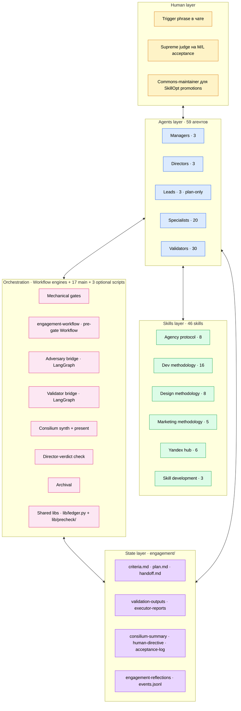
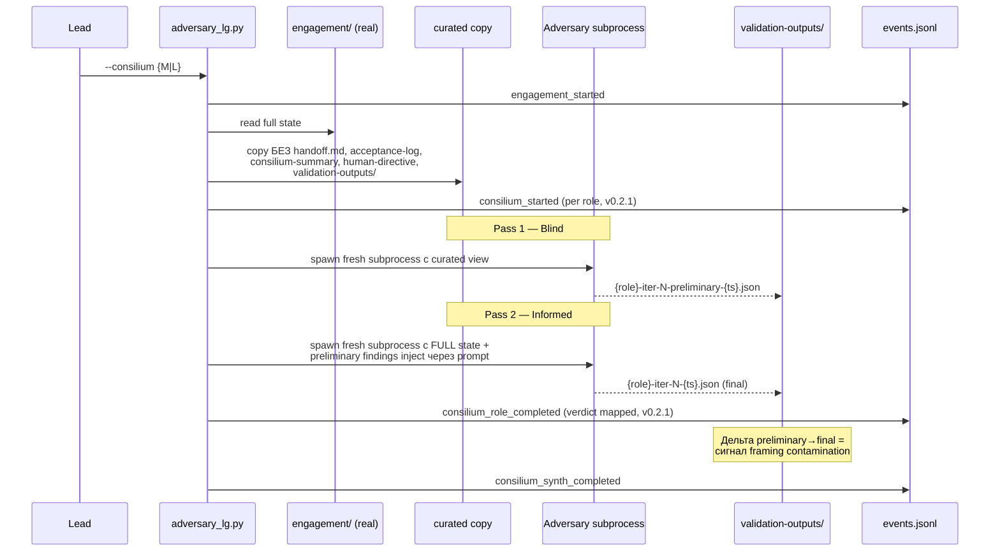
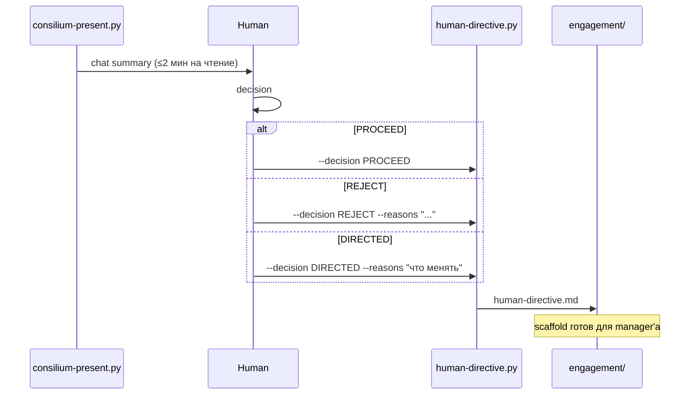
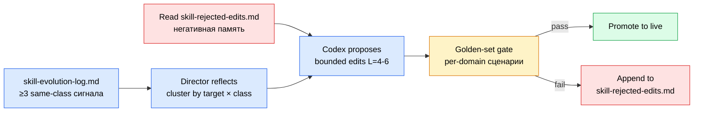
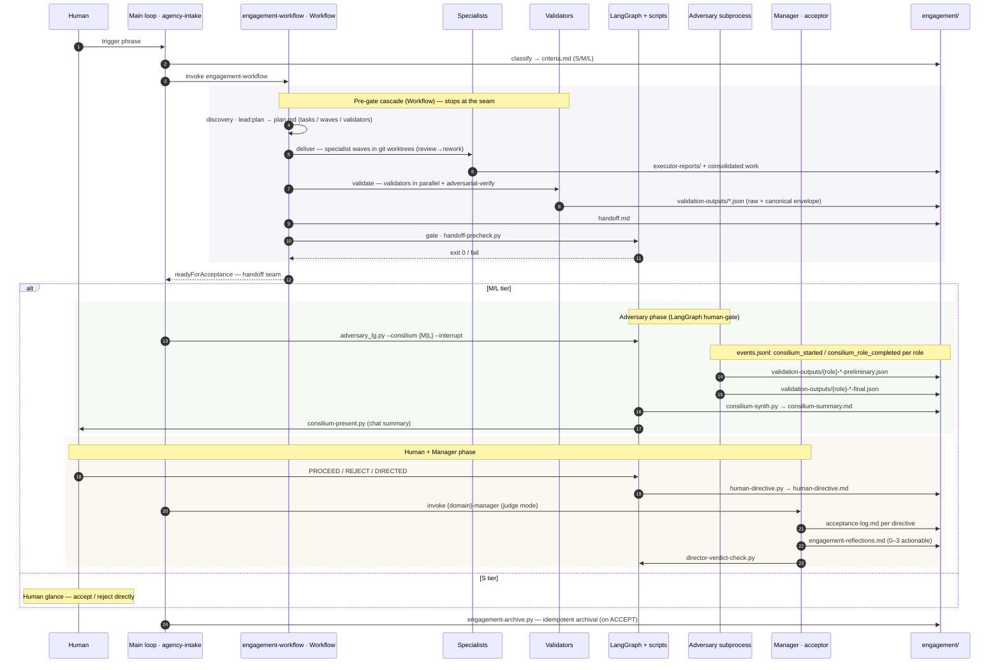

**Русский** · [English](./ARCHITECTURE.md)

# Архитектура — agentic-workflow

Глубокий разбор системы. Если README отвечает на вопрос «что это
делает», этот документ отвечает «как именно оно устроено внутри». Читай
сверху вниз: проблема → пять слоёв → ключевые механизмы → модель
состояния → flow.

> **v0.4 (2026-06-11):** движок pre-gate **engagement-workflow** получает
> opt-in **activation-флаги** (`args.A`), каждый default-OFF и byte-inert
> при выключении — `consGuard`, `repoPortable`, `contracts`, `replan`,
> `renderEval`, `cheapTiers` (см. §8.5). Плюс skill `acceptance-protocol`
> разделён на хаб + 6 references, счётчики precheck скорректированы
> (S=6 / M=13 / L=21), conductor-side эмиссия `events.jsonl` для pre-gate
> каскада и новый валидатор `render-eval` (59 агентов · 30 валидаторов).
> См. [`CHANGELOG.md`](CHANGELOG.md).
>
> **v0.3 (2026-06-05):** pre-gate каскад (plan → deliver → validate
> → handoff → gate) теперь оформлен как Workflow **engagement-workflow**,
> проводимый основным циклом и останавливающийся на шве handoff;
> LangGraph human-gate (consilium → directive → manager acceptance)
> остаётся активным путём после шва. Domain-lead'ы теперь
> planning-only (шаг `lead:plan`); координация специалистов структурна
> — закодирована как waves в плане lead'а. См. §8.5 и
> [`CHANGELOG.md`](CHANGELOG.md).
>
> **v0.2.4 (2026-05-28):** Windows-compat bugfix — `claude.CMD`
> npm-wrapper обрезает multiline argv на первом переводе строки (CMD
> line-parsing); `subprocess.run(text=True)` декодирует UTF-8 русский
> как cp1251 на Russian-locale Windows; `consilium_synth_completed`
> ledger emit передавал raw natural verdict в схему ожидающую
> `ACCEPT/REJECT/DIRECTED`. Все три починены в 4 скриптах
> (`adversary_lg.py` / `validator_lg.py` / `engagement_lg.py` /
> `scripts/lib/precheck/common.py`): `find_claude_cmd()` резолвит
> `.CMD` → `claude.exe` через npm wrapper layout (Unix/macOS не
> затронуты); 10 `subprocess.run` сайтов получили `encoding="utf-8",
> errors="replace"`; inline `VERDICT_MAP` mirror per-role mapping в
> `_make_finalize_node`. Все `--invoker mock` тесты проходили pre-fix;
> латентный риск жил в real subscription mode непротестированном на
> Windows до того как real subscription mode их всплыл.
>
> **v0.2.3 (2026-05-28):** `engagement_lg.py` end-to-end по всем
> 11 узлам (Send fan-out на specialists,
> `validator_lg.py` + `adversary_lg.py` subprocess делегация, manager
> subprocess с парсингом canonical verdict, REJECT_NOW short-circuit,
> engagement-archive на ACCEPT). НОВЫЙ режим `--mock` (взаимоисключающий
> с `--real`) запускает реальные пути графа, но с canned subprocess
> wrappers — позволяет полный end-to-end smoke без claude CLI. 7
> путей verified на synthetic engagements. Полная дельта —
> [`CHANGELOG.md`](CHANGELOG.md).
>
> **v0.2.2 (2026-05-28):** инкрементальный — модульное разделение
> `handoff-precheck.py` в пакет `scripts/lib/precheck/` (8 топик-модулей);
> добавлен третий LangGraph движок `engagement_lg.py`,
> владеющий жизненным циклом engagement, с 8 узлами-плейсхолдерами, 3
> точками HITL-паузы и узлами intake/plan, подключёнными к
> `size-detect.py --auto-promote` + `claude -p --agent {domain}-lead`
> subprocess. 3 новых ledger payload types
> (`engagement_completed` / `phase_skipped` / `dryrun_marker`). Полная
> дельта v0.2.2 — [`CHANGELOG.md`](CHANGELOG.md).
>
> **v0.2.1 (2026-05-28):** этот документ отражает полное состояние v0.2
> + refinement. Основные сдвиги относительно v0.1: разделение acceptor /
> system-optimizer (`*-manager` ≠ `*-director`), инвариант разрешения
> конфликтов авторитета, слой per-engagement reflection, append-only
> event ledger (`engagement/events.jsonl`), канонический envelope
> валидаторов, tier-keyed dispatch валидаторов (`validator_lg.py --auto`
> default на M/L), critical-pause HITL в `validator_lg.py`. v0.2.1
> добавил per-role consilium-события в `adversary_lg.py`, паритет
> golden-сетов во всех 3 доменах и hot-path / cold-path разделение в 3
> тяжёлых skills.

## 1. Проблематика

Многоагентные пайплайны на одной модельной семье страдают тремя
системными патологиями:

1. **Framing contamination.** Когда одна модель играет несколько ролей
   (writer, reviewer, judge), у них одинаковые слепые зоны. «Второй
   проход тем же мозгом» даёт тот же ответ другими словами.

2. **Goodhart на validators.** Валидаторы вырождаются в format-gates,
   проверяют наличие полей вместо качества мышления. Планка дрейфует
   с «это правильно?» на «проходит ли проверку?».

3. **Undifferentiated rigour.** Правка кнопки и редизайн посадочной
   идут через тот же пайплайн с той же глубиной ревью. Мелкие задачи
   платят цену крупных, крупные не получают достаточного внимания.

Система решает их через:
- **Tier-aware dispatch** (S/M/L) — разная глубина ревью в зависимости
  от размера задачи
- **Filesystem-isolated adversary** в свежих subprocess'ах
- **Cross-family второе мнение** через Codex MCP (другая модельная
  семья = другие слепые зоны)
- **Человек как supreme judge** на одном критическом переходе
- **Разделение acceptor / optimizer** — `*-manager` принимает
  engagement'ы, `*-director` улучшает корпус (Codex предлагает правки,
  директор судит против golden-сета)
- **Event ledger** фиксирует полный жизненный цикл в
  `engagement/events.jsonl` для post-hoc replay и аналитики

## 2. Пять слоёв


```mermaid
flowchart TB
    subgraph Human ["Human layer"]
        H1[Trigger phrase в чате]
        H2[Supreme judge на M/L acceptance]
        H3[Commons-maintainer для SkillOpt promotions]
    end

    subgraph Agents ["Agents layer · 59 агентов"]
        AM[Managers · 3]
        AD[Directors · 3]
        AL[Leads · 3 · plan-only]
        AS[Specialists · 20]
        AV[Validators · 30]
    end

    subgraph Skills ["Skills layer · 46 skills"]
        SK1[Agency protocol · 8]
        SK2[Dev methodology · 16]
        SK3[Design methodology · 8]
        SK4[Marketing methodology · 5]
        SK5[Yandex hub · 6]
        SK6[Skill development · 3]
    end

    subgraph Orch ["Orchestration · Workflow engines + 17 main + 3 optional scripts"]
        O1[Mechanical gates]
        O2[engagement-workflow · pre-gate Workflow]
        O3[Adversary bridge · LangGraph]
        O4[Validator bridge · LangGraph]
        O5[Consilium synth + present]
        O6[Director-verdict check]
        O7[Archival]
        O8[Shared libs · lib/ledger.py + lib/precheck/]
    end

    subgraph State ["State layer · engagement/"]
        ST1[criteria.md · plan.md · handoff.md]
        ST2[validation-outputs · executor-reports]
        ST3[consilium-summary · human-directive · acceptance-log]
        ST4[engagement-reflections · events.jsonl]
    end

    Human <--> Agents
    Agents <--> Skills
    Agents <--> Orch
    Orch <--> State
    Agents <--> State

    classDef human fill:#fef3c7,stroke:#d97706,color:#000
    classDef agents fill:#dbeafe,stroke:#2563eb,color:#000
    classDef skills fill:#dcfce7,stroke:#16a34a,color:#000
    classDef orch fill:#fce7f3,stroke:#db2777,color:#000
    classDef state fill:#e9d5ff,stroke:#9333ea,color:#000

    class H1,H2,H3 human
    class AM,AD,AL,AS,AV agents
    class SK1,SK2,SK3,SK4,SK5,SK6 skills
    class O1,O2,O3,O4,O5,O6,O7,O8 orch
    class ST1,ST2,ST3,ST4 state
```

Каждый слой имеет чёткую зону ответственности:

| Слой | Что делает | Что НЕ делает |
|---|---|---|
| **Human** | Триггерит intake, выносит supreme verdict на M/L, апрувит SkillOpt promotions | Не пишет markdown, не валидирует рутинно |
| **Agents** | Планируют, исполняют, судят, запускают SkillOpt loop (out-of-band) | Не пишут скрипты, не определяют tier'ы; lead'ы планируют, но не диспатчат (это делает engagement-workflow), manager'ы не диспатчат |
| **Skills** | Загружаются в agent context — методология, протоколы, tool guides | Не invокируются напрямую из чата; PROTOCOL skills экспонируют `triggers:` для лоадера |
| **Orchestration** | Mechanical gates, adversary bridge, consilium, event ledger | Не делает суждений о качестве контента |
| **State** | Хранит всё состояние engagement'а на FS — каждый факт в файле | Никакой логики — только схемы, whitelist, mutability rules |

## 3. Skills layer

Навыки — методологические референсы и протоколы. Загружаются в agent
context через `skills:` в frontmatter. По умолчанию у навыка **нет
chat-триггера**; PROTOCOL skills экспонируют `triggers:` frontmatter
field, читаемый лоадером.

### Категории

| Категория | # | Назначение |
|---|---|---|
| **Agency protocol** | 8 | Контракт agency-работы: схемы, lifecycle, gates, acceptance, system-optimization |
| **Dev methodology** | 16 | TDD, code review, spec planning, deploy, security |
| **Design methodology** | 8 | Brand, design system, UI/UX, presentation |
| **Marketing methodology** | 5 | SEO, semantic drift, AI visibility, task decomposition, benchmark research (standalone entry-point) |
| **Regional SEO/PPC stack** | 6 | API-интеграции для Russian-market analytics platforms |
| **Skill development** | 3 | Authoring и тестирование самих навыков |

### Frontmatter-теги для router'а

```yaml
---
name: code-writing
domain: dev
triggers:
  - "загружается каждым lead / manager через skills frontmatter"
description: |
  [METHODOLOGY] Universal quality coding process (plan, TDD, reviews).
---
```

| Тег | Значение |
|---|---|
| `[PROTOCOL]` | Обязательный контракт (читается агентами, не invокируется) |
| `[METHODOLOGY]` | Методологический референс (как делать работу правильно) |
| `[TOOL]` | Описание интеграции с конкретным инструментом |

### Ключевые protocol-skills

- `agency-intake` — единая точка входа. Классифицирует домен
  (dev/design/marketing), создаёт `criteria.md`, передаёт engagement
  соответствующему domain-lead.
- `engagement-protocol` — канонический контракт: схемы всех артефактов,
  whitelist путей, mutability rules, iteration budget, authority
  invariant.
- `acceptance-protocol` — методология per-engagement acceptance,
  используемая всеми `*-manager` агентами (tier-aware S/M/L verdict
  shape, эмиссия reflections).
- `system-optimization-protocol` — SkillOpt loop, используемый всеми
  `*-director` агентами (reflect → bounded edit → golden gate →
  promote / reject).
- `engagement-contract` — минимальный specialist-subset engagement-протокола;
  загружается 20 специалистами через frontmatter.
- `validation-pipeline` — какой валидатор когда запускать, в каком
  порядке, как логировать в `validation-log.md`; tier-keyed dispatch
  matrix + `validator_lg.py --auto` default на M/L.
- `docs-pipeline` — handling documentation-diff артефактов.
- `codex-bridge` — интеграция Codex CLI как MCP-сервера для
  cross-family adversary и image generation.

### Hot-path / cold-path разделение (v0.2.1)

Три тяжёлых skills имеют cold-секции перенесённые в on-demand
`references/{topic}.md` файлы:

- `engagement-protocol/SKILL.md` (1128 → 963 строк) + 7 references:
  `cross-domain`, `dangerous-ops`, `archival`, `ux-heavy`, `abort`,
  `resume`, `budget`.
- `ui-ux-methodology/SKILL.md` (664 → 347 строк) + 2 references:
  `quick-reference` (10 priority categories), `professional-ui-rules`
  (Common Rules + Pre-Delivery Checklist).
- `dev-methodology/SKILL.md` (441 → 351 строк) + 2 references:
  `skills-ecosystem`, `agents`.

Net effect: −572 строк на каждую загрузку engagement'а, который
подтягивает эти навыки; +515 строк припаркованы в references,
загружающихся только когда hot-path TL;DR указывает на релевантность
секции.

## 4. Agents layer

59 Claude Code subagent'ов в `~/.claude/agents/`. У каждого frontmatter
с `name`, `description`, `model`, `skills:`, `allowed-tools:`. В
зеркале агенты организованы в подкаталоги
`agents/{directors,leads,managers,specialists,validators}/`.

### Managers (3, НОВОЕ в v0.2)

`dev-manager`, `design-manager`, `marketing-manager`. Per-engagement
**acceptor**: судит между producer и adversary, никогда не планирует,
не диспатчит, не правит авторские артефакты, не запускает валидаторы
sweep-стилем.

| Действие | Manager |
|---|---|
| Читать `handoff.md`, `validation-outputs/*`, `consilium-summary.md`, `human-directive.md` | ✓ |
| Писать вердикт per directive в `acceptance-log.md` | ✓ (M/L only) |
| Adjudicate на каждое расхождение adversary↔author (`UPHELD` / `OVERRULED` / `DEFERRED`) | ✓ |
| Эмиссия 0–3 actionable reflections в `engagement-reflections.md` | ✓ (M/L only) |
| Диспатч работы | ✗ |
| Правка handoff content | ✗ |
| Sweep-style re-run валидаторов | ✗ |
| Targeted single validator re-run на L-tier при наличии gap'а в adversary findings | ✓ (max 1 per validator per iteration) |
| Возможные вердикты | ACCEPT / REJECT / ESCALATE |

На S-tier manager не задействован — producer self-attests + mechanical
checks + human glance.

### Directors (3, ПЕРЕПРОФИЛИРОВАНО в v0.2)

`dev-director`, `design-director`, `marketing-director`. Per-domain
**system-optimizer** (out-of-band, не per-engagement). Запускает
SkillOpt-loop эволюции навыков по накопленным REJECT/rework сигналам
из manager'овского `skill-evolution-log.md`:

1. **Reflect** — кластеризует сигналы по `target × class`
   (`rule_missing` / `rule_wrong` / `rule_ignored`); срабатывает только
   при ≥3 same-class сигналах.
2. **Codex предлагает bounded edits** (cross-family — убирает
   defend-bias). Edit budget L: 4–6 патчей за цикл, ≤10 строк каждый.
3. **Judge против golden-сета** — директор (не Codex) верифицирует,
   что правка не регрессирует ни один сценарий в
   `skills/system-optimization-protocol/golden/{domain}/`.
4. **Promote или reject.** Прошедшие правки промоутятся в `~/.claude/`
   дерево. Rejected попадают в `<your-memory>/skill-rejected-edits.md`
   (негативная память; читается перед следующим циклом).

Директор **никогда не пишет правки сам** — Codex это proposer, директор
это judge, человек — commons-maintainer для cross-domain промоушенов.

### Leads (3)

`dev-lead`, `design-lead`, `marketing-lead` — **planning-only**. Каждый
является шагом `lead:plan` внутри `engagement-workflow`: читает
`criteria.md` и возвращает план — специалистов, валидаторов и задачи,
сгруппированные в **waves** с зависимостями. Lead НЕ диспатчит; Workflow-скрипт
раскидывает специалистов по `task.owner`, wave за wave (задачи одного
wave идут параллельно на непересекающихся файлах; более поздний wave
может зависеть от более раннего). Координация, которую иначе обеспечивал
бы отдельный координаторский слой, здесь **структурна** — закодирована
как группировка по waves в плане, так что сложность tier'а масштабируется
добавлением waves, а не добавлением routing-слоя.

### Specialists (20)

Исполнители. Получают атомарную задачу от lead'а, делают работу, сдают
отчёт в `engagement/executor-reports/`. Все 20 специалистов загружают
`engagement-contract` skill (6-bullet specialist-subset
engagement-протокола) через frontmatter.

- **Dev (8):** `dev-backend-engineer`, `dev-frontend-engineer`,
  `dev-fullstack-engineer`, `dev-devops-engineer`, `dev-qa-engineer`,
  `dev-tech-architect`, `dev-product-analyst`, `dev-technical-writer`
- **Design (5):** `design-ux-designer`, `design-ui-designer`,
  `design-visual-designer`, `design-brand-strategist`,
  `design-presentation-designer`
- **Marketing (7):** `marketing-copywriter`, `marketing-banner-designer`,
  `marketing-seo-specialist`, `marketing-ppc-specialist`,
  `marketing-keyword-researcher`, `marketing-web-analyst`,
  `marketing-ai-visibility-specialist`

### Validators (30)

Узкоспециализированные reviewers, которых lead вызывает с конкретной
целью. У каждого skill-binding с review-методологией и возвращают
структурированный JSON-отчёт в `engagement/validation-outputs/`. С v0.2
каждый output получает `canonical` envelope рядом с raw полями
(нормализованный verdict + severity + validator_type).

| Validator | Что проверяет |
|---|---|
| `code-reviewer` | Качество кода после implementation |
| `security-auditor` | OWASP Top 10, утечки секретов, auth flows |
| `accessibility-validator` | WCAG AA, ARIA, keyboard nav, contrast |
| `performance-validator` | N+1, memory leaks, hot paths |
| `migration-validator` | Безопасность DB-миграций (atomicity, rollback) |
| `test-reviewer` | Качество тестов и стратегии |
| `reality-checker` | Cross-check task-файлов против реального состояния кода |
| `skeptic` | Mirage detection — несуществующие файлы / функции / зависимости |
| `completeness-validator` | Двунаправленная trace spec → tasks |
| `task-validator` | Task-файл vs template compliance |
| `tech-spec-validator` | Tech-spec template compliance |
| `userspec-quality-validator` | Качество user-spec (структура, edge cases) |
| `userspec-adequacy-validator` | Адекватность решения под стек |
| `feasibility-assessor` | Валидация research verdict |
| `infrastructure-reviewer` | Качество setup'а (folder structure, hooks, Docker) |
| `deploy-reviewer` | CI/CD pipeline, secrets management |
| `pre-deploy-qa` | Acceptance testing до deploy |
| `post-deploy-qa` | Acceptance testing после deploy на live env |
| `interview-completeness-checker` | Полнота интервью в user-spec planning |
| `documentation-reviewer` | Качество project-knowledge документации |
| `prompt-reviewer` | Качество LLM-промптов |
| `anti-pattern-detector` | Скрытые failure modes в diff'ах |
| `ux-review` | Exercised narrative на ux-heavy engagement'ах (drive mode: ре-прогоняет живой preview через Playwright, когда передан URL) |
| `render-eval` | Рендерит artefact-mode HTML в реальном браузере, сверяет результат с contract assertions / критериями |
| `code-researcher` | Codebase research для фичи (Layer 5) |
| `design-system-researcher` | Аудит существующего design-system перед редизайном (Layer 5) |
| `brand-context-researcher` | Аудит существующей brand-истории перед brand-работой (Layer 5) |
| `product-context-validator` | Cross-domain product coherence |
| `task-creator` | Генерация task-файлов из tech-spec |
| `skill-checker` | Skill compliance со стандартами `skill-authoring` |

## 5. Orchestration layer

17 main + 3 optional Python-скриптов в `~/.claude/scripts/`. Все скрипты
— **exit-code gates**: ненулевой exit блокирует пайплайн, без
промптов, без переговоров. **Без модельных суждений** — чистая
детерминистическая логика.

### Main (17)

| Скрипт | Назначение |
|---|---|
| `adversary_lg.py` | LangGraph adversary bridge — 5 reviewer-ролей, two-pass curated-view изоляция, `Send` fan-out, SQLite-checkpointed `--resume`, native HITL через `interrupt()`, event ledger подключён (lifecycle + per-role + early-return guards) |
| `validator_lg.py` | LangGraph atomic-validator fan-out через `Send`, retry edge, auto-plan из criteria.md predicates, `--resume`, native HITL через `--interrupt-on-critical`, канонический envelope, event ledger подключён (8 emit sites) |
| `ledger-emit.py` | CLI-эмиттер для append-only event ledger (`engagement/events.jsonl`) |
| `skillopt-ready.py` | Харвестер due-сигналов SkillOpt — кластеризует manager-emitted сигналы + orphan reflections по `target × class` и репортит, когда цикл директора назрел |
| `check-agent-models.py` | Roster-agnostic lint — фейлит, если у агента нет строки `model:` или объявлен tier вне `{opus, sonnet, haiku}`; не хардкодит имена агентов |
| `consilium-synth.py` | Агрегация adversary outputs, two-stage dedup |
| `consilium-present.py` | Chat-ready format с decision menu для человека |
| `director-verdict-check.py` | Mechanical adjudication completeness (legacy name; в v0.2 проверяет `*-manager` verdict) |
| `handoff-precheck.py` | Tier-aware hard gate (S=6 / M=13 / L=21 checks), event ledger подключён (per-check emit) |
| `human-directive.py` | Scaffold `human-directive.md` из CLI args |
| `preflight.py` | Tools availability (Codex CLI, Python deps) |
| `danger-scan.py` | Реестр опасных операций (DROP TABLE, force-push, prod deploy) |
| `handoff-paths-check.py` | Phantom path detection |
| `cross-val-check.py` | Verbatim quote verification в §4a table |
| `trace-schema-check.py` | Trace JSON schema + staleness check |
| `size-detect.py` | Детектор tier'а на intake / runtime с `--auto-promote` |
| `engagement-archive.py` | Idempotent engagement archival |

### Shared библиотеки

- `lib/ledger.py` — append-only event ledger. Per-engagement
  `engagement/events.jsonl`. Schema v1 с 17 полями per event, 28
  KNOWN_PAYLOAD_TYPES, assert guards, forward-only с synthetic
  `legacy_import` событием для pre-ledger engagement'ов,
  replay-friendly schema versioning. Helpers: `emit_authority_conflict()`,
  `emit_skill_snapshot()`, `snapshot_skills()`, `hash_input()`.
- `lib/precheck/` — модульный precheck-пакет (v0.2.2). 8
  топик-модулей: `common` (константы, shared utilities), `criteria`
  (frontmatter validation), `handoff` (handoff.md structural checks),
  `iteration` (counter consistency), `validators`
  (validation-outputs/* presence and shape), `acceptance`
  (acceptance-log + director-verdict), `danger` (danger-scan registry),
  плюс `__init__` re-exports. `handoff-precheck.py` (1264 → 423 строки,
  CLI/dispatcher only) импортирует из этого пакета. Кластеризация по
  topic'ам — как менеджеры/leads думают о системе, не по mechanism'у.
  Byte-identical JSON output к pre-refactor монолиту на real engagement
  smoke.

### Optional (3)

`engagement-doctor.py`, `engagement-migrate.py`, `token-budget.py` —
opt-in утилиты вне основного протокола.

`adversary.py` (legacy stdlib-only bridge) был **удалён в v0.2** после
того как adversary_lg.py поглотил его функциональность и приехал
auto-synth pipeline. 5 dead optional скриптов (`cross-val-template`,
`director-sweep`, `metrics-summary`, `secondary-init`, `validator-retry`)
удалены в earlier cleanup.

## 6. State layer — директория engagement

Engagement — это директория. Состояние читается полностью с
файловой системы. Никаких баз, никаких внешних логов, никакого
conversation state — если факт важен, он живёт в файле.

### Whitelist путей (закрытый список)

```
engagement/
├── criteria.md                 # secretary, semi-immutable
├── scope-sync.md               # manager, optional, append-only
├── plan.md                     # lead, заморожен после первого dispatch
├── specs/                      # dev: user-spec / tech-spec / research-verdict
├── tasks/                      # все домены: атомарные task-файлы
├── tasks/INDEX.md              # обязательно если size: L
├── brand/                      # design only
├── design-system/              # design only
├── ui/                         # design only
├── executor-reports/           # специалисты, append-only
├── code-research.md            # ОПЦИОНАЛЬНО — code-researcher output
├── design-research.md          # ОПЦИОНАЛЬНО — design-system-researcher output
├── brand-research.md           # ОПЦИОНАЛЬНО — brand-context-researcher output
├── validation-log.md           # lead, append-only
├── validation-outputs/         # JSON proof-of-run для каждого валидатора (raw + canonical)
├── consilium-summary.md        # auto-write от consilium-synth.py (M/L)
├── human-directive.md          # обязательно на M/L
├── codex-outputs/              # Codex assets (опционально)
├── iteration                   # plain-text counter
├── screens/iter-N/             # обязательно для ux_heavy
├── traces/iter-N/              # JSON traces flow-логов
├── deploy-log.md               # dev only когда перешли deploy boundary
├── docs-diff.md                # только для docs pipeline
├── handoff.md                  # lead, ЗАМЕНЯЕТСЯ per iteration
├── acceptance-log.md           # manager, append-only
├── engagement-reflections.md   # manager, append-only на M/L verdict (0–3 actionable lessons)
└── events.jsonl                # append-only event ledger
```

Файлы **вне whitelist** — нарушение протокола. Red-flag check
manager'а делает `ls engagement/` — любой extraneous file = REJECT с
причиной «out-of-whitelist artefact».

### Mutability rules

| Артефакт | Mutability |
|---|---|
| `criteria.md` | semi-immutable (добавления/удаления — только user'ом через scope-sync) |
| `plan.md` | mutable до первого dispatch, потом frozen |
| `handoff.md` | заменяется целиком per iteration |
| `validation-log.md`, `acceptance-log.md`, `executor-reports/*.md`, `engagement-reflections.md`, `events.jsonl` | append-only |
| `validation-outputs/*.json` | immutable после записи |

## 7. Tier dispatch (S / M / L)

Tier определяется на intake из `criteria.md` frontmatter:

```yaml
---
engagement: <name>
domain: dev | design | marketing
size: S | M | L
ux_heavy: false | minor | true
tools_required: [...]
---
```

| Tier | Use case | Схема | Adversary | Manager | Validator dispatch | Mechanical checks |
|---|---|---|---|---|---|---|
| **S** | Hotfix, single deliverable | 4-section minimum | Нет | Нет | engagement-workflow validate phase | 6 |
| **M** | Multi-specialist, mid-stakes | Full 11-section | 1× peer-opus | Judge mode | engagement-workflow validate phase | 13 |
| **L** | Cross-domain, high-stakes | Full + tasks INDEX | 5× consilium | Judge + adjudication | engagement-workflow validate phase | 21 |

Tier выбирается на intake эвристиками: число задействованных
специалистов, cross-domain природа, ux-heavy flag, risk profile.
`size-detect.py --auto-promote` может промоутить tier (S→M, M→L;
никогда не понижает) когда engagement растёт за пределы изначальной
классификации.

## 8. Adversary protocol

Adversary запускается через `adversary_lg.py` — LangGraph `StateGraph` —
в **свежем subprocess'е** с **filesystem-curated view**. Two-pass дизайн
разделяет «что я сказал бы холодно?» от «что я сказал бы после
ознакомления с авторскими рассуждениями?». Граф моделирует reviewer
fan-out как `Send` edges и зависимость `codex-informed` как conditional
edge; `--resume` — artefact-driven, перезапускает только missing или
failed reviewer'ов.


```mermaid
sequenceDiagram
    participant L as Lead
    participant SC as adversary_lg.py
    participant FS as engagement/ (real)
    participant CV as curated copy
    participant ADV as Adversary subprocess
    participant OUT as validation-outputs/
    participant LD as events.jsonl

    L->>SC: --consilium {M|L}
    SC->>LD: engagement_started
    SC->>FS: read full state
    SC->>CV: copy БЕЗ handoff.md, acceptance-log,<br/>consilium-summary, human-directive,<br/>validation-outputs/
    SC->>LD: consilium_started (per role, v0.2.1)
    Note over CV,ADV: Pass 1 — Blind
    SC->>ADV: spawn fresh subprocess с curated view
    ADV-->>OUT: {role}-iter-N-preliminary-{ts}.json
    Note over CV,ADV: Pass 2 — Informed
    SC->>ADV: spawn fresh subprocess с FULL state +<br/>preliminary findings inject через prompt
    ADV-->>OUT: {role}-iter-N-{ts}.json (final)
    SC->>LD: consilium_role_completed (verdict mapped, v0.2.1)
    Note over OUT: Дельта preliminary→final =<br/>сигнал framing contamination
    SC->>LD: consilium_synth_completed
```

### Реестр ролей (5)

| Роль | Модель | Scope |
|---|---|---|
| `peer-opus` | Anthropic Opus | Peer-level adversarial review |
| `codex-blind` | OpenAI GPT-5 (Codex CLI) | Полностью независимо, без prior findings |
| `codex-informed` | OpenAI GPT-5 (Codex CLI) | Читает peer-opus, фокусируется на gaps |
| `sonnet-scoped` | Anthropic Sonnet | «Средний человек», common-sense scope |
| `haiku-scoped` | Anthropic Haiku | Naive obvious-miss scope, format checks |

**Правило capability:** adversary никогда не слабее producer'а.

**Tier presets:**
- S = adversary не запускается
- M = только `peer-opus`
- L = все 5 ролей параллельно (cross-family disagreement detection)

### Event-ledger эмиссия

Каждый adversary-run пишет в `engagement/events.jsonl` через shared
`lib/ledger.py` shim. Lifecycle события: `engagement_started`,
`consilium_synth_completed`, `interrupt_paused/resumed`,
`human_directive_received`. Per-role события (v0.2.1):
`consilium_started` (перед two-pass), `consilium_role_completed`
(после two-pass; payload содержит verdict mapping
`satisfied → ACCEPT`, `rework_required` / `suspicious_too_clean` →
`REJECT`, `fail` → `REJECT`).

## 8.5 Pre-gate orchestration (engagement-workflow)

**engagement-workflow** — это Claude Code **Workflow-tool скрипт**
(`workflows/engagement-workflow.js`), который основной цикл проводит
после того как `agency-intake` залочил `criteria.md`. Он владеет всем
pre-gate каскадом — от планирования до handoff-гейта — затем
ОСТАНАВЛИВАЕТСЯ на **шве handoff**, где LangGraph human-gate (consilium ->
directive -> manager acceptance, секции 10-11) перехватывает управление.
Граница — это человеческое решение: всё до него — Workflow; машинерия
human-pause и acceptance остаётся LangGraph.

### Фазы

```mermaid
flowchart TB
    START([main loop invokes])
    PLAN[discovery · lead:plan<br/>reads criteria.md → tasks / waves / validators]
    DEC[decompose · gated<br/>L, or M with ≥2 specialists → tasks/*.md + INDEX]
    DEL[deliver · specialist waves<br/>isolated git worktrees · per-task review→rework · per-wave consolidate]
    VAL[validate<br/>validators in parallel + adversarial-verify each finding]
    HO[handoff · tier-aware sections]
    GATE[gate · handoff-precheck.py]
    SEAM([handoff seam → LangGraph human-gate])
    STOP([hard-stop · readyForAcceptance = false])

    START --> PLAN --> DEC --> DEL --> VAL --> HO --> GATE --> SEAM
    DEL -->|blocked / review-failed / malformed plan / consolidation-failed (consGuard)| STOP

    classDef node fill:#dbeafe,stroke:#2563eb,color:#000
    classDef term fill:#dcfce7,stroke:#16a34a,color:#000
    class PLAN,DEC,DEL,VAL,HO,GATE node
    class START,SEAM,STOP term
```

- **discovery (`lead:plan`)** — domain-lead отрабатывает как шаг
  планирования: читает `criteria.md`, оценивает размер engagement'а и
  возвращает задачи, валидаторы и группировку по waves (с зависимостями).
  Lead не диспатчит.
- **decompose** (gated: tier L, или M с >=2 специалистами) — пишет
  атомарные `tasks/*.md` + `tasks/INDEX.md`.
- **deliver** — последовательные waves; внутри wave — один специалист на
  задачу параллельно, каждый в СВОЁМ git worktree, ответвлённом от
  текущего integration HEAD (так что более поздний wave видит смерженную
  работу ранних waves). Каждая задача несёт scoped review -> bounded-rework
  loop (бюджет tier'а S=1 / M=2 / L=3). На барьере wave фаза консолидирует:
  режим **code** octopus-мержит непересекающиеся ветки (overlap ->
  sequential-merge + resolver) и гоняет тесты из корня репозитория; режим
  **artefact** (design / marketing deliverables, не мержащиеся как код)
  manifest-верифицирует, что каждый файл существует и непуст. При включённом
  флаге `consGuard` гардится и РЕЗУЛЬТАТ консолидации — null-консолидатор,
  `merge_ok:false` или code-mode merge, который сел но провалил тесты,
  hard-stop'ает прогон, так что зависимые waves не ответвляются от
  отсутствующего/сломанного integration HEAD.
- **validate** — каждый валидатор из плана идёт параллельно (по
  agentType), затем каждый non-info finding **adversarially verified**
  независимым skeptic'ом (опровергнутые findings отбрасываются). Фаза
  пишет per-validator `validation-outputs/{validator}-iter-N-{ts}.json` с
  каноническим envelope — byte-identical к тому, что пишет
  `validator_lg.py`, так что `handoff-precheck.py` и manager потребляют их
  без изменений.
- **handoff** — собирает tier-aware `handoff.md`.
- **gate** — гоняет `handoff-precheck.py --mode ready`; возвращает
  `readyForAcceptance`.

### Robustness

Wave **hard-stop**'ает engagement (`readyForAcceptance = false`, без
консолидации), если любая задача заблокирована, упала или не проходит
по-настоящему свой scoped review, либо если план malformed (дублирующиеся /
неизвестные / orphan task ids) — нет тихого прохода мимо сломанного wave.
При включённом флаге `consGuard` hard-stop'ает и провалившаяся
*консолидация* (не только провалившаяся задача). State — это run-journal
Workflow: повторный вызов с `resumeFromRunId` реплеит завершённые шаги из
кэша и перезапускает только изменившиеся или упавшие.

### Activation flags (`args.A`)

Движок несёт набор **opt-in флагов**, передаваемых в объекте `args.A` у
Workflow. Каждый по умолчанию **OFF**, и при всех выключенных флагах движок
рендерится byte-for-byte идентично безфлаговому пути — так что флаг это
per-engagement opt-in, а не глобальная смена режима. Они позволяют поднять
строгость каскада (или поторговать стоимостью) под конкретный engagement.

| Флаг | Фаза | Эффект при включении |
|---|---|---|
| `consGuard` | deliver | Гардит РЕЗУЛЬТАТ консолидации (выше): провалившийся merge / провалившиеся тесты hard-stop'ают вместо того чтобы быть просто залогированными. Merge, который никогда не приземлился, replan-совместим; merge, который сел но провалил тесты, hard-stop'ает без auto-replan. Bug-fix class. |
| `repoPortable` | discovery | Один агент `detect:repo` детектит integration-ветку + тест-раннер вместо хардкода `main` / `python -m unittest`; non-git `repoDir` рано hard-stop'ает в code mode. |
| `contracts` | deliver (M/L) | Per-task contract handshake: owner предлагает проверяемые assertions in-band → нейтральный reviewer co-sign'ит и пишет `tasks/{id}.md` → `## Contract (co-signed)` → owner может contest'ить. Связывает только rubric per-task review; никогда не отменяет `criteria.md`. |
| `replan` | deliver | Один bounded replan за прогон при hard-stop волны: completed-волны заблокированы, оставшаяся работа перепланирована (id с суффиксом `-r{n}`), ре-валидация, продолжение. |
| `renderEval` | deliver (artefact) | После manifest-verify рендерит HTML-артефакты волны и сверяет OBSERVED-значения с co-signed assertions / критериями (через агента `render-eval`). |
| `cheapTiers` | engine-wide | Механические шаги (manifest-verify + gate-runner → haiku; adversarial-verify → sonnet) идут на дешёвых моделях; judgement-шаги остаются на унаследованной модели. |

Guard на backslash-`repoDir` (validation-only, без флага) отклоняет
Windows-пути, которые вложили бы worktree внутрь репозитория.

### Почему здесь Workflow, а на гейте LangGraph

Pre-gate каскад — это детерминистический fan-out — план, параллельные
waves, worktree-изоляция, консолидация, validate — который Workflow-tool
выражает напрямую (и гоняет out-of-band, переживая compaction основного
цикла). Human-gate нуждается в durable интерактивной паузе; это вотчина
`interrupt()` у LangGraph, поэтому consilium + acceptance остаются там.
Шов — это ровно линия между двумя. Второй Workflow-движок,
`skillopt-workflow.js`, гоняет SkillOpt-цикл директора out-of-band
(секция 12).

## 9. Consilium synthesis (L-tier)

Когда 5 reviewer'ов закончили, outputs агрегируются через
`consilium-synth.py`:

**Stage 1 — Per-finding dedup.** Findings каждого reviewer'а
нормализуются в каноническую форму. Findings с высокой текстовой
similarity (configurable threshold) объединяются в кластеры.

**Stage 2 — Cluster-level voting.** Для каждого кластера скрипт
вычисляет:
- Сколько reviewer'ов подняли issue
- Severity distribution
- Consensus strength
- **Cross-family disagreement flag** — если Anthropic-семья и Codex
  расходятся, отдельный маркер для ручной проверки

Output — ранжированный `consilium-summary.md`:
- **Consensus findings** (≥3 reviewer'а согласны)
- **Outliers worth noting** (1 reviewer, но высокая severity)
- **Cross-family disagreements** (Anthropic vs OpenAI расходятся)

`consilium-present.py` форматирует synthesis в chat-ready summary с
decision menu — рассчитан на чтение <2 минут.

## 10. Человек как supreme judge

На M/L человек получает последнее слово на одной точке: после
consilium synthesis, перед manager verdict.


```mermaid
sequenceDiagram
    participant SC as consilium-present.py
    participant U as Human
    participant HD as human-directive.py
    participant FS as engagement/

    SC->>U: chat summary (≤2 мин на чтение)
    U->>U: decision
    alt PROCEED
        U->>HD: --decision PROCEED
    else REJECT
        U->>HD: --decision REJECT --reasons "..."
    else DIRECTED
        U->>HD: --decision DIRECTED --reasons "что менять"
    end
    HD->>FS: human-directive.md
    Note over FS: scaffold готов для manager'а
```

Human input быстрый, структурированный, минимальный — система сама
форматирует и расширяет. Юзер не пишет markdown, не структурирует
findings, не тегирует severity.

## 11. Manager как judge (M/L only)

На M/L per-engagement acceptor (`*-manager`) работает в **judge mode**.
Не диспатчит, не правит, не запускает валидаторы sweep-стилем.
Загружает `acceptance-protocol` skill, который кодирует tier-aware
verdict shape, reflection-emission constraint, и правила adjudication.

`director-verdict-check.py` enforces adjudication completeness
механически:
- Каждый adversary finding должен иметь decision marker в
  `acceptance-log.md`: `UPHELD` / `OVERRULED` / `DEFERRED` с
  обоснованием
- Каждая directive из `human-directive.md` должна иметь
  соответствующий acceptance-log item
- Любой missed finding → exit 1, manager переписывает verdict

Validator re-runs разрешены только на L-tier и только если adversary
finding явно идентифицирует gap в validator coverage. Максимум 1
re-run per validator per iteration.

После verdict manager аппендит **0–3 reflections** в
`engagement-reflections.md` — actionable lessons, каждый таргетирует
конкретное правило skill/agent (`target = skills/X | agents/Y` +
`class = rule_missing | rule_wrong | rule_ignored`). Zero reflections
— валидный исход (generic observations отбрасываются). Они кормят
ежемесячный reflection sweep директора, выявляя sub-threshold
паттерны, накопившиеся через engagement'ы.

## 12. Director как system-optimizer (out-of-band)

Роль `*-director` **не** часть никакого engagement'а. Запускает
SkillOpt-стилизованный skill-evolution loop по накопленным сигналам
из manager-emitted `skill-evolution-log.md` записей:


```mermaid
flowchart LR
    SIG["skill-evolution-log.md<br/>≥3 same-class сигнала"]
    REF[Director reflects<br/>cluster by target × class]
    REJ[Read skill-rejected-edits.md<br/>негативная память]
    CDX[Codex proposes<br/>bounded edits L=4-6]
    GLD[Golden-set gate<br/>per-domain сценарии]
    PROM[Promote to live]
    REJBUF[Append to<br/>skill-rejected-edits.md]

    SIG --> REF
    REJ --> CDX
    REF --> CDX
    CDX --> GLD
    GLD -->|pass| PROM
    GLD -->|fail| REJBUF

    classDef proc fill:#dbeafe,stroke:#2563eb,color:#000
    classDef gate fill:#fef3c7,stroke:#d97706,color:#000
    classDef out fill:#dcfce7,stroke:#16a34a,color:#000
    classDef neg fill:#fee2e2,stroke:#dc2626,color:#000

    class SIG,REF,CDX proc
    class GLD gate
    class PROM out
    class REJ,REJBUF neg
```

Паритет golden-сетов по доменам (v0.2.1):

| Домен | Сценарии | Failure classes покрыты |
|---|---|---|
| `golden/dev/` | 4 (spec-code-drift / flaky-test-masking / security-gap + manager-catches-mis-rendered-consilium) | rule_ignored / rule_missing / rule_wrong |
| `golden/design/` | 3 (token-drift / aria-missing / dark-contrast-fail) | rule_ignored / rule_missing / rule_wrong |
| `golden/marketing/` | 3 (keyword-undercount / SEO-claim-uncited / brand-voice-pronoun) | rule_ignored / rule_missing / rule_wrong |

Реальный цикл запускается только когда ≥3 реальных сигнала одного
класса накопились в `<your-memory>/skill-evolution-log.md`. Synthetic
dry-run на dev-домене (Codex предложил 3 правки, judge принял 2, 1
попала в rejection buffer) задокументирован в
memory проекта.

## 13. Mechanical gates

Набор hard mechanical-чеков работает на каждом переходе. Все
детерминистические, exit-code based, без model judgment.

| Gate | Что делает | Когда срабатывает |
|---|---|---|
| `preflight.py` | Tools availability (Codex CLI, Python deps) | Перед любым adversary-run |
| `danger-scan.py` | Реестр опасных операций | Перед specialist dispatch |
| `handoff-precheck.py` | Tier-aware structural verification | Lead → Manager |
| `handoff-paths-check.py` | Phantom path detection | Часть precheck'а |
| `cross-val-check.py` | Verbatim quote verification | precheck (M/L) |
| `trace-schema-check.py` | Trace JSON schema + staleness | precheck (ux_heavy) |
| `director-verdict-check.py` | Adjudication completeness | После manager verdict |
| `size-detect.py --auto-promote` | Tier-промоушен когда engagement растёт | Периодически во время исполнения |

Ненулевой exit на любом gate блокирует пайплайн. Fail = stop, fix =
retry.

## 14. Iteration budget и эскалация

Iteration budget **root-cause-based**, а не slot-based:

| Подход | Что происходит |
|---|---|
| Slot-based («3 попытки, затем escalate») | Budget gaming — агенты пробуют лёгкие правки первыми, жгут слоты |
| **Root-cause-based** («тот же root cause дважды → escalate») | Заставляет реально работать с underlying issue |

Реализация: `validation-outputs/*.json` несут `root_cause` тег (часть
canonical envelope), переживающий через iteration'ы. Mechanical
слой детектирует повторяющиеся root causes и триггерит эскалацию
независимо от счётчика попыток.

Стандартный лимит: **2 rework rounds на M, 3 на L**. После hard limit
escalate к user'у со scope-sync proposal.

## 15. Authority and conflict resolution invariant

Письменная 7-rule precedence решает любое расхождение между
источниками поведения. Живёт в `engagement-protocol/SKILL.md`:

1. **Нормативная precedence** (highest → lowest):
   `CLAUDE.md` > explicit judge decision > `criteria.md` > PROTOCOL
   skills > METHODOLOGY skills > agent body > frontmatter.
2. `criteria.md` может добавлять scope / quality bars, но не может
   отменить mandatory PROTOCOL gates без explicit judge waiver.
3. Frontmatter имеет нулевой behavioral authority — только декларирует
   что должно быть загружено.
4. Agent body может специализировать поведение только там, где loaded
   skills молчат; никогда не override'ит на same topic.
5. Между same-tier skills narrower scope wins, если не ослабляет
   mandatory check; в этом случае выигрывает stricter rule.
6. Неразрешённые конфликты — blocking `authority_conflict` события в
   `events.jsonl`; human judge решает до продолжения execution'а.
7. Каждый engagement снапшотит loaded skill names + versions + content
   hashes на старте; mid-engagement edits не применяются до следующей
   фазы (или judge approval, ledgered).

## 16. Audit trail через filesystem state + event ledger

Директория engagement'а ЕСТЬ audit trail. Картина восстанавливается
через `cat` + один ledger replay:

| Источник | Что показывает |
|---|---|
| `iteration` (plain-text counter) | Сколько итераций прошло |
| `validation-log.md` | Какие validator'ы запускались, с каким verdict |
| `validation-outputs/*.json` | JSON proof-of-runs (raw + canonical envelope) |
| `consilium-summary.md` | Что нашёл consilium на M/L |
| `human-directive.md` | Что решил человек |
| `acceptance-log.md` | Append-only история всех manager verdicts |
| `engagement-reflections.md` | Per-engagement reflections, кормящие SkillOpt |
| `executor-reports/*.md` | Что делал каждый specialist |
| `events.jsonl` | Append-only event ledger: phases, validator'ы, interrupts, verdicts, reflections, authority conflicts |

Система **inspectable, debuggable, diff-able в git**, и работает без
дополнительной инфраструктуры. Event ledger — primary observability
surface, читается через `scripts/lib/ledger.py` API или парсингом
JSONL напрямую.

## 17. Anti-patterns, которые система блокирует

| Anti-pattern | Mechanism блокировки |
|---|---|
| **Validator sweep theatre** — sweep-style «re-run everything» | Re-runs только point-targeted, с явным обоснованием через adversary finding |
| **Phantom claims в handoff** — ссылки на несуществующие файлы | `handoff-paths-check.py` + `skeptic` validator |
| **Manager-rewrite авторских артефактов** | Manager пишет только verdict + reflections; handoff content вне доступа |
| **Director пишет правки в skills напрямую** | Codex предлагает, director судит; director никогда не пишет правки сам |
| **Out-of-whitelist файлы в engagement/** | `ls engagement/` сверяется со whitelist; любой extraneous file = REJECT |
| **Format-first validation** | Validator'ы проверяют root causes; формат вынесен в отдельный mechanical слой; canonical envelope enforces normalization verdict / severity |
| **Vector-only communication** | Findings передаются полным текстом; dedup через textual similarity |
| **Silent rule drift mid-engagement** | Authority invariant rule 7: engagement снапшотит loaded skills на старте |
| **Координаторский слой для 1-specialist работы** | Нет отдельного координаторского слоя — lead планирует waves; engagement-workflow раскидывает специалистов напрямую по `task.owner` |
| **Reflection bloat** | Per-engagement reflection strict constraint: `target = skill/agent rule`, `class ∈ {rule_missing, rule_wrong, rule_ignored}`. Zero reflections валидно. |

## 18. Точка входа и flow

Единая точка входа для agency-работы — trigger phrase в чате.
Английский и русский распознаются:

```
agency task: <описание>
```
или
```
мне надо агенси задачу <описание>
```

Standalone-возможности имеют отдельные триггеры:
- `мне надо провести исследование` / `benchmark research` — invокирует
  `benchmark-research` skill (industry reverse-engineering).
- `прогнать skill-evolution` / `skill evolution cycle` — invокирует
  соответствующего domain-директора для запуска SkillOpt-цикла на
  накопленных сигналах.

Добавляй или меняй формулировки в `Use when:` списке навыка
`agency-intake`, чтобы совпадали со словарём твоей команды.

Дальше система автономно проводит engagement через все слои:


```mermaid
sequenceDiagram
    autonumber
    participant U as Human
    participant ML as Main loop · agency-intake
    participant WF as engagement-workflow · Workflow
    participant SP as Specialists
    participant V as Validators
    participant SC as LangGraph + scripts
    participant ADV as Adversary subprocess
    participant M as Manager · acceptor
    participant FS as engagement/

    U->>ML: trigger phrase
    ML->>FS: classify → criteria.md (S/M/L)
    ML->>WF: invoke engagement-workflow

    rect rgb(245, 245, 250)
        Note over WF,V: Pre-gate cascade (Workflow) — stops at the seam
        WF->>WF: discovery · lead:plan → plan.md (tasks / waves / validators)
        WF->>SP: deliver — specialist waves in git worktrees (review→rework)
        SP->>FS: executor-reports/ + consolidated work
        WF->>V: validate — validators in parallel + adversarial-verify
        V->>FS: validation-outputs/*.json (raw + canonical envelope)
        WF->>FS: handoff.md
        WF->>SC: gate · handoff-precheck.py
        SC-->>WF: exit 0 / fail
    end
    WF-->>ML: readyForAcceptance — handoff seam

    alt M/L tier
        rect rgb(245, 250, 245)
            Note over SC,ADV: Adversary phase (LangGraph human-gate)
            ML->>SC: adversary_lg.py --consilium {M|L} --interrupt
            Note over ADV,FS: events.jsonl: consilium_started / consilium_role_completed per role
            ADV->>FS: validation-outputs/{role}-*-preliminary.json
            ADV->>FS: validation-outputs/{role}-*-final.json
            SC->>FS: consilium-synth.py → consilium-summary.md
            SC->>U: consilium-present.py (chat summary)
        end

        rect rgb(250, 248, 240)
            Note over U,M: Human + Manager phase
            U->>SC: PROCEED / REJECT / DIRECTED
            SC->>FS: human-directive.py → human-directive.md
            ML->>M: invoke {domain}-manager (judge mode)
            M->>FS: acceptance-log.md per directive
            M->>FS: engagement-reflections.md (0–3 actionable)
            M->>SC: director-verdict-check.py
        end
    else S tier
        Note over U: Human glance — accept / reject directly
    end

    ML->>FS: engagement-archive.py — idempotent archival (on ACCEPT)
```

S-tier пропускает adversary, consilium и manager phase: producer
self-attests, mechanical checks гейтят, человек принимает напрямую.

M-tier добавляет 1× peer-opus adversary, manager-judge phase, и 0–3
post-verdict reflections.

L-tier добавляет полный 5-role consilium, cross-family adjudication в
manager verdict, и tasks INDEX как обязательный артефакт.

Director (`*-director`) **не** часть этого flow — запускает SkillOpt
loop out-of-band когда ≥3 same-class сигнала накопились.
