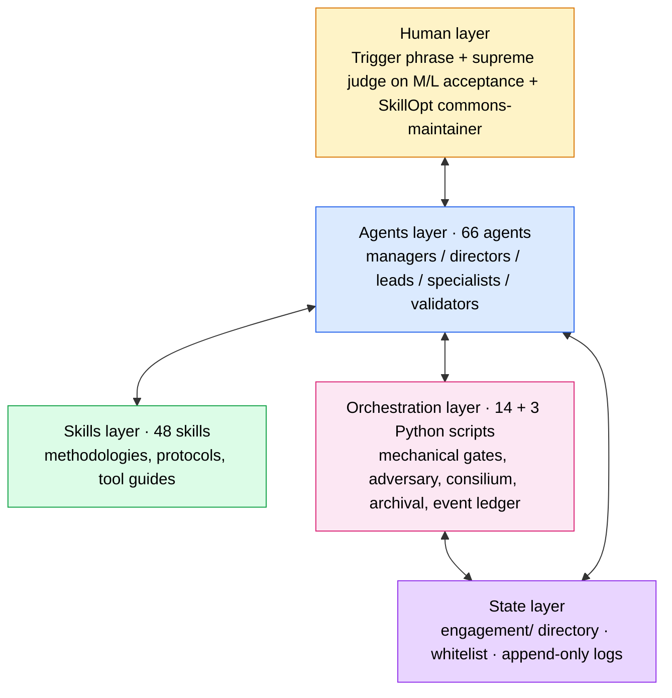
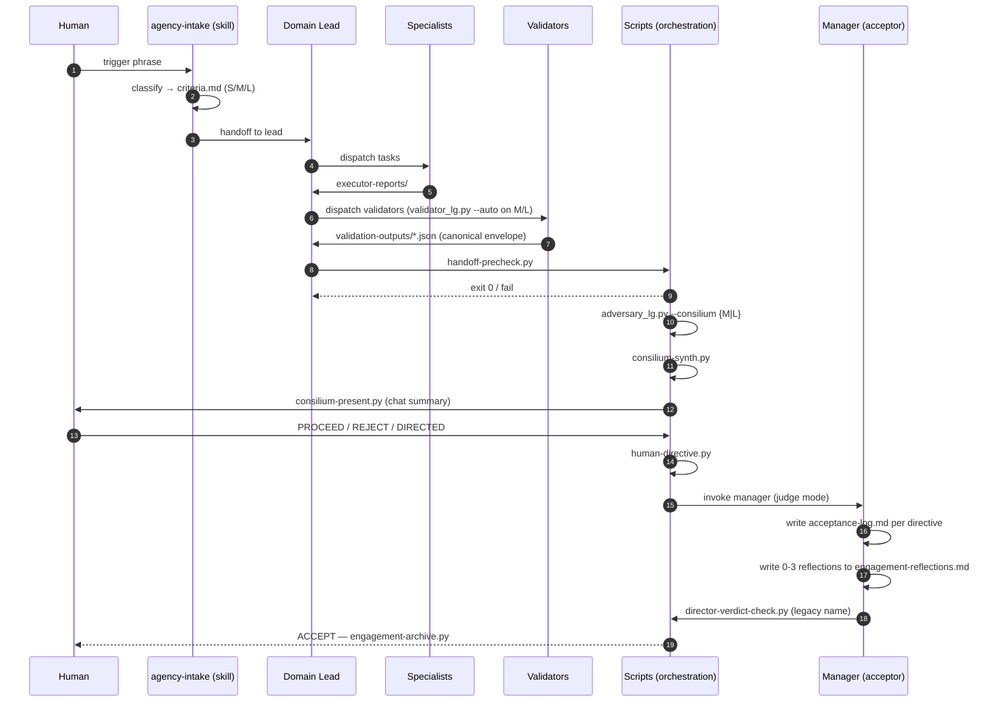

[Русский](./README.ru.md) · **English**

# agentic-workflow

> Multi-agent framework for Claude Code: 66 specialized agents, 48
> methodology skills, 15 + 3 Python orchestration scripts, 3 LangGraph
> engines, tier-aware acceptance (S/M/L), filesystem-isolated adversary
> review, cross-family second opinion via Codex MCP, human as supreme
> judge at critical transitions.

> **v0.2.4 (2026-05-28):** Windows compatibility — three latent issues
> surfaced on Max-subscription
> claude CLI: `claude.CMD` npm-wrapper truncates multiline argv at the
> first newline (CMD line-parsing), `subprocess.run(text=True)` decodes
> UTF-8 Russian as cp1251 on Russian-locale Windows, and
> `consilium_synth_completed` ledger emit was passing raw natural verdict
> to a schema expecting `ACCEPT/REJECT/DIRECTED`. All three fixed across
> 4 scripts (`find_claude_cmd()` resolves `.CMD` → `claude.exe`; 10
> subprocess sites got `encoding="utf-8", errors="replace"`; inline
> `VERDICT_MAP` mirror in `_make_finalize_node`). All `--invoker mock`
> tests passed pre-fix; latent risk lived in real subscription mode
> untested on Windows until now.
>
> **v0.2.3 (2026-05-28):** `engagement_lg.py` end-to-end across all
> 11 nodes in three execution modes. NEW `--mock`
> mode runs the real graph paths but with canned-artefact subprocess
> wrappers — full end-to-end smoke testing without claude CLI required.
> Send fan-out to specialists, `validator_lg.py` + `adversary_lg.py`
> subprocess integration, `claude -p --agent {domain}-manager` for
> acceptance, REJECT_NOW short-circuit, engagement-archive on ACCEPT.
> 7 end-to-end smoke paths verified on synthetic engagements (S/M/L
> tiers + REJECT loop + REJECT terminal + dry-run + claude-CLI-absent
> fail-fast).
>
> **v0.2.2 (2026-05-28):** modular precheck refactor (`handoff-precheck.py`
> 1264→423 lines + new `scripts/lib/precheck/` package, 8 topic-modules)
> + `engagement_lg.py` skeleton (3rd LangGraph engine owning the
> engagement-level lifecycle from intake to archive, `EngagementState` with
> 8 node placeholders, 3 HITL pause points, intake/plan nodes wired to
> `size-detect.py --auto-promote` + `claude -p --agent {domain}-lead`
> subprocess). 3 new ledger payload types. WHITELIST drift fix.
>
> **v0.2.1 (2026-05-28):** refinement release — adversary per-role
> ledger events (`consilium_started` / `consilium_role_completed`),
> SkillOpt golden-set parity across all 3 domains (dev/design/marketing,
> 9 scenarios), hot-path optimization via `references/` split in 3
> heavily-loaded skills (engagement-protocol / ui-ux-methodology /
> dev-methodology, −572 lines per engagement load).
>
> **v0.2 (2026-05-28):** acceptor/optimizer split — `*-manager`
> per-engagement acceptor + `*-director` system-optimizer (SkillOpt loop).
> Authority invariant, event ledger (`engagement/events.jsonl`),
> canonical validator schema, per-engagement reflections. See
> [`CHANGELOG.md`](CHANGELOG.md) for the full delta.

## Why this exists

Multi-agent pipelines on a single model family suffer from three
systemic failure modes:

| Problem | What goes wrong | How the system handles it |
|---|---|---|
| **Framing contamination** | The same Claude across multiple roles shares the same blind spots | Adversary runs in a fresh subprocess with a filesystem-curated view — sees only what an external process places there |
| **Goodhart on validators** | Validators degenerate into format-gates, checking fields instead of thinking | Tier-aware dispatch + cross-family second opinion via Codex (different model lineage = different blind spots) |
| **Undifferentiated rigour** | A button tweak and a landing redesign go through the same pipeline | S — light human-glance; M — adversary + judge; L — consilium of 5 reviewers + cross-family adjudication |

## Architecture — five layers



Each layer has a clear scope of responsibility. Layers don't substitute
for each other: agents don't write scripts, scripts don't make judgments,
humans don't do routine validation.

Detailed description of each layer and their interactions —
[`ARCHITECTURE.md`](ARCHITECTURE.md).

## Key mechanisms

**Tier-aware acceptance.** Each engagement is classified at intake into
one of three tiers:

| Tier | Use case | Adversary | Manager (acceptor) | Mechanical checks |
|---|---|---|---|---|
| **S** | Hotfix, button tweak, single deliverable | None — human glance | None | 6 |
| **M** | Feature, landing, dashboard, multi-specialist | 1× peer-opus | Judge mode | 13 |
| **L** | Rebrand, multi-wave, cross-domain | 5× consilium | Judge + adjudication | 21 |

**Adversary in filesystem-isolated subprocess.** Two-pass design against
framing contamination:
- **Pass 1 (Blind).** Adversary sees a curated copy of `engagement/`
  without `handoff.md`, without acceptance-log, without other reviewers.
  Forms preliminary findings without contamination.
- **Pass 2 (Informed).** Adversary receives full state plus its own
  preliminary findings injected via prompt. Confirms, refines, or
  retracts findings. Delta preliminary→final is a contamination signal.

**L-tier consilium.** 5 reviewers in parallel: Anthropic Opus +
2× OpenAI GPT-5 (Codex) + Anthropic Sonnet + Anthropic Haiku.
Cross-family disagreements are detected automatically and flagged for
manual review.

**Manager as judge, not sweep-runner.** On M/L the manager (per-engagement
acceptor — `*-manager` agent, ex-director) issues a verdict per directive
with explicit adjudication on every disagreement between adversary and
author. Doesn't dispatch, doesn't edit content, doesn't re-run validators.
Adjudication completeness is enforced mechanically — every finding must
have a decision marker.

**Director as system-optimizer (out-of-band).** The `*-director` role
(repurposed in v0.2) runs a SkillOpt-style skill-evolution loop on
accumulated REJECT / rework signals from `skill-evolution-log.md`. Fires
only at **≥3 same-class signals** clustered by `target × class`
(`rule_missing` / `rule_wrong` / `rule_ignored`). Cycle:
1. **Reflect** — director clusters manager-emitted signals by target +
   class, reads `skill-rejected-edits.md` (negative memory).
2. **Codex proposes bounded edits** — cross-family (kills defend-bias),
   budget L: 4–6 patches per cycle, ≤10 lines each.
3. **Golden-set gate** — director verifies the edit doesn't regress any
   scenario in `system-optimization-protocol/golden/{domain}/` (3 scenarios
   per domain × 3 domains = 9 total).
4. **Promote or reject** — passing edits land in the corpus; rejected
   edits append to `skill-rejected-edits.md` with reason (read before
   next cycle).

Judge-only — never authors edits itself. Never per-engagement. The human
is commons-maintainer for cross-domain promotions.

**Authority invariant.** When sources of behavior disagree, a written
7-rule precedence resolves it (CLAUDE.md > judge decision > criteria.md >
PROTOCOL > METHODOLOGY > agent body > frontmatter). Unresolved conflicts
become blocking `authority_conflict` events.

**Event ledger.** Every M/L engagement appends lifecycle events to
`engagement/events.jsonl` (append-only, per-engagement). Schema v1
captures phase transitions, validator runs, interrupts, verdicts,
reflections, authority conflicts. Read at any time via
`scripts/lib/ledger.py`.

**Human as supreme judge.** Between consilium synthesis and director
verdict the human gets a chat-ready summary (≤2 minutes to read) and
responds in one of three forms: `PROCEED` / `REJECT: <reason>` /
`DIRECTED: <what to change>`. No 200 lines of markdown — the system
formats and expands it.

**Mechanical safety baseline.** Exit-code gates run at every transition:
`danger-scan` (DROP / force-push / prod-deploy registry),
`handoff-precheck` (tier-aware structural verification),
`handoff-paths-check` (phantom path detection),
`director-verdict-check` (adjudication completeness),
`preflight` (tools availability).

**Audit trail by FS state.** Engagement = directory. State is read from
files: `iteration`, `validation-log.md`, `validation-outputs/*.json`,
`consilium-summary.md`, `human-directive.md`, `acceptance-log.md`.
No databases, no external logs — `cat` reconstructs the picture
completely.

## Engagement flow



S-tier skips adversary, consilium and manager phase: producer
self-attests, mechanical checks gate, human accepts directly.

## What's inside

### Agents (66)

| Category | Count | Roles |
|---|---|---|
| **Managers** | 3 | `dev-manager`, `design-manager`, `marketing-manager` — per-engagement acceptor (judge between producer + adversary) |
| **Directors** | 3 | `dev-director`, `design-director`, `marketing-director` — out-of-band system-optimizer (SkillOpt loop) |
| **Leads** | 11 | 3 top-leads (dev/design/marketing) + 8 mid-leads (product, engineering, quality, brand, product-design, traffic, content, analytics) |
| **Specialists** | 20 | backend, frontend, fullstack, devops, qa, tech-architect, product-analyst, technical-writer; ux, ui, visual, brand-strategist, presentation; copywriter, banner-designer, seo, ppc, keyword-researcher, web-analyst, ai-visibility |
| **Validators** | 29 | code-reviewer, security-auditor, accessibility, performance, migration, test-reviewer, reality-checker, skeptic, completeness, task/tech-spec/user-spec validators, infra/deploy reviewers, pre/post-deploy QA, anti-pattern detector, ux-review, skill-checker, 3 researchers (code/brand/design-system), product-context-validator, etc. |

### Skills (48)

| Category | Count | What's in it |
|---|---|---|
| **Agency protocol** | 8 | agency-intake, engagement-protocol, engagement-contract (specialist subset), acceptance-protocol (per-engagement acceptor methodology), system-optimization-protocol (SkillOpt loop), validation-pipeline, docs-pipeline, codex-bridge |
| **Dev methodology** | 18 | TDD, code review, spec planning (user/tech), task decomposition, deploy, security, infrastructure, prompt engineering, persistent tasks, pre/post-deploy QA |
| **Design methodology** | 8 | brand, design system, UI/UX, presentation, banner, design tokens |
| **Marketing methodology** | 5 | SEO auditing, semantic drift, AI visibility, task decomposition, benchmark research (industry reverse-engineering, standalone entry-point) |
| **Regional SEO/PPC stack** | 6 | API integrations for Russian-market analytics platforms (Webmaster, Metrika, Direct, Wordstat, Search) |
| **Skill development** | 3 | skill authoring, test design, testing |

Frontmatter tags for the router: `[PROTOCOL]`, `[METHODOLOGY]`, `[TOOL]`.

### Scripts (14 main + 3 optional)

Three LangGraph engines:
- `adversary_lg.py` — LangGraph adversary bridge: 5 reviewer roles, two-pass curated-view isolation, `Send`-based parallel fan-out, SQLite-checkpointed `--resume`, native HITL via `interrupt()`, event ledger wired
- `validator_lg.py` — LangGraph atomic-validator fan-out via `Send`; retry edge, auto-plan from criteria.md predicates, `--resume`, native HITL via `--interrupt-on-critical`, canonical validator envelope, event ledger wired
- `engagement_lg.py` — LangGraph engagement-level orchestrator owning the full lifecycle intake → plan → dispatch → validate → consilium → accept → archive. 11 nodes + 3 HITL pause points (criteria_lock / danger_gate / human_directive). Three execution modes: `--dry-run` (default, placeholders), `--mock` (real graph paths + canned subprocess artefacts — full end-to-end smoke without claude CLI), `--real` (full subprocess with `claude -p --agent X`). Delegates to `validator_lg.py` and `adversary_lg.py` as subprocesses (process isolation; promotion to sub-graphs deferred until field data shows overhead matters). Event ledger wired.

Mechanical gates and synthesis:
- `consilium-synth.py` — adversary output aggregation, two-stage dedup
- `consilium-present.py` — chat-ready format with decision menu
- `director-verdict-check.py` — mechanical adjudication completeness (legacy name; targets manager verdict in v0.2)
- `handoff-precheck.py` — hard-gate tier dispatch (S=6 / M=13 / L=21 checks), event ledger wired
- `human-directive.py` — scaffold human-directive.md from CLI args
- `preflight.py` — tools availability check
- `danger-scan.py` — registry of dangerous operations
- `handoff-paths-check.py` — phantom path detection
- `cross-val-check.py` — verbatim quote verification
- `trace-schema-check.py` — trace JSON schema + staleness
- `size-detect.py` — tier detection at intake / runtime, with `--auto-promote`
- `engagement-archive.py` — idempotent archival

Shared libraries:
- `lib/ledger.py` — append-only event ledger (`engagement/events.jsonl`); 28 known payload types; thin shim; smoke-tested
- `lib/precheck/` — modular precheck package (v0.2.2): 8 topic modules (`common`, `criteria`, `handoff`, `iteration`, `validators`, `acceptance`, `danger` + `__init__` re-exports). `handoff-precheck.py` (1264 → 423 lines, CLI/dispatch only) imports from this package. Byte-identical JSON output to the pre-refactor monolith.

Plus `optional/` — opt-in utilities outside the core protocol
(`engagement-doctor.py`, `engagement-migrate.py`, `token-budget.py`;
see [`scripts/optional/README.md`](scripts/optional/README.md)).

## SkillOpt golden sets

The director-optimizer uses golden scenarios as a regression gate before
promoting any Codex-proposed edit. One set per domain, 3 scenarios each
covering the three failure classes:

| Domain | Scenarios | Failure classes |
|---|---|---|
| `golden/dev/` | spec-code-drift / flaky-test-masking / security-gap | rule_ignored / rule_missing / rule_wrong |
| `golden/design/` | design-token-drift / accessibility-aria-missing / dark-mode-contrast-fail | rule_ignored / rule_missing / rule_wrong |
| `golden/marketing/` | keyword-count-underdelivery / seo-claim-unsupported / brand-voice-pronoun-violation | rule_ignored / rule_missing / rule_wrong |

A real SkillOpt cycle fires only when ≥3 real same-class signals
accumulate in `skill-evolution-log.md`. A synthetic dry-run on the dev
domain (Codex proposed 3 edits, the judge accepted 2, 1 entered
`skill-rejected-edits.md`) is documented in v0.2 and validates the loop
mechanics end-to-end.

## Setup

### Requirements

- **Claude Code**
- **Codex**
- **Python 3.10+**
- (Optional) **Yandex API tokens** — for marketing skills
  (Webmaster, Metrika, Direct, Wordstat, Search)

### Installation

1. Clone the repository:
   ```bash
   git clone https://github.com/AgentShekel/agentic-workflow.git
   cd agentic-workflow
   ```

2. Copy contents to `~/.claude/`:
   ```bash
   cp -r agents/* ~/.claude/agents/
   cp -r skills/* ~/.claude/skills/
   cp -r scripts/* ~/.claude/scripts/
   ```
   (On Windows — corresponding paths in `%USERPROFILE%\.claude\`.)

3. Configure Codex MCP:
   ```bash
   cp .mcp.json.example .mcp.json
   ```
   Set the absolute path to the `codex` CLI.

4. (Optional) Configure Yandex API:
   ```bash
   cp .env.example .env
   ```
   Fill in tokens if you use marketing skills.

5. Restart Claude Code — verify that MCP tools are visible.

## Quickstart

Entry point — trigger phrase in chat. Both English and Russian are
recognized out of the box:

```
agency task: <description>
```
or
```
мне надо агенси задачу <description>
```

Standalone capabilities have separate triggers:
- `мне надо провести исследование` / `benchmark research` — invokes
  `benchmark-research` skill (industry reverse-engineering).
- `прогнать skill-evolution` / `skill evolution cycle` — invokes the
  matching domain director to run the SkillOpt cycle on accumulated
  signals.

Add or adjust phrasings in the `agency-intake` skill's `Use when:`
list to match your team's vocabulary.

The system then autonomously runs the engagement through all layers.
On M/L you get a chat summary with a decision menu — respond with a
short verdict.

Detailed flow and role of each layer —
[`ARCHITECTURE.md`](ARCHITECTURE.md).

## License

MIT (see [`LICENSE`](LICENSE))
