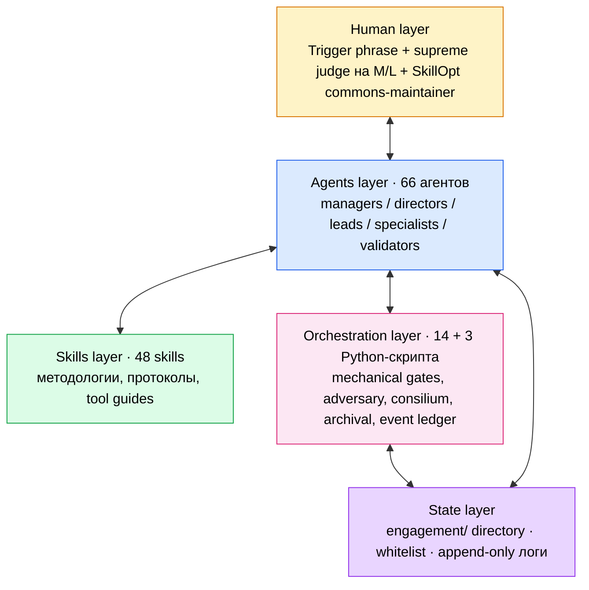
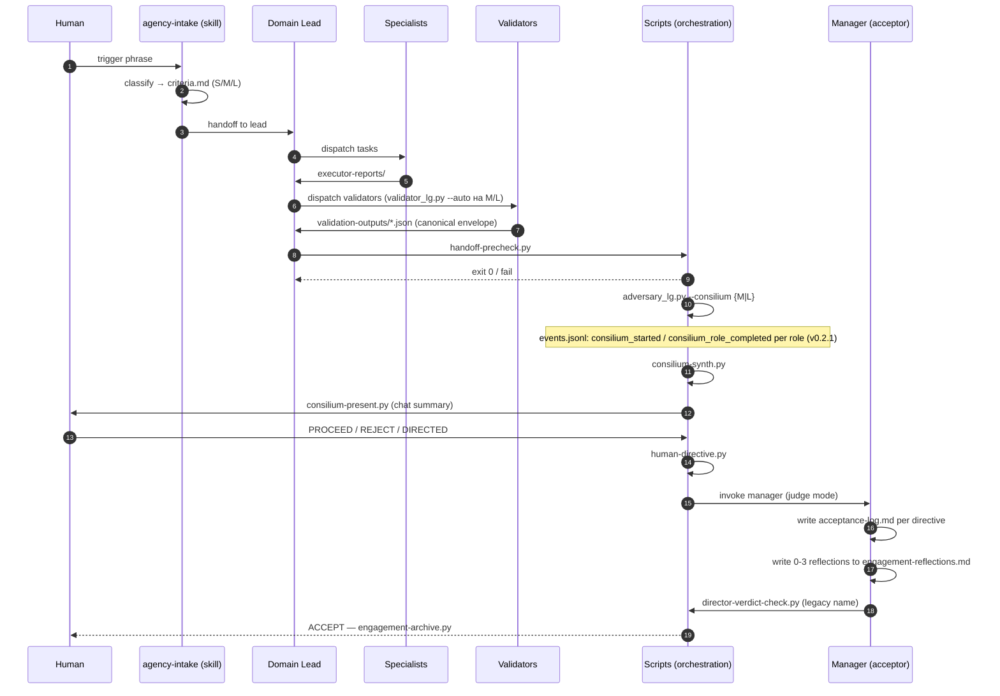

**Русский** · [English](./README.md)

# agentic-workflow

> Многоагентная система-фреймворк для Claude Code: 66 специализированных
> агентов, 48 методологических skills, 15 + 3 Python-скриптов оркестрации,
> 3 LangGraph движка, tier-aware acceptance (S/M/L), filesystem-isolated
> adversary review, cross-family второе мнение через Codex MCP, человек
> как supreme judge на критических переходах.

> **v0.2.4 (2026-05-28):** Windows-совместимость — три латентные проблемы
> вылезли в Max-subscription
> claude CLI: `claude.CMD` npm-wrapper обрезает multiline argv на первом
> переводе строки (CMD line-parsing), `subprocess.run(text=True)`
> декодирует UTF-8 русский как cp1251 на Russian-locale Windows, и
> `consilium_synth_completed` ledger emit передавал raw natural verdict
> в схему ожидающую `ACCEPT/REJECT/DIRECTED`. Все три починены в 4
> скриптах (`find_claude_cmd()` резолвит `.CMD` → `claude.exe`; 10
> subprocess-сайтов получили `encoding="utf-8", errors="replace"`;
> inline `VERDICT_MAP` mirror в `_make_finalize_node`). Все `--invoker
> mock` тесты проходили pre-fix; латентный риск жил в real subscription
> mode непротестированном на Windows до сих пор.
>
> **v0.2.3 (2026-05-28):** `engagement_lg.py` end-to-end по всем 11
> узлам в 3 режимах выполнения. НОВЫЙ режим `--mock` запускает реальные пути графа но с canned-artefact
> subprocess wrappers — полный end-to-end smoke без claude CLI. Send
> fan-out на specialists, `validator_lg.py` + `adversary_lg.py`
> subprocess интеграция, `claude -p --agent {domain}-manager` для
> acceptance, REJECT_NOW short-circuit, engagement-archive на ACCEPT.
> 7 end-to-end smoke путей verified на synthetic engagements (S/M/L
> tiers + REJECT loop + REJECT terminal + dry-run + fail-fast без
> claude CLI).
>
> **v0.2.2 (2026-05-28):** модульный precheck refactor (`handoff-precheck.py`
> 1264→423 строки + новый пакет `scripts/lib/precheck/`, 8 топик-модулей)
> + `engagement_lg.py` skeleton (третий LangGraph движок,
> владеющий жизненным циклом engagement от intake до archive,
> `EngagementState` с 8 узлами-плейсхолдерами, 3 точки HITL-паузы,
> узлы intake/plan подключены к `size-detect.py --auto-promote` +
> `claude -p --agent {domain}-lead` subprocess). 3 новых ledger payload
> types. Фикс WHITELIST drift.
>
> **v0.2.1 (2026-05-28):** refinement release — adversary per-role ledger events
> (`consilium_started` / `consilium_role_completed`), полный паритет
> golden-сетов SkillOpt по 3 доменам (dev/design/marketing, 9 сценариев),
> hot-path оптимизация через `references/` split в 3 тяжёлых skills
> (engagement-protocol / ui-ux-methodology / dev-methodology, −572 строки
> на каждую загрузку engagement).
>
> **v0.2 (2026-05-28):** разделение ролей acceptor / optimizer —
> `*-manager` per-engagement acceptor + `*-director` system-optimizer
> (SkillOpt loop). Инвариант разрешения конфликтов авторитета, event
> ledger (`engagement/events.jsonl`), канонический envelope
> валидаторов, per-engagement reflections. Полная дельта —
> [`CHANGELOG.md`](CHANGELOG.md).

## Зачем это нужно

Многоагентные пайплайны на одной модельной семье страдают от трёх
системных провалов:

| Проблема | Что происходит | Как решает система |
|---|---|---|
| **Framing contamination** | Один и тот же Claude в разных ролях имеет одинаковые слепые зоны | Adversary запускается в свежем subprocess'е с filesystem-curated view — видит только то, что положено внешним process'ом |
| **Goodhart на validators** | Валидаторы вырождаются в format-gates, проверяют поля вместо мышления | Tier-aware dispatch + cross-family второе мнение через Codex (другая модельная линия = другие слепые зоны) |
| **Undifferentiated rigour** | Правка кнопки и редизайн посадочной идут через один пайплайн | S — лёгкий human-glance, M — adversary + judge, L — consilium из 5 reviewers + cross-family adjudication |

## Архитектура — пять слоёв



Каждый слой имеет чёткую зону ответственности. Слои не подменяют друг
друга: агенты не пишут скрипты, скрипты не делают суждений, человек не
занимается рутинной валидацией.

Подробное описание каждого слоя и взаимодействий —
[`ARCHITECTURE.ru.md`](ARCHITECTURE.ru.md).

## Ключевые механизмы

**Tier-aware acceptance.** Каждый engagement классифицируется на intake
в один из трёх tier'ов:

| Tier | Use case | Adversary | Manager (acceptor) | Mechanical checks |
|---|---|---|---|---|
| **S** | Hotfix, правка кнопки, single deliverable | Нет — human glance | Нет | 6 |
| **M** | Фича, лендинг, dashboard, multi-specialist | 1× peer-opus | Judge mode | 13 |
| **L** | Rebrand, multi-wave, cross-domain | 5× consilium | Judge + adjudication | 21 |

**Adversary в filesystem-isolated subprocess.** Two-pass дизайн против
framing contamination:
- **Pass 1 (Blind).** Adversary видит curated копию `engagement/` без
  `handoff.md`, без acceptance-log, без других reviewers. Формирует
  preliminary findings без contamination.
- **Pass 2 (Informed).** Adversary получает полное состояние +
  inject своих preliminary findings. Подтверждает, уточняет или
  отзывает выводы. Дельта preliminary→final — сигнал contamination.

**L-tier consilium.** 5 reviewers параллельно: Anthropic Opus +
2× OpenAI GPT-5 (Codex) + Anthropic Sonnet + Anthropic Haiku.
Cross-family disagreements детектируются автоматически и помечаются для
ручной проверки.

**Manager как judge, не sweep-runner.** На M/L manager (per-engagement
acceptor — `*-manager` агент, ex-director) выносит вердикт per directive
с явным adjudication по каждому disagreement между adversary и автором.
Не диспатчит, не правит контент, не запускает validators заново.
Adjudication completeness проверяется механически — каждый finding
должен иметь decision marker.

**Director как system-optimizer (out-of-band).** Роль `*-director`
(перепрофилирована в v0.2) запускает SkillOpt-цикл эволюции навыков на
накопленных REJECT/rework сигналах из `skill-evolution-log.md`.
Срабатывает только при **≥3 сигналах одного класса**, кластеризованных
по `target × class` (`rule_missing` / `rule_wrong` / `rule_ignored`).
Цикл:
1. **Reflect** — директор кластеризует manager-emitted сигналы по
   target + class, читает `skill-rejected-edits.md` (negative memory).
2. **Codex предлагает bounded edits** — cross-family (убивает
   defend-bias), budget L: 4–6 патчей за цикл, ≤10 строк каждый.
3. **Golden-set gate** — директор проверяет что правка не регрессит ни
   один сценарий в `system-optimization-protocol/golden/{domain}/` (по
   3 сценария на домен × 3 домена = 9 всего).
4. **Promote или reject** — passing правки попадают в корпус;
   отклонённые добавляются в `skill-rejected-edits.md` с причиной
   (читается перед следующим циклом).

**Judge-only — никогда не пишет правки сам.** Никогда per-engagement.
Человек — commons-maintainer для cross-domain промоутов.

**Authority invariant.** Когда источники поведения расходятся, письменная
7-rule precedence решает (CLAUDE.md > judge decision > criteria.md >
PROTOCOL > METHODOLOGY > agent body > frontmatter). Неразрешённые
конфликты становятся blocking `authority_conflict` событиями в ledger.

**Event ledger.** Каждый M/L engagement пишет события жизненного цикла
в `engagement/events.jsonl` (append-only, per-engagement). Schema v1
фиксирует phase transitions, validator runs, interrupts, verdicts,
reflections, authority conflicts, **per-role consilium события (v0.2.1)**.
Читается в любой момент через `scripts/lib/ledger.py`.

**Человек как supreme judge.** Между consilium synthesis и manager
verdict человек получает chat-ready summary (≤2 минуты на чтение) и
отвечает одной из трёх форм: `PROCEED` / `REJECT: <причина>` /
`DIRECTED: <что менять>`. Никаких 200 строк markdown — система сама
форматирует и расширяет.

**Mechanical safety baseline.** На каждом переходе работают exit-code
gates: `danger-scan` (DROP/force-push/prod-deploy registry),
`handoff-precheck` (tier-aware structural verification),
`handoff-paths-check` (phantom path detection),
`director-verdict-check` (adjudication completeness; legacy name —
проверяет manager verdict),
`preflight` (tools availability).

**Audit trail by FS state.** Engagement = директория. Состояние читается
из файлов: `iteration`, `validation-log.md`, `validation-outputs/*.json`,
`consilium-summary.md`, `human-directive.md`, `acceptance-log.md`,
`engagement-reflections.md`, `events.jsonl`. Никаких баз, никаких внешних
логов — `cat` восстанавливает картину полностью.

## Engagement flow



S-tier пропускает adversary, consilium и manager phase: producer
self-attests, mechanical checks гейтят, человек принимает напрямую.

## Что внутри

### Agents (66)

| Категория | Количество | Роли |
|---|---|---|
| **Managers** | 3 | `dev-manager`, `design-manager`, `marketing-manager` — per-engagement acceptor (judge между producer + adversary) |
| **Directors** | 3 | `dev-director`, `design-director`, `marketing-director` — out-of-band system-optimizer (SkillOpt loop) |
| **Leads** | 11 | 3 top-leads (dev/design/marketing) + 8 mid-leads (product, engineering, quality, brand, product-design, traffic, content, analytics) |
| **Specialists** | 20 | backend, frontend, fullstack, devops, qa, tech-architect, product-analyst, technical-writer; ux, ui, visual, brand-strategist, presentation; copywriter, banner-designer, seo, ppc, keyword-researcher, web-analyst, ai-visibility |
| **Validators** | 29 | code-reviewer, security-auditor, accessibility, performance, migration, test-reviewer, reality-checker, skeptic, completeness, task/tech-spec/user-spec validators, infra/deploy reviewers, pre/post-deploy QA, anti-pattern detector, ux-review, skill-checker, 3 researchers (code/brand/design-system), product-context-validator, и т.д. |

### Skills (48)

| Категория | Количество | Что в ней |
|---|---|---|
| **Agency protocol** | 8 | agency-intake, engagement-protocol, engagement-contract (specialist subset), acceptance-protocol (per-engagement acceptor methodology), system-optimization-protocol (SkillOpt loop), validation-pipeline, docs-pipeline, codex-bridge |
| **Dev methodology** | 18 | TDD, code review, spec planning (user/tech), task decomposition, deploy, security, infrastructure, prompt engineering, persistent tasks, pre/post-deploy QA |
| **Design methodology** | 8 | brand, design system, UI/UX, presentation, banner, design tokens |
| **Marketing methodology** | 5 | SEO auditing, semantic drift, AI visibility, task decomposition, benchmark research (industry reverse-engineering, отдельный entry-point) |
| **Regional SEO/PPC stack** | 6 | API-интеграции для Russian-market analytics platforms (Webmaster, Metrika, Direct, Wordstat, Search) |
| **Skill development** | 3 | skill authoring, test design, testing |

Frontmatter-теги для router'а: `[PROTOCOL]`, `[METHODOLOGY]`, `[TOOL]`.

Тяжёлые skills (`engagement-protocol`, `ui-ux-methodology`,
`dev-methodology`) разделены на hot-path TL;DR + cold-path
`references/{topic}.md` — последние подгружаются on-demand. См. v0.2.1
в CHANGELOG.

### Scripts (14 main + 3 optional)

Три LangGraph-движка:
- `adversary_lg.py` — LangGraph adversary bridge: 5 reviewer-ролей, two-pass curated-view изоляция, `Send`-based parallel fan-out, SQLite-checkpointed `--resume`, native HITL через `interrupt()`, event ledger подключён (lifecycle + per-role + early-return guard события)
- `validator_lg.py` — LangGraph atomic-validator fan-out через `Send`; retry edge, auto-plan из criteria.md predicates, `--resume`, native HITL через `--interrupt-on-critical`, канонический validator envelope, event ledger подключён
- `engagement_lg.py` — LangGraph engagement-level оркестратор, владеющий полным жизненным циклом intake → plan → dispatch → validate → consilium → accept → archive. 11 узлов + 3 точки HITL-паузы (criteria_lock / danger_gate / human_directive). Три режима выполнения: `--dry-run` (default, плейсхолдеры), `--mock` (реальные пути графа + canned subprocess артефакты — полный end-to-end smoke без claude CLI), `--real` (полный subprocess через `claude -p --agent X`). Делегирует `validator_lg.py` и `adversary_lg.py` как subprocess'ы (process isolation; промоут в sub-graphs отложен до field-data о накладных расходах). Event ledger подключён.

Mechanical gates и synthesis:
- `consilium-synth.py` — агрегация adversary outputs, two-stage dedup
- `consilium-present.py` — chat-ready format с decision menu
- `director-verdict-check.py` — mechanical adjudication completeness (legacy name; в v0.2 проверяет manager verdict)
- `handoff-precheck.py` — hard-gate tier dispatch (S=6 / M=13 / L=21 checks), event ledger подключён
- `human-directive.py` — scaffold human-directive.md из CLI args
- `preflight.py` — tools availability check
- `danger-scan.py` — реестр опасных операций
- `handoff-paths-check.py` — phantom path detection
- `cross-val-check.py` — verbatim quote verification
- `trace-schema-check.py` — trace JSON schema + staleness
- `size-detect.py` — детектор tier'а на intake / runtime, с `--auto-promote`
- `engagement-archive.py` — idempotent archival

Shared библиотеки:
- `lib/ledger.py` — append-only event ledger (`engagement/events.jsonl`); 28 known payload types; thin shim; smoke-tested
- `lib/precheck/` — модульный precheck пакет (v0.2.2): 8 топик-модулей (`common`, `criteria`, `handoff`, `iteration`, `validators`, `acceptance`, `danger` + `__init__` re-exports). `handoff-precheck.py` (1264 → 423 строки, CLI/dispatch only) импортирует из этого пакета. Byte-identical JSON output к pre-refactor монолиту.

Плюс `optional/` — opt-in утилиты вне основного протокола
(`engagement-doctor.py`, `engagement-migrate.py`, `token-budget.py`;
см. [`scripts/optional/README.ru.md`](scripts/optional/README.ru.md)).

## SkillOpt golden-сеты

Директор-оптимизатор использует golden-сценарии как регрессионный шлюз
перед промоутом любой Codex-предложенной правки. По одному набору на
домен, 3 сценария в каждом покрывают три класса провалов:

| Домен | Сценарий | Failure class |
|---|---|---|
| `golden/dev/` | spec-code-drift / flaky-test-masking / security-gap | rule_ignored / rule_missing / rule_wrong |
| `golden/design/` | design-token-drift / accessibility-aria-missing / dark-mode-contrast-fail | rule_ignored / rule_missing / rule_wrong |
| `golden/marketing/` | keyword-count-underdelivery / seo-claim-unsupported / brand-voice-pronoun-violation | rule_ignored / rule_missing / rule_wrong |

Реальный SkillOpt-цикл запускается когда ≥3 реальных сигнала одного
класса накопились в `skill-evolution-log.md`. Synthetic dry-run проведён
на dev в v0.2 (2/3 правок Codex-а прошли gate; одна попала в
`skill-rejected-edits.md`).

## Setup

### Требования

- **Claude Code**
- **Codex**
- **Python 3.10+**
- (Опционально) **Yandex API tokens** — для marketing skills
  (Webmaster, Metrika, Direct, Wordstat, Search)

### Установка

1. Клонировать репозиторий:
   ```bash
   git clone https://github.com/AgentShekel/agentic-workflow.git
   cd agentic-workflow
   ```

2. Скопировать содержимое в `~/.claude/`:
   ```bash
   cp -r agents/* ~/.claude/agents/
   cp -r skills/* ~/.claude/skills/
   cp -r scripts/* ~/.claude/scripts/
   ```
   (на Windows — соответствующие пути в `%USERPROFILE%\.claude\`)

3. Настроить Codex MCP:
   ```bash
   cp .mcp.json.example .mcp.json
   ```
   Прописать абсолютный путь к `codex` CLI.

4. (Опционально) Настроить Yandex API:
   ```bash
   cp .env.example .env
   ```
   Заполнить токены, если используются marketing skills.

5. Перезапустить Claude Code — проверить, что MCP tools видны.

## Quickstart

Точка входа — trigger phrase в чате. Английский и русский распознаются
из коробки:

```
agency task: <описание>
```
или
```
мне надо агенси задачу <описание>
```

Standalone-возможности имеют отдельные триггеры:
- `мне надо провести исследование` / `benchmark research` — invокирует
  навык `benchmark-research` (industry reverse-engineering).
- `прогнать skill-evolution` / `skill evolution cycle` — invокирует
  соответствующего domain-директора для запуска SkillOpt-цикла на
  накопленных сигналах.

Добавляй или меняй формулировки в `Use when:` списке навыка
`agency-intake`, чтобы совпадали со словарём твоей команды.

Дальше система автономно проводит engagement через все слои. На M/L
получаешь chat-summary с decision menu — отвечаешь коротким verdict.

Подробный flow и роли каждого слоя —
[`ARCHITECTURE.ru.md`](ARCHITECTURE.ru.md).

## Лицензия

MIT (см. [`LICENSE`](LICENSE))
