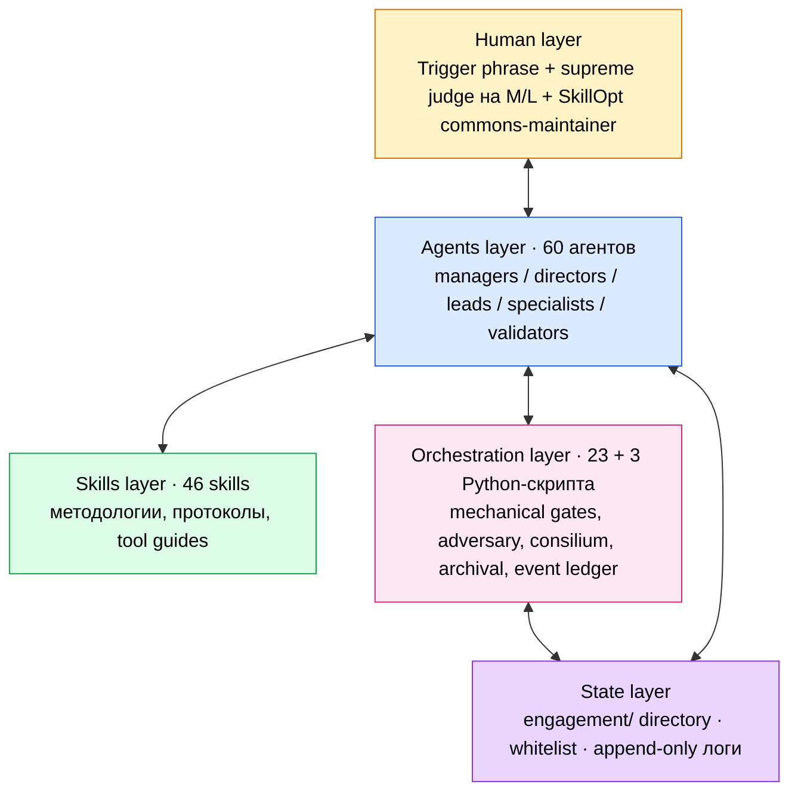
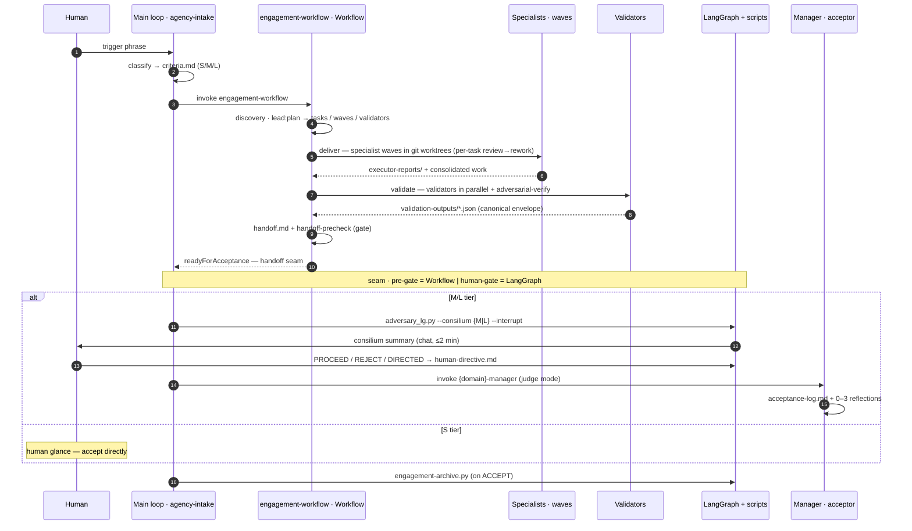

**Русский** · [English](./README.md)

# agentic-workflow

> Многоагентная система-фреймворк для Claude Code: 60 агентов, 46
> методологических skills, 23 + 3 Python-скриптов оркестрации, 3 Workflow
> движка оркестрации + 2 LangGraph движка human-gate, tier-aware
> acceptance (S/M/L), filesystem-isolated adversary review, cross-family
> второе мнение через Codex MCP, человек как supreme judge на критических
> переходах.

История версий: [`CHANGELOG.md`](CHANGELOG.md).

## Зачем это нужно

Многоагентные пайплайны на одной модельной семье страдают от трёх
системных провалов:

| Проблема | Что происходит | Как решает система |
|---|---|---|
| **Framing contamination** | Один и тот же Claude в разных ролях имеет одинаковые слепые зоны | Adversary запускается в свежем subprocess'е с filesystem-curated view — видит только то, что положено внешним process'ом |
| **Goodhart на validators** | Валидаторы вырождаются в format-gates, проверяют поля вместо мышления | Tier-aware dispatch + cross-family второе мнение через Codex (другая модельная линия = другие слепые зоны) |
| **Undifferentiated rigour** | Правка кнопки и редизайн посадочной идут через один пайплайн | S — лёгкий human-glance, M — adversary + judge, L — consilium из 5 reviewers + cross-family adjudication |

## Архитектура — пять слоёв


```mermaid
flowchart TB
    H["Human layer<br/>Trigger phrase + supreme judge на M/L + SkillOpt commons-maintainer"]
    A["Agents layer · 60 агентов<br/>managers / directors / leads / specialists / validators"]
    S["Skills layer · 46 skills<br/>методологии, протоколы, tool guides"]
    O["Orchestration layer · 23 + 3 Python-скрипта<br/>mechanical gates, adversary, consilium, archival, event ledger"]
    St["State layer<br/>engagement/ directory · whitelist · append-only логи"]

    H <--> A
    A <--> S
    A <--> O
    O <--> St
    A <--> St

    classDef human fill:#fef3c7,stroke:#d97706,color:#000
    classDef agents fill:#dbeafe,stroke:#2563eb,color:#000
    classDef skills fill:#dcfce7,stroke:#16a34a,color:#000
    classDef orch fill:#fce7f3,stroke:#db2777,color:#000
    classDef state fill:#e9d5ff,stroke:#9333ea,color:#000

    class H human
    class A agents
    class S skills
    class O orch
    class St state
```

Каждый слой имеет чёткую зону ответственности. Слои не подменяют друг
друга: агенты не пишут скрипты, скрипты не делают суждений, человек не
занимается рутинной валидацией.

Подробное описание каждого слоя и взаимодействий —
[`ARCHITECTURE.ru.md`](ARCHITECTURE.ru.md).

## Ключевые механизмы

**Tier-aware acceptance.** Каждый engagement классифицируется на intake
в один из трёх tier'ов:

| Tier | Use case | Adversary | Manager (acceptor) | Mechanical checks |
|---|---|---|---|---|
| **S** | Hotfix, правка кнопки, single deliverable | Нет — human glance | Нет | 6 |
| **M** | Фича, лендинг, dashboard, multi-specialist | 1× peer-opus | Judge mode | 13 |
| **L** | Rebrand, multi-wave, cross-domain | 5× consilium | Judge + adjudication | 21 |

**Adversary в filesystem-isolated subprocess.** Two-pass дизайн против
framing contamination:
- **Pass 1 (Blind).** Adversary видит curated копию `engagement/` без
  `handoff.md`, без acceptance-log, без других reviewers. Формирует
  preliminary findings без contamination.
- **Pass 2 (Informed).** Adversary получает полное состояние +
  inject своих preliminary findings. Подтверждает, уточняет или
  отзывает выводы. Дельта preliminary→final — сигнал contamination.

**L-tier consilium.** 5 reviewers параллельно: Anthropic Opus +
2× OpenAI Codex (GPT-6-Astra) + Anthropic Sonnet + Anthropic Haiku.
Cross-family disagreements детектируются автоматически и помечаются для
ручной проверки.

**Manager как judge, не sweep-runner.** На M/L manager (per-engagement
acceptor — `*-manager` агент, ex-director) выносит вердикт per directive
с явным adjudication по каждому disagreement между adversary и автором.
Не диспатчит, не правит контент, не запускает validators заново.
Adjudication completeness проверяется механически — каждый finding
должен иметь decision marker.

**Director как system-optimizer (out-of-band).** Роль `*-director`
(перепрофилирована в v0.2) запускает SkillOpt-цикл эволюции навыков на
накопленных REJECT/rework сигналах из `skill-evolution-log.md`.
Срабатывает только при **≥3 сигналах одного класса**, кластеризованных
по `target × class` (`rule_missing` / `rule_wrong` / `rule_ignored`).
Цикл:
1. **Reflect** — директор кластеризует manager-emitted сигналы по
   target + class, читает `skill-rejected-edits.md` (negative memory) и
   память оптимизатора, оставленную прошлым циклом. Второй, намеренно
   консервативный канал читает `- worked:` рефлексии — то, что вытянуло
   энгейджмент, — чтобы цикл умел не только запрещать, но и усиливать.
   Успех сам по себе цикл не открывает, а при конфликте корректирующая
   правка всегда побеждает подкрепляющую.
2. **Codex предлагает bounded edits** — cross-family (убивает
   defend-bias), budget L: 4–6 патчей за цикл, ≤10 строк каждый.
3. **Golden-set gate** — директор проверяет что правка не регрессит ни
   один сценарий в `system-optimization-protocol/golden/{domain}/`
   (7 dev + 4 design + 4 marketing = 15 всего). В каждом домене есть сценарий
   на отсутствие ложного срабатывания, который гейт тоже обязан пройти: иначе
   правку можно протащить, просто сделав корпус подозрительнее.
4. **Promote или reject** — passing правки попадают в корпус за
   предварительным снимком файлов; отклонённые добавляются в
   `skill-rejected-edits.md` с причиной (читается перед следующим циклом).
5. **Проверка того, что реально легло** — diff guard сверяет, что цикл
   писал только туда, куда заявил; slow-update перечитывает golden-сет по
   каждому промоушену, а регрессия восстанавливает снимок и блокирует
   draft MR. Проверка, которая не отработала, считается проваленной, а не
   пройденной.
6. **Record** — закрытые промоушеном сигналы получают `resolved:`, а цикл
   без правок пишет `adjudicated:`, чтобы триггер гас в обоих случаях и не
   срабатывал вечно на кластере, который никто не может закрыть.

**Judge-only — никогда не пишет правки сам.** Никогда per-engagement.
Человек — commons-maintainer для cross-domain промоутов.

**Authority invariant.** Когда источники поведения расходятся, письменная
7-rule precedence решает (CLAUDE.md > judge decision > criteria.md >
PROTOCOL > METHODOLOGY > agent body > frontmatter). Неразрешённые
конфликты становятся blocking `authority_conflict` событиями в ledger.

**Event ledger.** Каждый M/L engagement пишет события жизненного цикла
в `engagement/events.jsonl` (append-only, per-engagement). Schema v1
фиксирует phase transitions, validator runs, interrupts, verdicts,
reflections, authority conflicts, **per-role consilium события (v0.2.1)**.
Читается в любой момент через `scripts/lib/ledger.py`.

**Человек как supreme judge.** Между consilium synthesis и manager
verdict человек получает chat-ready summary (≤2 минуты на чтение) и
отвечает одной из трёх форм: `PROCEED` / `REJECT: <причина>` /
`DIRECTED: <что менять>`. Никаких 200 строк markdown — система сама
форматирует и расширяет.

**Mechanical safety baseline.** На каждом переходе работают exit-code
gates: `danger-scan` (DROP/force-push/prod-deploy registry),
`handoff-precheck` (tier-aware structural verification),
`handoff-paths-check` (phantom path detection),
`director-verdict-check` (adjudication completeness; legacy name —
проверяет manager verdict),
`preflight` (tools availability).

**Audit trail by FS state.** Engagement = директория. Состояние читается
из файлов: `iteration`, `validation-log.md`, `validation-outputs/*.json`,
`consilium-summary.md`, `human-directive.md`, `acceptance-log.md`,
`engagement-reflections.md`, `events.jsonl`. Никаких баз, никаких внешних
логов — `cat` восстанавливает картину полностью.

## Engagement flow


```mermaid
sequenceDiagram
    autonumber
    participant U as Human
    participant ML as Main loop · agency-intake
    participant WF as engagement-workflow · Workflow
    participant SP as Specialists · waves
    participant V as Validators
    participant SC as LangGraph + scripts
    participant M as Manager · acceptor

    U->>ML: trigger phrase
    ML->>ML: classify → criteria.md (S/M/L)
    ML->>WF: invoke engagement-workflow
    WF->>WF: discovery · lead:plan → tasks / waves / validators
    WF->>SP: deliver — specialist waves in git worktrees (per-task review→rework)
    SP-->>WF: executor-reports/ + consolidated work
    WF->>V: validate — validators in parallel + adversarial-verify
    V-->>WF: validation-outputs/*.json (canonical envelope)
    WF->>WF: handoff.md + handoff-precheck (gate)
    WF-->>ML: readyForAcceptance — handoff seam
    Note over ML,SC: seam · pre-gate = Workflow | human-gate = LangGraph
    alt M/L tier
        ML->>SC: adversary_lg.py --consilium {M|L} --interrupt
        SC->>U: consilium summary (chat, ≤2 min)
        U->>SC: PROCEED / REJECT / DIRECTED → human-directive.md
        ML->>M: invoke {domain}-manager (judge mode)
        M->>M: acceptance-log.md + 0–3 reflections
    else S tier
        Note over U: human glance — accept directly
    end
    ML->>SC: engagement-archive.py (on ACCEPT)
```

S-tier пропускает adversary, consilium и manager phase: producer
self-attests, mechanical checks гейтят, человек принимает напрямую.

## Engine activation flags

Движок pre-gate `engagement-workflow` несёт набор **opt-in
activation-флагов**, передаваемых в объекте `args.A` у Workflow. Каждый
флаг по умолчанию **OFF**, и при всех выключенных флагах движок
рендерится byte-for-byte идентично безфлаговому пути — так что флаг
включается per engagement, а не глобально. Они позволяют поднять строгость
каскада под конкретный engagement, не меняя поведение по умолчанию для
остальных.

| Флаг (`args.A.*`) | Default | Что добавляет |
|---|---|---|
| `consGuard` | off (guard-class) | Жёстко стопорит волну, чья консолидация не приземлилась — null-консолидатор, `merge_ok:false` или code-mode merge, который сел, но провалил тесты репозитория — с тем же error-контрактом, что и pre-consolidation hard-stop, так что зависимые волны не ответвляются от отсутствующего/сломанного integration HEAD. Асимметрия: merge, который никогда не приземлился, replan-совместим; merge, который сел но провалил тесты, hard-stop'ает без auto-replan. Bug-fix, поэтому может включаться раньше feature-флагов. |
| `repoPortable` | off | Добавляет один discovery-агент `detect:repo`, который детектит integration-ветку + тест-раннер репозитория вместо хардкода `main` / `python -m unittest`; non-git `repoDir` рано hard-stop'ает в code mode. |
| `contracts` | off (M/L) | Per-task contract handshake: owner предлагает ≥1 проверяемое assertion на каждый цитируемый критерий in-band, нейтральный reviewer co-sign'ит и пишет `tasks/{id}.md` → `## Contract (co-signed)`, owner может contest'ить. Связывает **только** rubric per-task review — никогда не отменяет `criteria.md`. |
| `replan` | off | Один bounded replan за прогон при hard-stop волны: completed-волны заблокированы, оставшаяся работа перепланируется (id с суффиксом `-r{n}`), ре-валидация, продолжение. |
| `renderEval` | off (artefact) | После manifest-verify рендерит HTML-артефакты волны в реальном браузере и сверяет OBSERVED-значения с co-signed assertions / критериями — не просто «файл существует». |
| `cheapTiers` | off | Роутит механические шаги движка (manifest-verify + gate-runner → haiku; adversarial-verify → sonnet) на дешёвые модели; judgement-шаги остаются на унаследованной модели. |

Guard на backslash-`repoDir` (validation-only, без флага) отклоняет
Windows-пути, которые вложили бы worktree внутрь репозитория.

## Что внутри

### Agents (60)

| Категория | Количество | Роли |
|---|---|---|
| **Managers** | 3 | `dev-manager`, `design-manager`, `marketing-manager` — per-engagement acceptor (judge между producer + adversary) |
| **Directors** | 4 | `dev-director`, `design-director`, `marketing-director`, `harness-director` — out-of-band system-optimizer (SkillOpt-цикл + harness-evolution-цикл) |
| **Leads** | 3 | `dev-lead`, `design-lead`, `marketing-lead` — только планирование (шаг `lead:plan` в engagement-workflow; они планируют волны, специалистов диспатчит Workflow) |
| **Specialists** | 20 | backend, frontend, fullstack, devops, qa, tech-architect, product-analyst, technical-writer; ux, ui, visual, brand-strategist, presentation; copywriter, banner-designer, seo, ppc, keyword-researcher, web-analyst, ai-visibility |
| **Validators** | 30 | code-reviewer, security-auditor, accessibility, performance, migration, test-reviewer, reality-checker, skeptic, completeness, task/tech-spec/user-spec validators, infra/deploy reviewers, pre/post-deploy QA, anti-pattern detector, ux-review, render-eval, skill-checker, 3 researchers (code/brand/design-system), product-context-validator, и т.д. |

### Skills (46)

| Категория | Количество | Что в ней |
|---|---|---|
| **Agency protocol** | 8 | agency-intake, engagement-protocol, engagement-contract (specialist subset), acceptance-protocol (per-engagement acceptor methodology), system-optimization-protocol (SkillOpt loop), validation-pipeline, docs-pipeline, codex-bridge |
| **Dev methodology** | 16 | TDD, code review, spec planning (user/tech), task decomposition, deploy, security, infrastructure, prompt engineering, persistent tasks, pre/post-deploy QA |
| **Design methodology** | 8 | brand, design system, UI/UX, presentation, banner, design tokens |
| **Marketing methodology** | 5 | SEO auditing, semantic drift, AI visibility, task decomposition, benchmark research (industry reverse-engineering, отдельный entry-point) |
| **Regional SEO/PPC stack** | 6 | API-интеграции для Russian-market analytics platforms (Webmaster, Metrika, Direct, Wordstat, Search) |
| **Skill development** | 3 | skill authoring, test design, testing |

Frontmatter-теги для router'а: `[PROTOCOL]`, `[METHODOLOGY]`, `[TOOL]`.

Тяжёлые skills (`engagement-protocol`, `ui-ux-methodology`,
`dev-methodology`) разделены на hot-path TL;DR + cold-path
`references/{topic}.md` — последние подгружаются on-demand. См. v0.2.1
в CHANGELOG.

### Scripts (23 main + 3 optional)

Три Workflow-движка оркестрации (`workflows/`):
- `engagement-workflow.js` — **pre-gate каскад**, который проводит главный цикл: discovery (`lead:plan`) → decompose (gated) → deliver (волны специалистов в изолированных git-worktree, per-task review→rework, консолидация по волне: код = octopus-merge / артефакт = manifest-verify) → validate (валидаторы параллельно + adversarial-verify каждого finding) → handoff → gate. Останавливается на шве handoff; волна жёстко стопорится, если задача заблокирована / провалила review / план некорректен (без молчаливого продолжения). Возобновляется через journal прогонов Workflow (`resumeFromRunId`). Opt-in activation-флаги (`args.A`, все default-OFF) добавляют per-task contract handshake, bounded replan, детект репозитория, guard консолидации, artefact render-eval и cheap-model tiering — см. [Engine activation flags](#engine-activation-flags).
- `skillopt-workflow.js` — SkillOpt-цикл директора как Workflow (harvest накопленных сигналов → Codex предлагает bounded edits → golden-set gate → promote / reject).
- `harnessopt-workflow.js` — цикл harness-evolution как Workflow (harvest harness-ready сигналов → Codex пишет patch-бандлы → executable gate → promote / escalate / reject); peer `skillopt-workflow.js` для слоя скриптов/движка.

Два LangGraph-движка (human-gate, после шва):
- `adversary_lg.py` — LangGraph adversary bridge: 5 reviewer-ролей, two-pass curated-view изоляция, `Send`-based parallel fan-out, SQLite-checkpointed `--resume`, native HITL через `interrupt()`, event ledger подключён
- `validator_lg.py` — LangGraph atomic-validator fan-out через `Send`; retry edge, auto-plan из criteria.md predicates, `--resume`, native HITL через `--interrupt-on-critical`, канонический validator envelope, event ledger подключён

Mechanical gates и synthesis:
- `consilium-synth.py` — агрегация adversary outputs, two-stage dedup
- `consilium-present.py` — chat-ready format с decision menu
- `director-verdict-check.py` — mechanical adjudication completeness (legacy name; в v0.2 проверяет manager verdict)
- `handoff-precheck.py` — hard-gate tier dispatch (S=6 / M=13 / L=21 checks), event ledger подключён
- `human-directive.py` — scaffold human-directive.md из CLI args
- `preflight.py` — tools availability check
- `danger-scan.py` — реестр опасных операций
- `handoff-paths-check.py` — phantom path detection
- `cross-val-check.py` — verbatim quote verification
- `trace-schema-check.py` — trace JSON schema + staleness
- `size-detect.py` — детектор tier'а на intake / runtime, с `--auto-promote`
- `engagement-archive.py` — idempotent archival

Готовность и наблюдаемость:
- `skillopt-ready.py` — готовность SkillOpt: кластеризует сигналы лога, орфанные рефлексии и `- worked:` паттерны успеха; сообщает, что DUE
- `harness-ready.py` — аналог для слоя скриптов и движка, кластеризация по `(script × class)` при ≥2
- `metrics.py` — agreement / override / false-positive rate и пофазовые дельты по event ledger
- `ledger-emit.py`, `ledger-emit-phases.py` — дописать lifecycle-события одной строкой из шелла
- `reflect-emit.py` — дописать одну рефлексию (`--kind gap` или `--kind worked`) на лету
- `handoff-digest.py` — напечатать digest хендоффа, который должен зафиксировать acceptance-log
- `outcome-due.py` — показать энгейджменты, у которых пришло время проверить outcome-гипотезу
- `check-agent-models.py` — назначение моделей по корпусу агентов

Shared библиотеки:
- `lib/ledger.py` — append-only event ledger (`engagement/events.jsonl`); 28 known payload types; thin shim; smoke-tested
- `lib/precheck/` — модульный precheck пакет (v0.2.2): 8 топик-модулей (`common`, `criteria`, `handoff`, `iteration`, `validators`, `acceptance`, `danger` + `__init__` re-exports). `handoff-precheck.py` (1264 → 423 строки, CLI/dispatch only) импортирует из этого пакета. Byte-identical JSON output к pre-refactor монолиту.

Плюс `optional/` — opt-in утилиты вне основного протокола
(`engagement-doctor.py`, `engagement-migrate.py`, `token-budget.py`;
см. [`scripts/optional/README.ru.md`](scripts/optional/README.ru.md)).

## SkillOpt golden-сеты

Директор-оптимизатор использует golden-сценарии как регрессионный шлюз
перед промоутом любой Codex-предложенной правки. По одному набору на
домен, каждый покрывает три класса провалов плюс сценарий на
**отсутствие ложного срабатывания**. Последний важен: все остальные
сценарии награждают за находку дефекта, поэтому без него каждая принятая
правка двигает корпус в сторону подозрительности и ничто не двигает
обратно. Правка, которая закрывает свою цель, но валит этот сценарий,
отклоняется.

| Домен | Сценарий | Failure class |
|---|---|---|
| `golden/dev/` | spec-code-drift / flaky-test-masking / security-gap / mis-rendered-consilium / http-endpoint-on-unit-green (+ clean-work-must-not-be-rejected, escalation-quality) | rule_ignored / rule_missing / rule_wrong + non-rejection |
| `golden/design/` | design-token-drift / accessibility-aria-missing / dark-mode-contrast-fail (+ documented-exception-must-not-be-flagged) | rule_ignored / rule_missing / rule_wrong + non-rejection |
| `golden/marketing/` | keyword-count-underdelivery / seo-claim-unsupported / brand-voice-pronoun-violation (+ sourced-claim-must-not-be-flagged) | rule_ignored / rule_missing / rule_wrong + non-rejection |

Реальный SkillOpt-цикл запускается когда ≥3 реальных сигнала одного
класса накопились в `skill-evolution-log.md`. Synthetic dry-run проведён
на dev в v0.2 (2/3 правок Codex-а прошли gate; одна попала в
`skill-rejected-edits.md`).

## Setup

### Требования

- **Claude Code**
- **Codex**
- **Python 3.10+**
- (Опционально) **Yandex API tokens** — для marketing skills
  (Webmaster, Metrika, Direct, Wordstat, Search)

### Установка

1. Клонировать репозиторий:
   ```bash
   git clone https://github.com/AgentShekel/agentic-workflow.git
   cd agentic-workflow
   ```

2. Скопировать содержимое в `~/.claude/`:
   ```bash
   cp -r agents/* ~/.claude/agents/
   cp -r skills/* ~/.claude/skills/
   cp -r scripts/* ~/.claude/scripts/
   ```
   (на Windows — соответствующие пути в `%USERPROFILE%\.claude\`)

3. Настроить Codex MCP:
   ```bash
   cp .mcp.json.example .mcp.json
   ```
   Прописать абсолютный путь к `codex` CLI.

4. (Опционально) Настроить Yandex API:
   ```bash
   cp .env.example .env
   ```
   Заполнить токены, если используются marketing skills.

5. Перезапустить Claude Code — проверить, что MCP tools видны.

## Quickstart

Точка входа — trigger phrase в чате. Английский и русский распознаются
из коробки:

```
agency task: <описание>
```
или
```
мне надо агенси задачу <описание>
```

Standalone-возможности имеют отдельные триггеры:
- `мне надо провести исследование` / `benchmark research` — invокирует
  навык `benchmark-research` (industry reverse-engineering).
- `прогнать skill-evolution` / `skill evolution cycle` — invокирует
  соответствующего domain-директора для запуска SkillOpt-цикла на
  накопленных сигналах.

Добавляй или меняй формулировки в `Use when:` списке навыка
`agency-intake`, чтобы совпадали со словарём твоей команды.

Дальше система автономно проводит engagement через все слои. На M/L
получаешь chat-summary с decision menu — отвечаешь коротким verdict.

Подробный flow и роли каждого слоя —
[`ARCHITECTURE.ru.md`](ARCHITECTURE.ru.md).

## Лицензия

MIT (см. [`LICENSE`](LICENSE))
